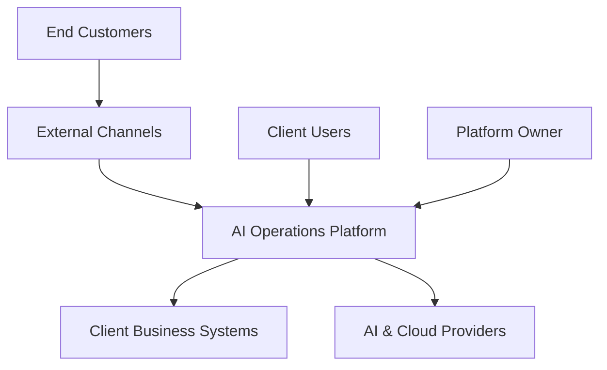
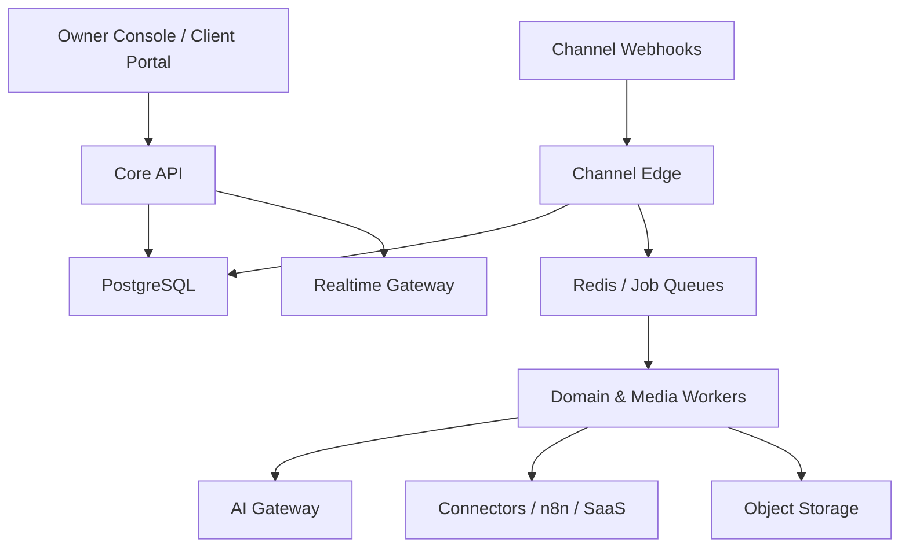
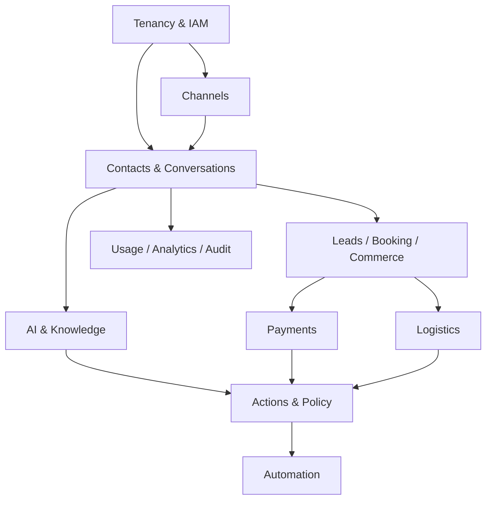
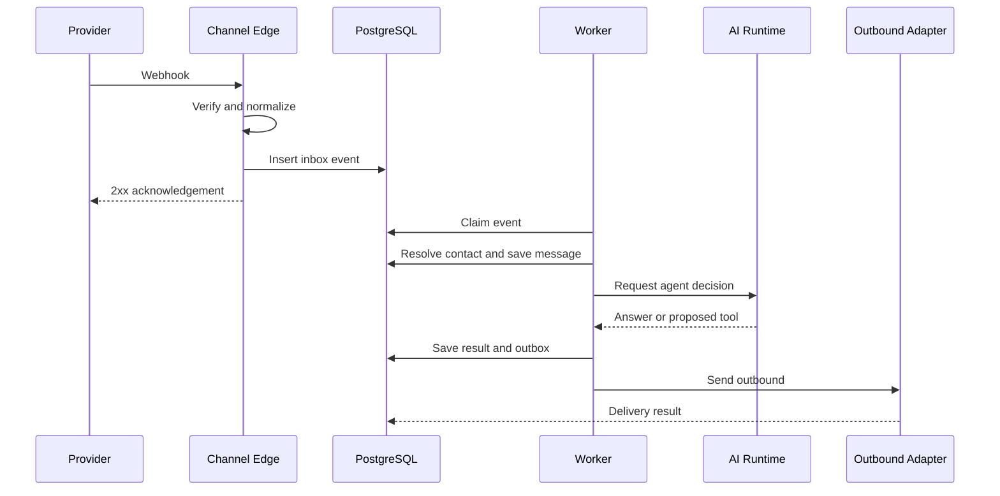
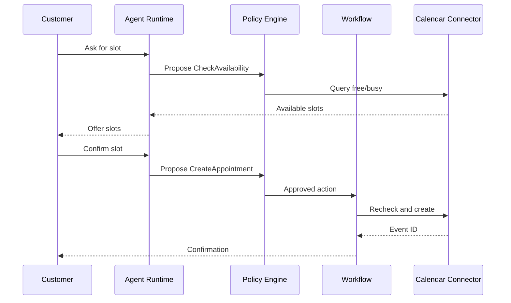
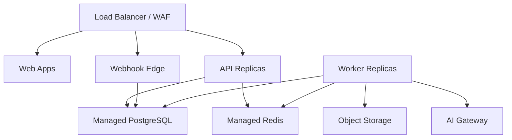

# System Architecture Specification

## 1. Architectural Style

Recommended baseline:

- modular monolith for domain core;
- stateless HTTP API replicas;
- dedicated realtime gateway;
- asynchronous workers by workload class;
- transactional outbox/inbox;
- provider-neutral connector and AI boundaries;
- PostgreSQL source of truth;
- Redis for cache, locks, rate limits, and BullMQ;
- S3-compatible object storage for binaries;
- n8n outside the core trust boundary;
- Temporal introduced when durable workflow requirements exceed simple delayed jobs.

## 2. System Context

## 3. Container Architecture

### 3.1 Owner Console

- Next.js application.
- Separate session audience: platform-internal.
- Route prefix or hostname recommended: owner.platform-domain.
- Server-side authorization on every layout/page request.
- No client tenant navigation unless Platform Owner chooses explicit tenant context.

### 3.2 Client Portal

- Next.js application.
- Session audience: client.
- Tenant resolved from membership plus hostname/path.
- All data requests use tenant-scoped access token.
- White-label/custom domains deferred.

### 3.3 Core API

- NestJS + Fastify.
- REST/OpenAPI.
- Stateless except request-local transaction/tenant context.
- Modules own services and repositories.
- Synchronous calls limited to low-latency validation/query operations.
- Mutations write business state + audit + outbox in one transaction.

### 3.4 Realtime Gateway

- WebSocket or SSE.
- Authenticates client session and membership.
- Subscriptions scoped by tenant, queue, conversation, and role.
- Receives sanitized domain notifications, never raw provider webhook.
- Presence/typing are ephemeral Redis data.

### 3.5 Channel Edge

- Public webhook endpoints.
- Provider-specific verification.
- Fast acknowledgement.
- Raw envelope reference with restricted retention.
- Canonical normalization.
- Inbox deduplication.
- No AI calls inside request lifecycle.

### 3.6 Workers

| Worker | Responsibility | Queue |
|---|---|---|
| channel-worker | Normalize/process inbound and send outbound | realtime-channel |
| conversation-worker | Routing, state transition, summary | realtime-domain |
| ai-worker | Agent/model/tool proposal | realtime-ai |
| media-worker | Download, scan, transcribe, OCR | media |
| automation-worker | Follow-up and event-action flows | automation |
| connector-worker | Calendar/CRM/commerce/n8n calls | connector |
| payment-worker | Hosted-payment commands, webhook projection, reconciliation | payment-command/payment-webhook/payment-reconciliation |
| logistics-worker | Tracking webhook/poll, shipment commands, exception detection | logistics-webhook/logistics-command/logistics-poll |
| analytics-worker | Metric aggregation and export | analytics |
| maintenance-worker | Retention, token checks, reconciliation | maintenance |

Realtime queues have independent capacity from bulk/export queues.

## 4. Domain Module Boundaries

### 4.1 Modules

| Module | Owns | Must not own |
|---|---|---|
| Tenancy/IAM | Tenant, membership, role, entitlement | Conversation content |
| Channels | ChannelAccount, provider config, capabilities | Contact or lead truth |
| Contacts | Contact, identity, merge | Provider session |
| Conversations | Conversation, message, assignment, state | Model routing |
| AI Runtime | Agent profile, model alias, prompt release | External side effect |
| Knowledge | Source, document, chunk, evidence | Conversation state |
| Action Policy | Tool definitions, approval, execution decision | Provider-specific API logic |
| Leads | Lead, qualification, stage, owner | CRM credentials |
| Calendar | Appointment, resource mapping | Google token storage implementation |
| Commerce | Product mapping, order snapshot, action request | Marketplace session |
| Payments | Payment request/attempt/projection, attribution, reconciliation | Provider settlement ledger or merchant credentials |
| Logistics | Shipment/package/tracking/exception projection, reconciliation | Carrier routing truth or provider credential storage |
| Automation | Definition, version, run, timer | Business entity truth |
| Usage/Billing | Usage records, quota, cost allocation | Provider billing account secrets |
| Analytics | Metric events, aggregates, definitions | Operational mutations |
| Audit | Append-only security/business audit | User-facing analytics |

## 5. Dependency Rules

1. Module may read another module only through application service/query interface.
2. Cross-module writes occur through commands or domain events.
3. No repository imports across module boundaries.
4. Provider adapters depend on contracts, not domain internals.
5. AI runtime cannot import connector SDK.
6. Analytics cannot mutate operational tables.
7. n8n can call public/internal integration APIs only.
8. Web apps consume generated contracts, not database types.
9. Shared package contains value objects/contracts, not business orchestration.
10. Payment and Logistics read authoritative provider state through adapter contracts; AI never imports or invokes provider SDKs.

CI must reject forbidden imports.

## 6. Primary Runtime Flows

### 6.1 Inbound message

### 6.2 Human takeover

1. Agent requests takeover with expected conversation version.
2. API locks/version-checks conversation.
3. State becomes HUMAN_ACTIVE.
4. Pending unsent AI outbox entries are cancelled where safe.
5. Realtime event updates all viewers.
6. AI may still create internal summary, but cannot send.
7. Resume requires explicit role-authorized command.

### 6.3 Booking with tool action

### 6.4 Long-running follow-up

- AutomationRun stores definition version and business reference.
- Temporal workflow or scheduler waits durably.
- Before each send: reload current state, consent, provider window, and entitlement.
- Create idempotent SendMessage action.
- Stop reason is persisted.

### 6.5 Hosted payment link

1. Order, invoice, booking, or approved draft supplies amount/currency.
2. AI/user proposes action; Tool Policy validates identity, amount source, entitlement, confirmation, and duplicate state.
3. Payment Domain stores request/action/outbox transactionally.
4. Payment worker creates hosted checkout through the tenant provider adapter.
5. Verified webhook updates canonical projection; authenticated reconciliation resolves delayed/uncertain results.
6. `payment.paid` stops applicable reminders and updates linked projections exactly once.

Redirect pages and uploaded screenshots are not authoritative payment evidence.

### 6.6 Shipment tracking

1. Order/fulfillment sync or authorized user links/imports a shipment.
2. Logistics worker consumes verified webhook events or uses state-aware polling fallback.
3. Provider status maps to a versioned canonical shipment status and immutable tracking timeline.
4. Automation sends configured milestones and opens exceptions for stale/failed/lost/damaged/return states.
5. Customer lookup verifies tenant plus contact/order ownership and returns only permitted fields.

## 7. Transaction and Consistency Model

### 7.1 Strong consistency

Use one PostgreSQL transaction for:

- tenant/user membership mutations;
- conversation state + message + outbox;
- lead stage + activity + outbox;
- action approval state;
- usage quota reservation;
- audit event associated with mutation.

### 7.2 Eventual consistency

Accept for:

- dashboard aggregates;
- provider delivery/read status;
- external CRM/commerce synchronization;
- knowledge indexing;
- AI cost reconciliation;
- payment/shipment provider projections and reconciliation;
- search indexes.

UI must show freshness when eventual consistency affects decisions.

### 7.3 Idempotency

Required for:

- provider webhook ingestion;
- outbound send;
- create/reschedule/cancel appointment;
- invoice creation/send;
- hosted payment request/link creation, cancel, refund, and reconciliation command;
- shipment import/create, label/pickup/cancel/return mutation;
- inventory/order mutation;
- automation trigger;
- export;
- external webhook delivery.

Idempotency record contains tenant, operation, key, request hash, status, response reference, and expiry.

## 8. Data Plane

### 8.1 PostgreSQL

- Primary source of truth.
- RLS on all tenant business tables.
- Runtime role cannot own tables or bypass RLS.
- Connection pool applies tenant context per transaction.
- Append-only inbox/outbox/audit/metric records.

### 8.2 Redis

- BullMQ queues.
- Distributed locks with bounded TTL.
- Presence and typing.
- Cache for short-lived reads.
- Rate-limit counters.
- Model/connector circuit state.

Redis loss must not destroy source-of-truth business state.

### 8.3 Object Storage

- Tenant-scoped key prefix.
- Private by default.
- Presigned URLs with short expiry.
- Lifecycle by data class.
- Malware scan status metadata.
- Original and derived artifacts separated.

### 8.4 Vector Search

- PostgreSQL full-text + pgvector at MVP.
- Every query must include tenant predicate before/with vector search.
- Embedding version is explicit.
- Dedicated engine adoption requires benchmark and ADR.

## 9. Deployment Topology

### 9.1 MVP

### 9.2 Production baseline

- Minimum two API replicas across failure domains.
- Minimum two webhook edge replicas.
- Workers autoscale by queue depth/lag.
- Managed PostgreSQL HA with point-in-time recovery.
- Managed Redis HA.
- Object storage versioning and lifecycle.
- AI Gateway replicas with shared health/budget state.
- OpenTelemetry collector.
- CDN for web assets/widget.
- Secret manager and KMS.

### 9.3 Community WhatsApp Gateway

- Separate deployment group from official channel workers.
- No public management API.
- Per-session resource quota.
- Session storage encrypted outside application database.
- Failure cannot crash Core API or official channel workers.

## 10. Scaling Strategy

### Phase 1

- Scale stateless API and workers horizontally.
- Partition queues by workload class.
- Index hot PostgreSQL queries.
- Batch analytics.
- Isolate payment webhook/command/reconciliation and logistics webhook/command/poll queues.
- Apply provider-account and tenant fair-rate limits; realtime status lookup outranks bulk reconciliation.

### Phase 2

- Add read replica for reporting where safe.
- Introduce Temporal.
- Add ClickHouse for event analytics.
- Dedicated media workers and GPU/private model endpoints if justified.

### Phase 3 triggers

Consider Kafka/Redpanda or service extraction only when:

- sustained event volume exceeds tested outbox/queue capacity;
- long replay requirements emerge;
- independent teams own domains;
- failure blast radius or release cadence requires separation;
- compliance requires physical isolation.

## 11. Performance Budgets

| Path | Platform budget, excluding provider |
|---|---:|
| Webhook verify + persist p95 | 500 ms |
| Read conversation list p95 | 600 ms |
| Open conversation p95 | 800 ms |
| Mutation acknowledgement p95 | 800 ms |
| Realtime notification after commit p95 | 1 s |
| Queue claim latency p95 | 2 s |
| Dashboard cached query p95 | 1.5 s |

Large exports and media extraction are asynchronous.

## 12. Failure Handling

| Failure | Response |
|---|---|
| Provider duplicate webhook | Inbox unique key returns existing result |
| AI provider timeout | Same-tier fallback, then safe handover |
| Connector 429 | Retry-after aware backoff |
| Database unavailable | Fail closed; webhook retry where provider supports |
| Redis unavailable | No new async work; preserve DB outbox and recover |
| Worker crash | Lease/stalled job recovery |
| Community session logout | Mark REAUTH_REQUIRED, stop sends, alert owner |
| Outbound uncertain result | Reconcile before retry if duplicate side effect possible |
| Payment create/webhook uncertain | Mark uncertain, query provider by idempotency/business reference, never mark paid from redirect/screenshot |
| Payment reconciliation mismatch | Preserve both facts, block unsafe fulfillment if configured, alert owner/client finance role |
| Shipping webhook missing | State-aware polling fallback with provider rate-limit and freshness warning |
| Unknown shipment status | Map to UNKNOWN, retain provider code, alert mapping owner, avoid invented ETA |
| Duplicate/out-of-order tracking event | Deduplicate and recompute canonical state without deleting timeline |
| Knowledge index unavailable | Use approved static fallback or handover |

## 13. Architecture Quality Gates

- Tenant isolation integration test passes.
- API and event schemas are backward compatible.
- All mutations generate audit decision.
- All external side effects are idempotent or explicitly non-retryable.
- Queue overload has backpressure test.
- No provider SDK leaks into domain modules.
- No web route depends on hidden client-side-only authorization.
- Backup restore and failover are exercised before production-ready status.
- Payment and shipment providers pass signed-webhook, idempotency, unknown-result, reconciliation, and tenant-isolation certification.
- Payment/Logistics production rollout has provider-specific kill switches, SLO exclusions, and tested runbooks.
