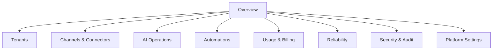
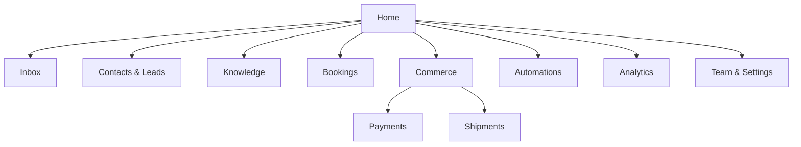
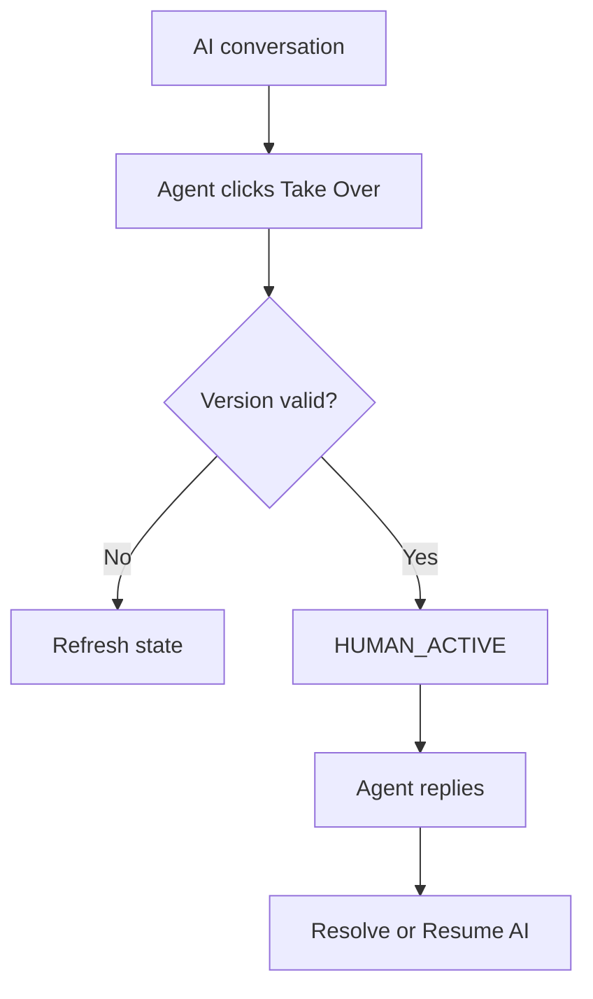
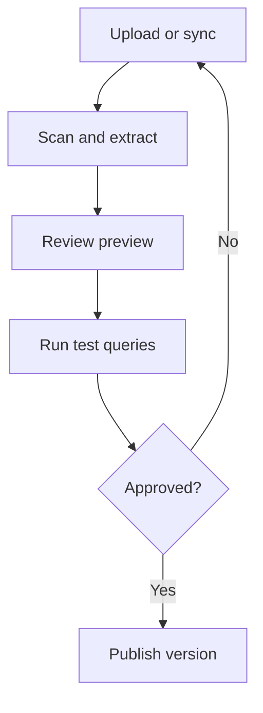
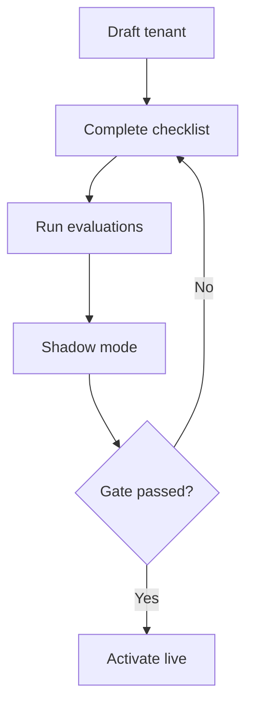

# UX/UI Specification

## 1. UX Goals

1. Founder dapat memahami kondisi seluruh platform dalam kurang dari 60 detik.
2. Client dapat membuktikan outcome bot tanpa memahami teknologi AI.
3. Human agent dapat mengambil alih conversation dengan maksimal dua tindakan.
4. Configuration berisiko tidak dapat diubah tanpa context, validation, dan confirmation.
5. Setiap data yang terlambat atau parsial ditandai agar dashboard tidak menyesatkan.
6. Mobile mendukung monitoring dan inbox; konfigurasi kompleks diprioritaskan untuk desktop.

## 2. Application Separation

### 2.1 Internal Control Panel

- Audience: PLATFORM_OWNER.
- MVP active accounts: satu akun Founder.
- Recommended hostname: owner.domain.
- Distinct login audience and session cookie.
- Tidak ada public sign-up.
- Tidak dapat diakses dari Client Portal navigation.
- Semua route diawali server-side authorization.

### 2.2 Client Portal

- Audience: client roles.
- Recommended hostname: app.domain.
- Invite-only pada MVP.
- Tenant context berasal dari membership.
- User multi-tenant memakai tenant switcher hanya untuk tenant yang memang dimiliki.

### 2.3 Access-denied behavior

| Scenario | Response |
|---|---|
| Client token membuka owner route | 404 atau generic forbidden; jangan bocorkan route |
| Owner belum MFA | Redirect ke MFA challenge |
| Client kehilangan membership | Session invalidated untuk tenant tersebut |
| Feature tidak termasuk package | Upsell/disabled state, bukan broken page |
| Insufficient role | Read-only state atau 403 sesuai action |

## 3. Global Navigation

### 3.1 Owner Console navigation

### 3.2 Client Portal navigation

Navigation item hanya dirender jika entitlement dan permission terpenuhi.

## 4. Shared App Shell

### Desktop

| Region | Content |
|---|---|
| Left sidebar | Logo, tenant context, primary navigation, collapse control |
| Top bar | Page title, date/context, global search, notifications, help, user menu |
| Main content | Page-specific content; max width only for forms, full width for inbox/tables |
| Context panel | Optional drawer for filters, detail, help, approval |

### Mobile

- Top app bar dengan tenant/title.
- Bottom navigation maksimal lima primary items.
- Secondary items masuk More.
- Tables berubah menjadi card/list dengan prioritized fields.
- Conversation composer tetap sticky.
- Destructive/configuration-heavy actions dapat diarahkan ke desktop dengan explanation.

## 5. Owner Console Route Specification

### 5.1 Route map

| Route | Screen | Primary action |
|---|---|---|
| /login | Owner Sign In | Sign in + MFA |
| / | Platform Overview | Investigate alert |
| /tenants | Tenant Directory | Create tenant |
| /tenants/new | Tenant Wizard | Create draft tenant |
| /tenants/:id | Tenant Overview | Open operational context |
| /tenants/:id/channels | Tenant Channels | Connect/manage channel |
| /tenants/:id/ai | Tenant AI Policy | Publish routing policy |
| /tenants/:id/features | Entitlements | Change feature flags |
| /tenants/:id/usage | Tenant Usage | Adjust quota |
| /channels | Global Channel Health | Resolve unhealthy account |
| /connectors | Connector Catalog | Add connector definition |
| /payments | Payment Operations | Investigate provider/reconciliation health |
| /shipments | Logistics Operations | Investigate provider lag/exceptions |
| /ai/providers | AI Providers | Add/rotate provider |
| /ai/models | Model Registry | Create model deployment |
| /ai/routing | Routing Policies | Publish route |
| /ai/prompts | Prompt Releases | Review/publish |
| /ai/evaluations | Evaluations | Compare release |
| /automations | Automation Templates | Create template |
| /automation-runs | Cross-tenant Run Health | Inspect failure |
| /usage | Platform Usage | Filter cost/margin |
| /billing | Billing Operations | Export billing records |
| /reliability | Reliability Overview | Open incident |
| /queues | Queue & DLQ | Replay approved item |
| /incidents | Incidents | Create/update incident |
| /audit | Security Audit | Investigate event |
| /access | Privileged Access | Review/revoke session |
| /settings | Platform Settings | Update guarded setting |

### 5.2 Owner Sign In

Purpose: memastikan internal surface tidak berbagi login flow dengan client.

Required:

- email/passwordless or OIDC;
- MFA challenge;
- recovery code flow;
- suspicious login notification;
- session/device list after login;
- no self-registration;
- rate-limit and generic error.

States:

- invalid credentials;
- MFA required;
- account locked;
- recovery required;
- platform maintenance.

### 5.3 Platform Overview

Primary questions:

- Apakah platform sehat?
- Tenant/channel mana yang perlu tindakan?
- Berapa volume, cost, dan outcome hari ini?
- Apakah ada security/consent incident?

Layout:

1. Date range and environment badge.
2. Critical alert rail.
3. KPI cards: active tenants, inbound, successful outcomes, AI cost, channel health, error budget.
4. Trend chart: messages/outcomes/cost.
5. Tenant risk table.
6. Provider/channel health matrix.
7. Recent incidents and privileged actions.

KPI card wajib menampilkan delta, freshness, dan link ke definition.

### 5.4 Tenant Directory

Columns:

- tenant name/status;
- package;
- channel count/health;
- active conversations;
- month usage/cost;
- last activity;
- risk/incident;
- onboarding stage.

Actions:

- create;
- open;
- suspend;
- begin deletion;
- impersonation/support access request.

Bulk destructive action tidak tersedia pada MVP.

### 5.5 Tenant Creation Wizard

Steps:

1. Identity: name, legal/business identifier, timezone, locale.
2. Package and entitlements.
3. Vertical template.
4. Client Owner invite.
5. Channel plan.
6. AI policy and budget.
7. Data retention and consent defaults.
8. Review and create draft.

Wizard autosaves draft. Tenant tidak ACTIVE sampai onboarding checklist lulus.

### 5.6 Tenant Detail

Header:

- tenant status;
- package;
- environment/risk badges;
- support access state;
- suspend menu.

Tabs:

- Overview;
- Users;
- Channels;
- AI & Knowledge;
- Features;
- Usage;
- Audit;
- Data policy.

Cross-tenant navigation selalu menampilkan tenant identity banner untuk mencegah salah operasi.

### 5.7 Global Channel Health

Views:

- account list;
- provider matrix;
- webhook latency/error;
- token/session expiry;
- delivery failure;
- rate limits.

Community Gateway menampilkan high-risk badge dan tidak boleh terlihat identik dengan Meta Direct.

Primary actions:

- test connection;
- rotate/reconnect;
- disable;
- open migration;
- inspect recent errors.

### 5.8 AI Operations

Provider screen:

- provider type;
- region;
- auth mode;
- health;
- monthly cost;
- last error;
- data policy.

Model registry:

- logical alias;
- physical deployment;
- capabilities;
- price;
- latency;
- quality score;
- circuit status.

Routing policy editor:

- use case;
- required capabilities;
- primary/fallback;
- budget;
- timeout;
- data sensitivity;
- canary percentage.

Publish requires validation summary and rollback target.

### 5.9 Automation Operations

List:

- template/version;
- tenants using it;
- active runs;
- failure rate;
- overdue timers;
- last publish.

Run detail:

- timeline;
- trigger;
- evaluated conditions;
- actions;
- retry;
- stop reason;
- trace;
- replay/dry-run.

### 5.10 Usage and Billing

Views:

- tenant usage;
- provider/channel cost;
- platform cost;
- estimated margin;
- quota breach;
- export/reconciliation.

Cost values carry source: measured, estimated, or reconciled.

### 5.11 Reliability

Required widgets:

- SLO status and burn;
- API latency/error;
- queue depth/lag;
- DB/cache saturation;
- provider/channel health;
- failed workflows;
- backup status;
- deploy markers.

Incident creation pre-fills affected services/tenants from selected signal.

### 5.12 Security and Audit

Filters:

- actor;
- tenant;
- action category;
- risk;
- source IP/device;
- date;
- correlation ID.

High-risk events:

- owner login/recovery;
- secret rotation;
- support content access;
- export;
- deletion;
- provider switch;
- Community Gateway activation/session export;
- approval override.

## 6. Client Portal Route Specification

### 6.1 Route map

| Route | Screen | Roles |
|---|---|---|
| /login | Client Sign In | All |
| /accept-invite | Invite Setup | Invited user |
| /onboarding | Tenant Onboarding | Owner/Admin |
| / | Client Home | All, scoped |
| /inbox | Unified Inbox | Owner/Admin/Manager/Agent |
| /inbox/:conversationId | Conversation Workspace | Assigned/authorized |
| /contacts | Contacts | Owner/Admin/Manager/Agent |
| /contacts/:id | Customer 360 | Authorized |
| /leads | Lead Pipeline | Owner/Admin/Manager |
| /leads/:id | Lead Detail | Authorized |
| /knowledge | Knowledge Sources | Owner/Admin/Manager |
| /knowledge/:id | Source/Document Detail | Owner/Admin/Manager |
| /bookings | Booking Calendar/List | Owner/Admin/Manager/Agent |
| /commerce | Commerce Overview | Entitled roles |
| /payments | Payments Overview/List | Entitled roles |
| /payments/:id | Payment Detail | Authorized roles |
| /shipments | Shipments Overview/List | Entitled roles |
| /shipments/:id | Shipment Detail | Authorized roles |
| /shipment-exceptions | Delivery Exceptions | Owner/Admin/Manager/assigned Agent |
| /automations | Automation Library | Owner/Admin/Manager |
| /analytics | Analytics | Owner/Admin/Manager/Analyst/Viewer |
| /usage | Usage | Owner/Admin |
| /team | Team & Roles | Owner/Admin |
| /settings | Business Settings | Owner/Admin |
| /settings/channels | Channel Settings | Owner/Admin, guarded |
| /settings/ai | AI Behavior | Owner/Admin, guarded |
| /settings/payments | Payment Provider Settings | Owner/Admin, guarded + recent auth |
| /settings/shipping | Shipping Provider Settings | Owner/Admin, guarded |

### 6.2 Invite and onboarding

Invite flow:

1. Verify invite token.
2. Show tenant and assigned role.
3. Create/attach identity.
4. Accept terms/privacy.
5. Configure MFA if required.
6. Enter portal.

Tenant onboarding checklist:

- business profile;
- support/escalation contacts;
- business hours/holidays;
- channel connected;
- knowledge published;
- AI test scenarios passed;
- human inbox team assigned;
- consent/template settings;
- dashboard timezone;
- payment merchant/provider account, source-of-truth, approval, and reconciliation test when enabled;
- shipping provider/source, tracking mapping, notification, stale threshold, and exception owner when enabled;
- go-live approval.

### 6.3 Client Home

Questions answered:

- Apa yang terjadi hari ini?
- Apa yang membutuhkan tindakan?
- Apakah AI membantu service/sales?

Sections:

1. Alerts and recommended actions.
2. KPI: open conversations, response time, automation rate, qualified leads, bookings, verified paid outcomes, shipment exceptions, dan CSAT sesuai entitlement.
3. Conversation trend.
4. Outcome funnel.
5. Queue/agent workload.
6. Unanswered/low-evidence topics.
7. Upcoming bookings.
8. Usage summary.

### 6.4 Unified Inbox

Desktop layout:

| Left | Center | Right |
|---|---|---|
| Queue/filter and conversation list | Message timeline and composer | Customer context and actions |

List item:

- customer name/identity;
- channel icon;
- last message preview/time;
- unread;
- status;
- assignee;
- SLA risk;
- AI/human mode;
- intent/priority.

Composer:

- text;
- approved attachment types;
- template selector if required;
- internal note mode;
- send/schedule where permitted;
- AI suggested reply;
- visible channel window warning.

Right context:

- contact fields;
- lead stage/score;
- active booking;
- order status;
- tags;
- recent summary;
- consent;
- allowed actions.

Critical interactions:

- Take Over;
- Assign;
- Resolve;
- Escalate;
- Pause/Resume AI;
- add internal note;
- view AI evidence/trace summary.

Mobile:

- conversation list → message screen → context drawer;
- composer remains sticky;
- takeover button visible above composer;
- no three-column compression.

### 6.5 Customer 360

Header:

- verified identities;
- consent/opt-out;
- owner/segment;
- risk flags.

Tabs:

- Overview;
- Conversations;
- Lead activities;
- Bookings;
- Orders;
- Payments;
- Shipments;
- Notes;
- Data/privacy.

PII fields masked based on role. Merge/unmerge is manager/admin only.

### 6.6 Lead Pipeline

Views:

- Kanban by stage;
- table;
- funnel report.

Card:

- contact/company;
- source;
- score and explanation;
- owner;
- next action;
- last activity;
- SLA/age.

Drag stage requires confirmation if automation will trigger.

### 6.7 Lead Detail

- qualification fields and missing data;
- score version and factors;
- timeline;
- linked conversations;
- owner;
- next action;
- booking;
- CRM sync status.

AI-generated field is visually marked and can be confirmed/corrected.

### 6.8 Knowledge

List:

- source name/type;
- status;
- version;
- freshness;
- documents/chunks;
- last sync;
- usage;
- error.

Source detail:

- ingestion timeline;
- document list;
- extraction preview;
- access scope;
- unanswered questions;
- test query panel;
- publish/rollback.

Published and draft are clearly separated.

### 6.9 Bookings

Views:

- calendar;
- list;
- resource view.

Actions:

- create;
- reschedule;
- cancel;
- mark completed/no-show;
- send reminder.

All time displays show timezone when customer/resource differ.

### 6.10 Commerce

MVP/deferred feature state must be graceful.

Read-first views:

- product search;
- inventory freshness;
- order lookup;
- fulfillment status;
- connector health.

Mutation buttons only appear if connector capability and approval policy allow.

### 6.10A Payments

Navigation is hidden when `payment_orchestration` is disabled.

Overview:

- paid value and request conversion by currency;
- outstanding/processing/expired/failed requests;
- time to pay;
- provider/webhook/reconciliation health and freshness;
- payment-attributed outcome, never confused with platform-recognized revenue.

List columns:

- customer and linked invoice/order/booking;
- amount/currency/purpose;
- provider and merchant account label;
- status, expiry, last verified provider event, and reconciliation state.

Detail:

- immutable amount/business reference summary;
- payment link/attempt timeline;
- verified provider events and canonical state;
- related conversation, lead, booking, order, and invoice;
- guarded cancel/reconcile/refund-request actions.

The UI never asks for card number, CVV, PIN, OTP, or bank-login credentials. `Link sent`, `Processing`, and `Paid` use different status/copy. Redirect success and customer screenshot cannot render a Paid badge.

### 6.10B Shipments and Exceptions

Navigation is hidden when `shipment_tracking` is disabled.

Overview/list:

- active shipments by canonical status;
- delivered, stale, failed, returning, and unresolved exception counts;
- provider/source, tracking reference, linked order/customer, ETA source, last event, and freshness;
- filters for provider, store, carrier, state, exception, age, and owner.

Shipment detail:

- canonical milestone timeline plus provider-specific detail;
- packages/items and partial-fulfillment relationships;
- provider ETA/commitment with source/freshness;
- notification history;
- exception owner/status;
- restricted proof-of-delivery access.

Exception queue:

- severity, type, age, customer/order, current provider state, assignee, next action, and SLA;
- assign, contact customer, open conversation, reconcile, and resolve with reason;
- create/cancel/return actions appear only after Stage 2 capability, state, and approval checks.

Customer-facing tracking shows only identity-authorized data. Full address, unrelated order contents, and proof of delivery are not exposed from a guessed tracking number.

### 6.11 Automations

MVP client view:

- available templates;
- enabled/disabled;
- safe parameters;
- recent runs;
- failures;
- pause.

Client does not edit raw workflow graph on MVP.

### 6.12 Analytics

Tabs:

- Service;
- Sales;
- Bookings;
- AI Quality;
- Channels;
- Agents;
- Usage.

Every metric supports:

- definition tooltip;
- date/timezone;
- current vs comparison;
- filters;
- freshness;
- export permission.

### 6.13 Team and Settings

Team:

- invite;
- role;
- queue membership;
- status;
- last active;
- revoke.

Settings:

- business profile;
- business hours;
- brand/tone;
- escalation;
- consent;
- fields;
- notifications;
- guarded AI settings;
- channel state.

## 7. Key User Flows

### 7.1 Human takeover

### 7.2 Publish knowledge

### 7.3 Owner activates tenant

### 7.4 Hosted payment link

1. Show authoritative amount, currency, purpose, merchant, and expiry.
2. Require confirmation or approval according to risk policy.
3. Create/send the provider-hosted link once using an idempotency key.
4. Show `Waiting for payment` while provider evidence is absent.
5. Update to `Paid` only after verified webhook/query and show the provider-event time.
6. If status is stale/uncertain, show reconcile/handover instead of success.

### 7.5 Shipment tracking and exception

1. Verify customer/order ownership or authorized client session.
2. Show canonical current state, last provider event, source, and freshness.
3. Render the immutable timeline and provider ETA only when supplied.
4. For stale/failed/lost/damaged/return state, create an exception and surface contact/escalation actions.
5. Do not promise a new ETA unless the source provides it.

## 8. Global UI States

Every data surface defines:

| State | Required behavior |
|---|---|
| Loading | Skeleton matching final layout; no full-page spinner for normal reads |
| Empty-first-use | Explain value and primary setup action |
| Empty-filter | Explain no match and clear filters |
| Partial | Show available data plus source-specific warning |
| Stale | Show last updated and refresh action |
| Error-retryable | Plain-language error, retry, correlation ID |
| Error-permission | Explain required role without exposing data |
| Offline | Preserve unsent composer draft locally where safe |
| Saving | Disable duplicate mutation; show progress |
| Success | Inline confirmation; toast only for transient feedback |

## 9. Confirmation Patterns

| Risk | Pattern |
|---|---|
| Low | Immediate with undo where possible |
| Medium | Confirmation dialog with object summary |
| High | Re-auth/approval plus typed confirmation where destructive |
| Critical | Two-person approval or Founder re-auth |

Never use color alone to communicate risk.

## 10. Notifications

Channels:

- in-app notification center;
- email;
- optional WhatsApp/Slack for internal operations later.

Categories:

- conversation assignment/SLA;
- lead/booking;
- knowledge freshness;
- payment status, expiry, mismatch, and provider health;
- shipment milestone, stale tracking, delivery exception, and provider health;
- connector/token/session health;
- usage/quota;
- security;
- incident.

Users control non-critical notifications; security and owner-critical alerts cannot be fully disabled.

## 11. Search and Command Behavior

- Global search is permission-aware.
- Owner Console searches tenant, channel account, incident, and correlation ID.
- Client Portal searches contact, conversation, lead, booking, and order.
- Payment and shipment search is tenant/permission-aware; tracking reference alone never bypasses identity or role checks.
- Search result never reveals object existence outside current scope.
- Command palette is optional after MVP.

## 12. Accessibility

- Target WCAG 2.2 AA.
- Keyboard-complete navigation for inbox and tables.
- Visible focus ring.
- Semantic heading order.
- Labels for all inputs.
- Live region for message arrival and save status.
- Chart data table alternative.
- Minimum touch target 44×44 px.
- Contrast ≥4.5:1 for normal text.
- Reduced motion preference respected.
- Captions/transcript available for audio.

## 13. Localization

- UI strings externalized.
- Dates use tenant locale; timestamps store UTC.
- Relative time always has absolute tooltip.
- Numbers/currency use locale.
- Copy avoids unexplained English jargon in Indonesian UI.
- Customer message language may differ from portal language.

## 14. UX Acceptance Checklist

- Route exists in permission matrix.
- Page has loading/empty/error/partial states.
- Primary action is visually clear.
- Destructive actions show impact.
- Freshness visible for external/analytical data.
- Payment status visually distinguishes requested, processing, verified paid, expired/failed, and refunded/disputed states.
- Shipment timeline exposes provider source/freshness and exception action without inventing ETA.
- Mobile critical path tested.
- Keyboard path tested.
- Analytics has definitions.
- AI-generated content is identified where material.
- Owner-only controls never render for client sessions.
