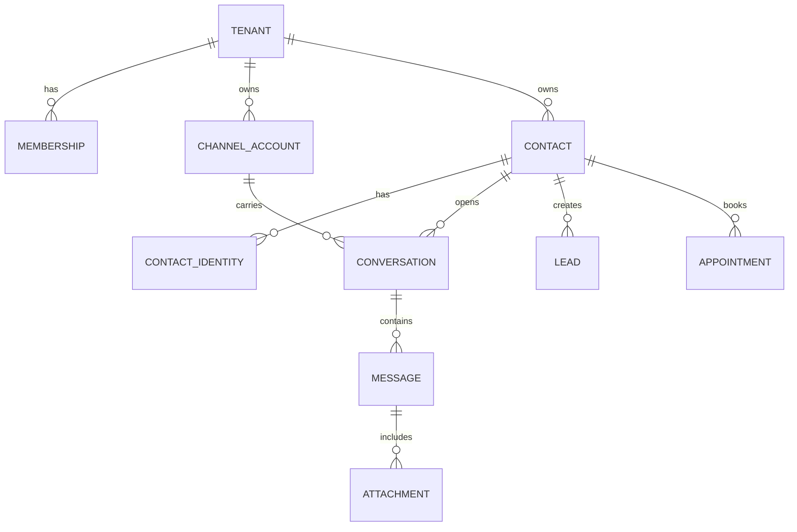
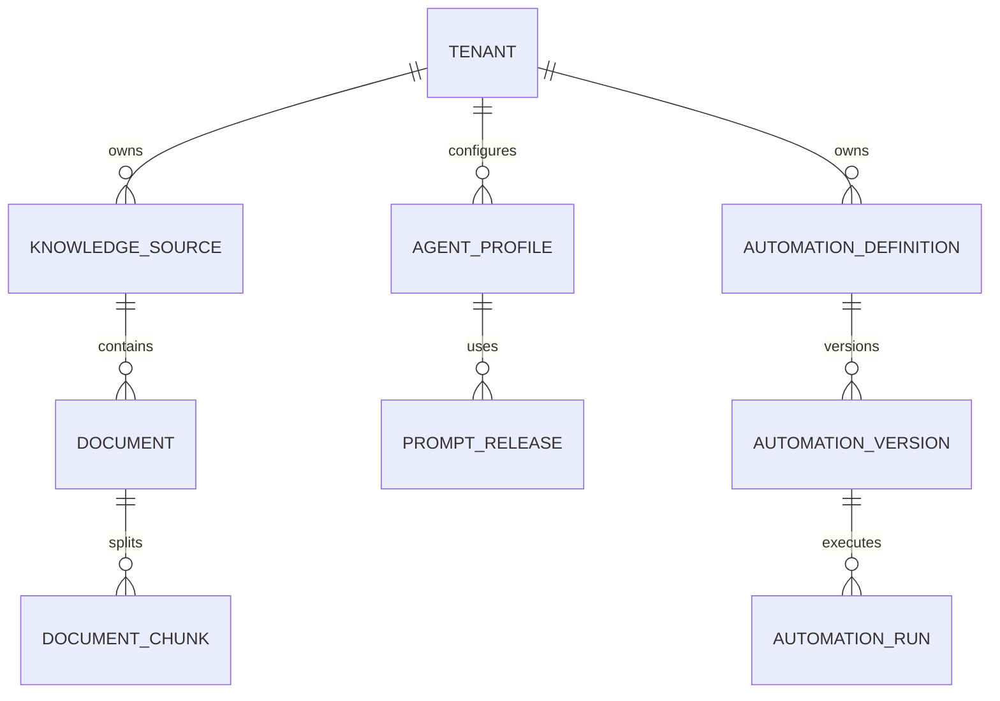
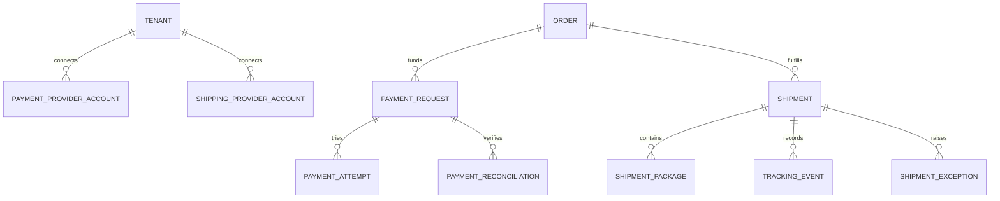

# Data Model and Tenancy Specification

## 1. Database Standards

- Primary key: UUIDv7 or equivalent sortable UUID.
- Time: timestamptz in UTC.
- Money: integer minor units + currency code.
- Phone: normalized E.164 when possible; original value retained only when needed.
- Mutable aggregate: version integer for optimistic concurrency.
- Soft deletion only where business recovery/audit requires it.
- JSONB allowed for provider payload fragments and extensible metadata, not as replacement for core relational fields.
- All migrations are explicit, reviewed, and forward-compatible.

Standard tenant-owned columns:

| Column | Purpose |
|---|---|
| id | Global technical identifier |
| tenant_id | Mandatory isolation key |
| created_at | Creation time |
| updated_at | Last mutation time |
| created_by | User/service actor where relevant |
| updated_by | User/service actor where relevant |
| version | Optimistic concurrency |

## 2. Tenant Boundary

Tenant is primary business boundary. Channel account/WhatsApp number is a resource under tenant.

All tenant-owned queries must satisfy:

- application membership/permission;
- database RLS;
- tenant-aware foreign key;
- tenant-aware cache/object key;
- audit context.

### 2.1 Database roles

| Role | Permission |
|---|---|
| migration_owner | Own schema/migrations; no application use |
| app_runtime | CRUD through RLS; no BYPASSRLS; not table owner |
| worker_runtime | Same tenant restrictions; service actions scoped |
| analytics_reader | Read approved views/aggregates |
| breakglass_admin | Emergency only, vaulted, fully audited |

Runtime transaction sets trusted tenant context after token validation. Request body/header cannot independently choose tenant.

## 3. High-Level ERD

## 4. Identity and Tenancy Tables

### 4.1 platform_user

| Field | Notes |
|---|---|
| id | User identity |
| identity_provider_id | OIDC subject |
| email_normalized | Unique verified email |
| display_name | User-facing name |
| status | INVITED, ACTIVE, LOCKED, DISABLED |
| mfa_state | REQUIRED, ENROLLED, RECOVERY |
| last_login_at | Security telemetry |

No tenant_id because one identity can join multiple tenants.

### 4.2 platform_role_assignment

Used only for internal roles.

Fields:

- user_id;
- role: PLATFORM_OWNER, PLATFORM_ADMIN, SUPPORT, BILLING, AUDITOR;
- status;
- granted_by;
- granted_at;
- revoked_at.

MVP constraint: only one ACTIVE PLATFORM_OWNER; all other internal roles disabled.

### 4.3 tenant

Fields:

- id;
- slug;
- legal_name;
- display_name;
- status;
- timezone;
- locale;
- data_region;
- package_code;
- onboarding_state;
- retention_policy_id;
- suspended_at/reason;
- deletion_scheduled_at.

Unique: slug.

### 4.4 membership

Fields:

- tenant_id;
- user_id;
- role;
- status;
- invited_by;
- accepted_at;
- last_tenant_access_at.

Unique: tenant_id + user_id.

### 4.5 entitlement

Fields:

- tenant_id;
- capability_code;
- enabled;
- limit_value;
- effective_from/to;
- source: PACKAGE, OVERRIDE, TRIAL;
- changed_by.

Unique active entitlement per tenant + capability.

## 5. Channel Tables

### 5.1 channel_account

Fields:

- tenant_id;
- channel_type;
- display_name;
- external_account_id;
- provider_mode;
- provider_key;
- status;
- risk_class;
- sla_class;
- capabilities JSONB;
- connection_status;
- health_reason;
- last_inbound_at;
- last_outbound_at;
- last_health_at;
- pricing_policy_version;
- migration_status;
- target_provider;
- credential_reference;
- session_reference;

Unique:

- tenant_id + channel_type + external_account_id;
- provider_key + external_account_id where globally required.

### 5.2 connector_instance

- tenant_id;
- connector_definition_id;
- display_name;
- auth_mode;
- credential_reference;
- status;
- capabilities;
- configuration;
- token_expires_at;
- last_health_at/error.

### 5.3 webhook_subscription

- tenant_id;
- channel_account_id/connector_instance_id;
- provider_subscription_id;
- secret_reference;
- status;
- event_types;
- last_received_at;
- verification_state.

Raw secrets never stored in this table.

## 6. Contact and Conversation Tables

### 6.1 contact

- tenant_id;
- display_name;
- given_name/family_name;
- preferred_language;
- timezone;
- email_normalized;
- phone_normalized;
- status;
- owner_user_id;
- segment;
- custom_fields JSONB;
- merged_into_contact_id;
- pii_classification;

phone_normalized is not globally unique.

### 6.2 contact_identity

- tenant_id;
- contact_id;
- channel_type;
- channel_account_id;
- external_user_id;
- address_normalized;
- display_handle;
- verification_state;
- first_seen_at;
- last_seen_at;
- metadata.

Unique: tenant_id + channel_account_id + external_user_id.

### 6.3 conversation

- tenant_id;
- contact_id;
- channel_account_id;
- external_thread_id;
- status;
- mode: AI_ACTIVE, HUMAN_ACTIVE, PAUSED;
- queue_id;
- assignee_user_id;
- priority;
- intent;
- opened_at;
- last_message_at;
- waiting_since;
- resolved_at;
- reopen_until;
- ai_agent_profile_id;
- summary;
- version.

Indexes:

- tenant + status + last_message_at;
- tenant + assignee + status;
- tenant + queue + priority + waiting_since;
- tenant + contact + last_message_at.

### 6.4 message

- tenant_id;
- conversation_id;
- external_message_id;
- direction: INBOUND, OUTBOUND, INTERNAL;
- sender_type: CUSTOMER, AI, HUMAN, SYSTEM;
- sender_reference;
- content_type;
- text_content;
- content_parts JSONB;
- reply_to_message_id;
- status;
- provider_timestamp;
- received_at;
- sent_at;
- delivered_at;
- read_at;
- failed_at/error_code;
- model_trace_id;
- idempotency_key;

Unique provider message key scoped by channel account/provider.

### 6.5 attachment

- tenant_id;
- message_id;
- object_key;
- original_filename;
- mime_declared;
- mime_detected;
- byte_size;
- checksum;
- scan_status;
- processing_status;
- media_kind;
- extracted_text_object_key;
- transcription_object_key;
- retention_expires_at.

### 6.6 assignment_event and conversation_state_event

Append-only timelines for routing, takeover, assignment, SLA, and resolution.

## 7. Consent and Privacy

### 7.1 consent_event

- tenant_id;
- contact_id;
- channel_account_id;
- purpose/category;
- action: GRANTED, WITHDRAWN, OPTED_OUT;
- source;
- evidence_reference;
- occurred_at;
- expires_at.

Current consent is derived, not overwritten.

### 7.2 suppression_entry

- tenant_id;
- identity/contact;
- channel;
- category;
- reason;
- effective_from/to.

### 7.3 data_subject_request

- tenant_id;
- contact_id;
- request_type;
- verification_state;
- status;
- due_at;
- approved_by;
- result_reference;
- completed_at.

## 8. AI and Knowledge Tables

### 8.1 agent_profile

- tenant_id;
- name;
- use_case;
- status;
- tone/language;
- business_rules;
- handover_policy_id;
- tool_policy_id;
- model_policy_id;
- knowledge_scope_id;
- published_version_id.

### 8.2 prompt_release

- tenant_id nullable for global template;
- agent_profile_id;
- version;
- status;
- system_instruction;
- template_variables_schema;
- created_by;
- evaluation_run_id;
- published_at;
- rollback_of.

### 8.3 model_alias and model_deployment

model_alias:

- alias code;
- task type;
- tenant scope/global;
- routing_policy_id.

model_deployment:

- provider;
- physical model name;
- endpoint reference;
- credential reference;
- region;
- capabilities;
- data policy;
- cost policy;
- health/circuit state.

Domain records reference alias/release and trace, not provider SDK object.

### 8.4 knowledge_source

- tenant_id;
- name/type;
- status;
- connector_reference;
- visibility_scope;
- freshness_policy;
- published_version;
- last_sync_at;
- next_review_at.

### 8.5 document

- tenant_id;
- knowledge_source_id;
- external_source_id;
- title;
- mime;
- checksum;
- source_version;
- status;
- language;
- effective_from/to;
- object_key;
- extraction_status.

### 8.6 document_chunk

- tenant_id;
- document_id;
- chunk_index;
- text;
- token_count;
- metadata;
- embedding;
- embedding_model_version;
- search_vector;
- effective_from/to;

Indexes: tenant filter plus vector/full-text.

### 8.7 ai_trace_reference

Operational database stores:

- tenant_id;
- conversation/message;
- trace external ID;
- alias/deployment;
- prompt release;
- knowledge source IDs;
- token/cost;
- latency;
- finish/error reason;
- retention expiry.

Raw prompt content may remain in dedicated trace store with stricter access.

## 9. Tool and Action Tables

### 9.1 tool_definition

- code/version;
- input/output schema;
- risk class;
- required capability;
- handler key;
- timeout/retry policy;
- status.

### 9.2 tool_policy

- tenant_id;
- tool code;
- enabled;
- conditions;
- confirmation requirement;
- approval role/threshold;
- field allowlist.

### 9.3 action_request

- tenant_id;
- conversation/contact reference;
- tool/version;
- input;
- risk;
- status;
- idempotency_key;
- proposed_by_trace;
- confirmation state;
- approval state;
- execution reference;
- result/error;
- timestamps.

## 10. Sales and Booking

### 10.1 lead

- tenant_id;
- contact_id;
- source;
- stage;
- status;
- owner_user_id;
- qualification_schema_version;
- qualification_fields;
- score;
- score_version;
- score_factors;
- next_action_at/type;
- converted_at/outcome.

### 10.2 lead_activity

Append-only message, stage, assignment, note, CRM sync, booking, and outcome events.

### 10.3 appointment

- tenant_id;
- contact_id;
- conversation_id;
- connector_instance_id;
- external_calendar_id/event_id;
- resource_id;
- status;
- starts_at/ends_at;
- timezone;
- title;
- attendee data;
- confirmation state;
- reminder policy;
- idempotency_key;
- cancelled/rescheduled references.

## 11. Commerce

### 11.1 product / sku / channel_listing

product:

- tenant_id;
- name;
- description;
- brand/category;
- status.

sku:

- tenant_id;
- product_id;
- code;
- attributes;
- price minor/currency;
- status.

channel_listing:

- tenant_id;
- sku_id;
- connector/channel;
- external product/variant IDs;
- status;
- last_synced_at.

### 11.2 inventory_snapshot

- tenant_id;
- sku/location/source;
- available/on_hand/reserved;
- source_version;
- observed_at;
- expires_at.

### 11.3 order / order_item

- tenant_id;
- contact/customer identity;
- connector;
- external_order_id;
- status;
- totals/currency;
- placed_at;
- fulfillment/payment summaries;
- last_synced_at.

Order item contains SKU mapping, quantity, price, and external IDs.

### 11.4 invoice

- tenant_id;
- contact/order;
- source system;
- external invoice ID/number;
- status;
- amount/currency;
- payment link/reference;
- issued/due/paid timestamps.

Invoice is not the payment ledger. Its paid projection references the verified payment outcome or authoritative external invoice/accounting source.

### 11.5 payment_provider_account

- tenant_id;
- connector_instance_id;
- provider key and adapter version;
- environment: SANDBOX or LIVE;
- external merchant/account ID;
- secret reference and signing-key version;
- capability/scopes snapshot;
- status/health/last success/last webhook/token expiry;
- supported currency/market metadata;
- risk/SLA class.

Unique external account identifiers are scoped by tenant + provider + environment. Secret plaintext is never stored in this table.

### 11.6 payment_request / payment_attempt / payment_transaction

payment_request:

- tenant_id;
- contact/conversation/lead/appointment/order/invoice references;
- provider account;
- purpose and authoritative amount-source reference/version;
- amount_minor and currency;
- status;
- expires_at;
- idempotency_key;
- attribution dimensions;
- paid/failed/cancelled timestamps;
- current reconciliation state/version.

payment_attempt:

- tenant_id and payment_request_id;
- external payment/order/checkout ID;
- hosted-link reference or encrypted token reference, never logged raw;
- method category if returned by provider;
- status and provider timestamps;
- provider idempotency/reference;
- unknown-result and last-query state.

payment_transaction:

- tenant_id, request, and attempt;
- provider event/transaction ID;
- type: PAYMENT, REVERSAL, REFUND, DISPUTE, ADJUSTMENT;
- amount_minor/currency;
- occurred_at and settled_at where supplied;
- verified source and raw diagnostic reference.

Provider event/transaction uniqueness is scoped by tenant + provider account + external ID. A paid request cannot be regressed by a late pending event without an explicit reversal/refund/dispute transaction.

### 11.7 payment_webhook_event / payment_reconciliation / refund_request

payment_webhook_event extends inbox semantics with provider account, external event ID, signature-key version, provider occurred time, verification result, schema version, payload reference/hash, and processing outcome.

payment_reconciliation stores:

- tenant/request/attempt/provider account;
- trigger and queried_at;
- local/provider status and amount/currency comparison;
- MATCH, MISMATCH, PENDING, or FAILED;
- mismatch fields, severity, owner, resolution, and linked incident/action.

refund_request stores requested amount/reason, eligibility snapshot, requested actor, recent-auth state, approval policy/approvers, status, provider action reference, and reconciliation result. Refund execution is unavailable until the corresponding entitlement and stage gate are enabled.

### 11.8 shipping_provider_account

- tenant_id and connector_instance_id;
- provider key, adapter version, environment;
- external carrier/aggregator/store account ID;
- secret reference/signing-key version;
- capabilities/scopes;
- status/health/last webhook/last poll/token expiry;
- rate-limit and market/service metadata.

### 11.9 shipment / shipment_package / shipment_item

shipment:

- tenant_id;
- contact/conversation/order/fulfillment references;
- shipping provider account;
- external shipment ID and tracking reference;
- carrier/service/source;
- canonical status and mapping version;
- origin/destination country/region summary; full address in restricted fields/reference;
- promised/estimated delivery range, source, and observed_at;
- shipped/delivered/returned timestamps;
- last provider event/poll/reconciliation;
- notification policy/status;
- parent/original shipment reference for returns.

shipment_package stores external package ID, tracking reference, dimensions/weight/unit, status, and label reference where permitted. shipment_item maps order item + quantity to a shipment/package, enabling partial fulfillment.

### 11.10 tracking_event / shipment_exception / proof_of_delivery

tracking_event is immutable and includes:

- tenant/shipment/package/provider account;
- provider event ID/code/status/message reference;
- canonical status + mapping version;
- event time/provider timezone and received_at;
- normalized location at allowed granularity;
- source: WEBHOOK, POLL, IMPORT, MANUAL_VERIFIED;
- payload reference/hash and dedup key.

shipment_exception:

- tenant/shipment/current tracking event;
- type/severity/status;
- detected_at, acknowledged_at, resolved_at;
- assignee/team;
- customer-impact and next-action codes;
- resolution reason and linked conversation/ticket/incident.

proof_of_delivery stores only a restricted provider/object reference, type, provider timestamp, masked recipient metadata, checksum, access classification, and retention. Broad list/analytics views never contain the original artifact.

### 11.11 shipping_reconciliation

Stores local/provider state comparison, last event identity, event-gap/staleness detection, queried_at, mismatch fields, severity, resolution, and provider rate-limit outcome. It is append-oriented so an operational timeline is auditable.

## 12. Automation and Reliability

### 12.1 automation_definition/version

Definition owns identity/status; version stores immutable trigger, conditions, actions, stop rules, timezone, and schema version.

### 12.2 automation_run

- tenant_id;
- definition/version;
- trigger event/reference;
- status;
- current step;
- workflow engine reference;
- started/completed/stopped timestamps;
- stop/error reason.

### 12.3 inbox_event

- tenant_id where resolved;
- provider/channel account;
- external event ID;
- schema version;
- payload reference/hash;
- status;
- attempts;
- received/processed timestamps.

Unique provider event identity.

### 12.4 outbox_event

- tenant_id;
- aggregate type/id/version;
- event type/version;
- payload;
- status;
- available_at;
- attempts;
- published_at.

### 12.5 idempotency_record

- tenant_id;
- operation;
- idempotency key;
- request hash;
- status;
- result reference;
- expires_at.

## 13. Usage, Analytics, and Audit

### 13.1 usage_record

- tenant_id;
- usage type;
- quantity/unit;
- provider/channel/model;
- business reference;
- measured_at;
- source;
- estimated/confirmed cost;
- currency;
- pricing version.

### 13.2 metric_event

- tenant_id;
- event name/version;
- dimensions;
- numeric values;
- occurred_at;
- ingested_at;
- source reference.

### 13.3 audit_log

- tenant_id nullable for platform-only event;
- actor type/id;
- session/service;
- action;
- object type/id;
- risk;
- before/after diff reference;
- reason/ticket;
- source IP/device;
- correlation ID;
- occurred_at.

Append-only; no standard update/delete.

## 14. RLS Policy Pattern

Tenant tables use default-deny:

- SELECT/INSERT/UPDATE/DELETE allowed only when tenant_id equals trusted transaction tenant;
- platform owner cross-tenant access does not bypass RLS silently; owner selects explicit tenant context;
- global control-plane tables use separate permission policy;
- support content access requires grant record and tenant context.

Tests:

- missing tenant context;
- wrong tenant;
- guessed UUID;
- cross-tenant join;
- vector search filter;
- export job;
- background worker;
- owner context switch.
- payment provider account/request/transaction/reconciliation/refund;
- shipping provider account/shipment/tracking/proof/exception;
- end-customer lookup using a tracking/external reference owned by another contact/tenant.

## 15. Foreign Keys and Constraints

- Tenant-owned foreign keys use composite tenant_id + id where practical.
- Conversation contact and channel account must share tenant.
- Message and attachment must share tenant with parent.
- Contact identity channel account must share tenant.
- Action request business references must share tenant.
- Appointment connector must belong to tenant.
- Payment provider account, request, attempt, transaction, webhook, refund, and business references must share tenant.
- Shipment provider account, order, package, item, event, exception, proof, and return references must share tenant.
- External payment/shipment IDs are never globally unique without tenant + provider-account scope.
- Payment amount/currency become immutable after an external attempt exists; correction creates a replacement request.
- Shipment current status must be derivable from immutable events plus explicit verified correction.
- Unique keys include tenant scope.

## 16. Data Classification

| Class | Examples | Control |
|---|---|---|
| Public | Published widget config | Standard |
| Internal | Feature config, non-sensitive metrics | Authenticated |
| Confidential | Conversations, contact, lead, order | Tenant RBAC + encryption |
| Restricted | Secrets, auth tokens, sensitive identifiers | Vault/KMS, minimal access, redaction |

Additional classification defaults:

- payment amount/status/reference and shipment/order status: Confidential;
- payment tokens, merchant credentials, webhook secrets, full delivery address, and proof-of-delivery artifact: Restricted;
- card number, CVV, PIN, OTP, and bank-login credentials: prohibited from platform collection/storage.

## 17. Retention Defaults

Defaults require legal/client review:

| Data | Default proposal |
|---|---:|
| Raw webhook envelope | 14 days |
| Message/conversation | 24 months |
| Attachment original | 12 months |
| AI raw trace | 90 days |
| AI usage summary | 24 months |
| Audit log | 36 months |
| Failed job/DLQ payload | 30 days |
| Export file | 7 days |
| Backup | 35 days + monthly archive as contracted |
| Payment webhook raw payload | 30 days proposed; normalized/audit record per finance/legal policy |
| Payment request/transaction projection | Contract/legal/accounting policy; proposed 7 years only after jurisdiction review |
| Tracking raw provider payload | 30 days proposed |
| Shipment/tracking normalized timeline | 24 months proposed or client order-retention policy |
| Delivery address/proof artifact | Minimum operational period; proposed 90/180 days, then delete or minimize |

Tenant policy may shorten retention; legal hold can suspend deletion.

## 18. Migration Rules

- Expand-and-contract for breaking schema change.
- New nullable/read-compatible field first.
- Backfill asynchronous with checkpoint.
- Dual read/write only with explicit expiry.
- RLS policy changes reviewed as security changes.
- Event schema version maintained during migration.
- Destructive column removal after all consumers and rollback window expire.
