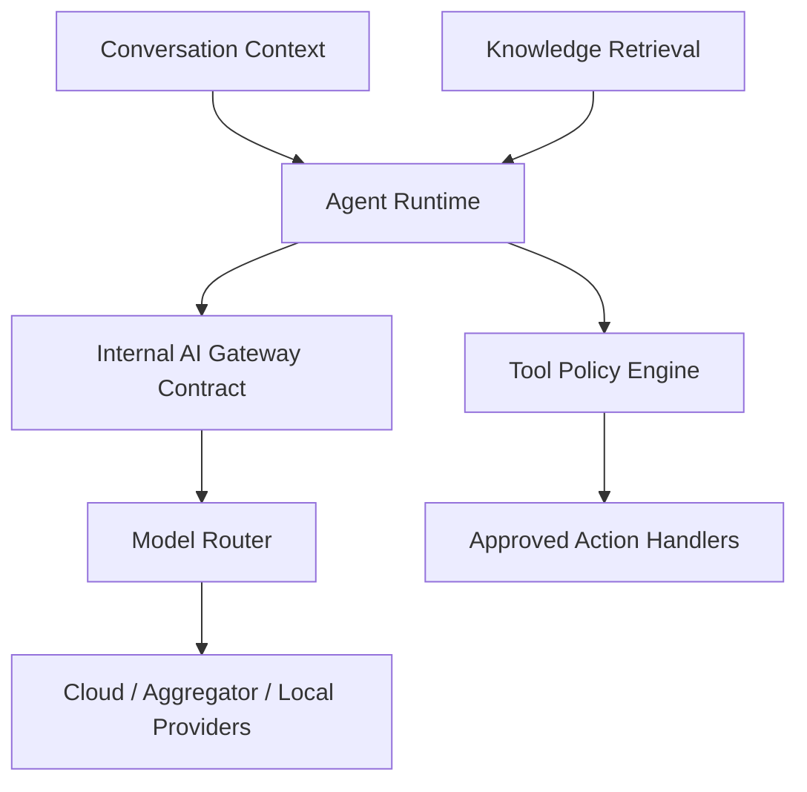
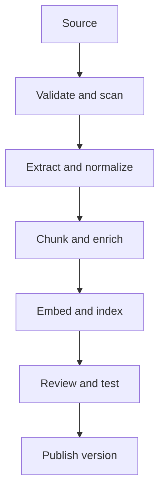

# AI Agent, Model Gateway, and Knowledge Specification

## 1. Objectives

- Provider-neutral AI.
- Predictable, auditable behavior.
- Evidence-grounded answers.
- Safe tool use.
- Per-tenant budgets and privacy.
- Graceful fallback to human.
- Prompt/model changes tested before production.

## 2. Architecture

## 3. Internal AI Contract

### Request

| Field | Purpose |
|---|---|
| request_id | Idempotency/trace |
| tenant_id | Policy/budget boundary |
| task_type | CHAT, CLASSIFY, EXTRACT, EMBED, RERANK, VISION, TRANSCRIBE, TTS |
| model_alias | Logical model |
| content | Normalized multimodal parts |
| structured_output_schema | Optional required JSON |
| allowed_tools | Tool versions allowed |
| sensitivity | PUBLIC, INTERNAL, CONFIDENTIAL, RESTRICTED |
| latency_class | REALTIME, INTERACTIVE, BATCH |
| max_cost | Request ceiling |
| timeout | End-to-end model deadline |
| region_policy | Residency/region |
| trace_context | Correlation |

### Response

- normalized content parts;
- structured output;
- proposed tool calls;
- provider/deployment used;
- tokens/units/cost;
- latency/retries;
- finish reason;
- safety metadata;
- fallback chain;
- error classification.

Core never persists provider-specific response as the business contract.

## 4. Provider Registry

Provider types include:

- OpenAI;
- Azure OpenAI/AI Foundry;
- Anthropic;
- Google Gemini/Vertex;
- AWS Bedrock;
- Mistral;
- Cohere;
- Groq;
- xAI;
- OpenRouter;
- other native providers;
- OpenAI-compatible endpoint;
- Ollama;
- vLLM/private endpoint;
- custom non-compatible adapter.

New provider requires adapter tests and capability manifest, not core code change.

## 5. Model Deployment Capabilities

- text input/output;
- image input;
- audio input/output;
- streaming;
- tool calling;
- strict structured output;
- embeddings;
- rerank;
- context limit;
- max output;
- regions;
- retention/training policy;
- rate limits;
- cost;
- quality/evaluation tags.

## 6. Logical Model Aliases

| Alias | Use | Required |
|---|---|---|
| cs-fast | Common FAQ/routing | Low latency, tools, Indonesian |
| cs-quality | Complex service | High evaluation score |
| lead-extractor | Lead schema | Strict structured output |
| intent-classifier | Routing | Stable classification |
| vision-product | Image/product evidence | Vision |
| transcription-id | Voice note | Indonesian STT |
| embedding-default | Knowledge indexing | Versioned dimensions |
| rerank-default | Hybrid retrieval | Rerank |
| summary-default | Conversation summary | Cost-efficient |

Tenant chooses policy/tier; physical deployment remains replaceable.

## 7. Routing Policy

Order:

1. Tenant allow/deny list.
2. Sensitivity/region.
3. Capability.
4. Evaluation quality floor.
5. Latency class.
6. Budget.
7. health/rate limit.
8. weighted primary.
9. same-model fallback.
10. cross-provider evaluated fallback.
11. deterministic response or handover.

Cross-provider fallback is allowed only when output/tool behavior passes the same evaluation suite.

## 8. Agent Runtime

### Inputs

- published Agent Profile;
- recent message window;
- structured conversation summary;
- verified contact/lead/booking/order/payment/shipment context;
- retrieved evidence;
- channel capability/window;
- allowed tools;
- human takeover state;
- language/tone.

### Decision outputs

- answer;
- clarification question;
- tool proposal;
- handover;
- no-op/wait;
- internal classification/field extraction.

### Hard rules

- HUMAN_ACTIVE means no outbound AI.
- No evidence for tenant-specific fact means ask, qualify, or handover.
- AI cannot override consent, permission, entitlement, approval, or state.
- AI never receives unrestricted database access.
- Tool result is untrusted and validated.

## 9. Conversation Context

Context layers:

1. System safety/base policy.
2. Tenant Agent Profile.
3. Channel constraints.
4. Structured customer/business facts.
5. Recent conversation turns.
6. Retrieved knowledge evidence.
7. Allowed tools and schemas.

Token budget allocation is configurable by model alias.

Long-term memory:

- only approved fields;
- source and timestamp;
- expiry;
- correction flow;
- never store speculative sensitive traits.

## 10. Prompt Lifecycle

States:

DRAFT → REVIEW → EVALUATED → CANARY → PUBLISHED → ROLLED_BACK/ARCHIVED.

Prompt release contains:

- immutable instruction;
- variable schema;
- associated agent/tool policy;
- supported aliases;
- evaluation result;
- owner;
- release notes;
- rollback target.

No production prompt edited in place.

## 11. Knowledge Ingestion

Stages:

- source authorization;
- file/MIME/malware check;
- extraction;
- language detection;
- metadata/effective date;
- chunking;
- embedding;
- hybrid index;
- review;
- publish.

## 12. Retrieval

Query process:

1. Rewrite only when useful; preserve customer intent.
2. Apply tenant, visibility, language, effective-date filters.
3. Full-text + vector candidates.
4. Rerank.
5. Diversity/dedup.
6. Minimum evidence threshold.
7. Return source/chunk IDs and excerpts.

No cross-tenant global retrieval. Global platform knowledge is a separate approved namespace and never contains tenant data.

## 13. Grounded Answer Policy

Tenant-specific claims such as price, stock, policy, schedule, order, payment, or shipment status require:

- published evidence or verified tool result;
- freshness within policy;
- no unresolved conflict.

If not:

- state limitation;
- ask clarification;
- offer human;
- never invent.

## 14. Tool Catalog

| Tool | Risk | Default |
|---|---|---|
| SearchKnowledge | Low | Auto |
| SearchProduct | Low | Auto |
| GetInventory | Low | Auto |
| GetOrder | Medium | Identity check |
| CheckAvailability | Low | Auto |
| CreateAppointment | Medium | Customer confirmation |
| RescheduleAppointment | Medium | Customer confirmation |
| CancelAppointment | Medium | Confirmation |
| CreateLead/UpdateLead | Low/Medium | Schema/policy |
| CreateInvoiceDraft | Medium | Rule/confirmation |
| SendInvoice | High | Approval as configured |
| GetPaymentStatus | Low | Auto after customer/order identity check |
| CreatePaymentLink | Medium | Approved amount/source + confirmation/rule |
| CancelPaymentRequest | Medium/High | State recheck + confirmation |
| RequestRefund | High | Human eligibility/approval |
| ExecuteRefund | Critical | Disabled for AI; recent auth + strong approval |
| GetShipmentStatus/GetTrackingTimeline | Low | Auto after identity check; redact private fields |
| GetProofOfDelivery | Medium | Restricted identity/role + audit |
| CreateShipment/SchedulePickup | High | Validated address/cost + human approval |
| CancelShipment/CreateReturnShipment | High | Eligibility/state recheck + approval |
| Reserve/UpdateInventory | High | Human approval |
| CancelOrder/RequestRefund | Critical | Strong approval |
| SendFollowUp | Medium/High | Consent/window |
| HandoverToHuman | Low | Auto |

## 15. Tool Execution Contract

1. Model proposes tool + JSON arguments.
2. Schema validation.
3. Resolve tenant and current entity.
4. Re-check state/version.
5. Policy and entitlement.
6. Consent/identity/confirmation.
7. Approval if required.
8. Create idempotent ActionRequest.
9. Execute handler/workflow.
10. Validate result.
11. Save audit/usage/metric.
12. Agent communicates result without overstating.

Payment/logistics-specific execution rules:

- price, amount, currency, discount, tax, merchant, address, courier, and service are never accepted from unconstrained model text;
- payment evidence is a verified provider webhook/query, never redirect, screenshot, OCR, or customer claim;
- tracking status/ETA comes from a provider result with source and freshness;
- guessed tracking number alone cannot authorize contact, address, order-item, or proof-of-delivery disclosure;
- uncertain external mutations remain RECONCILING and cannot invite a duplicate retry;
- refund, payout, recurring mandate, split settlement, label purchase, pickup, cancel-after-handoff, and return execution are unavailable until entitlement/policy gates pass.

## 16. Multimodal

### Image

- product/photo understanding;
- receipt/reference extraction;
- OCR;
- do not identify sensitive traits;
- image retained by policy.

### Audio

- transcribe first;
- language/time offsets/confidence where available;
- show transcript to human agent;
- original access permission-controlled.

### Document

- isolated extraction;
- source page reference;
- prompt injection treated as untrusted content;
- password/corrupt/unsupported flow.

## 17. Guardrails

- input/output size limits;
- prompt injection/content boundary;
- secret/PII redaction;
- tenant tool allowlist;
- structured output validation;
- URL/domain allowlist;
- prohibited/regulated topic policy;
- high-risk escalation;
- repetitive loop limit;
- maximum tool calls per turn;
- spend/token limits.

## 18. Evaluation Framework

### Dataset categories

- FAQ grounded answers;
- no-answer/handover;
- adversarial prompt injection;
- tool selection;
- structured extraction;
- multilingual Indonesian/English;
- image/audio/document;
- sensitive data;
- channel policy;
- payment-link/status/refund policy;
- shipment tracking/ETA/privacy/exception policy;
- vertical-specific cases.

### Metrics

- answer correctness;
- evidence support;
- unsupported claim;
- tool selection/input validity;
- handover precision/recall;
- structured output validity;
- latency;
- cost;
- tone/policy.

### Release floor

- zero regression on critical safety suite;
- schema validity target met;
- quality not below current published release;
- cost/latency within budget;
- canary success before full rollout.

## 19. Observability

Trace links:

- tenant;
- conversation/message;
- prompt release;
- alias/deployment;
- retrieved chunks;
- tool proposals/actions;
- tokens/cost;
- latency/fallback;
- evaluator score;
- human feedback.

Raw trace access is restricted and retention-limited.

## 20. Cost Controls

- per-tenant monthly budget;
- per-request ceiling;
- alias tier;
- route simple tasks to smaller model;
- cache embeddings and deterministic safe outputs where valid;
- prevent repeated retries;
- audio/image size limits;
- alert at threshold;
- fail to safe model/handover rather than unbounded spend.

## 21. AI Acceptance Tests

- provider swap preserves internal response contract;
- wrong capability never selected;
- restricted tenant policy blocks provider;
- tool schema invalid never executes;
- AI cannot invent amount/discount/tax or mark a payment paid from screenshot/redirect;
- AI cannot reveal another customer’s shipment or full address from a guessed tracking reference;
- stale/unknown shipment status produces transparent freshness/handover rather than an invented ETA;
- payment/shipment mutation cannot bypass entitlement, state recheck, confirmation, approval, idempotency, or reconciliation;
- human takeover blocks AI send;
- no-evidence scenario does not hallucinate;
- prompt injection document cannot expand tool access;
- fallback trace/cost captured;
- model release rollback works;
- tenant budgets isolate noisy tenant.
