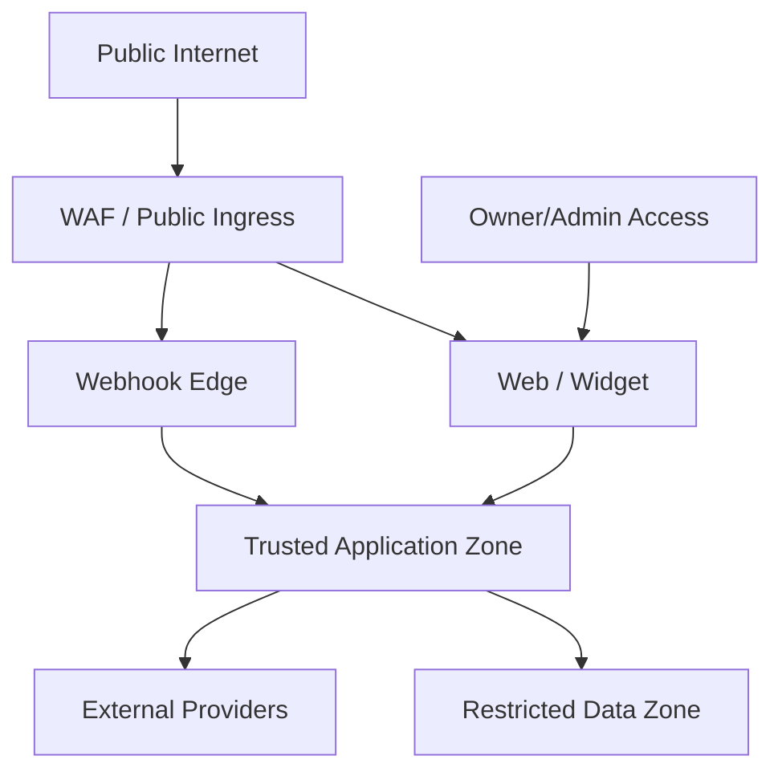

# Security, Privacy, and RBAC Specification

## 1. Security Objectives

1. Zero cross-tenant data exposure.
2. Internal Control Panel inaccessible to client identities.
3. Least privilege for users, services, database roles, connectors, and AI tools.
4. Sensitive data encrypted and excluded from logs.
5. External actions authenticated, authorized, idempotent, and auditable.
6. Data lifecycle supports consent, retention, export, correction, and deletion.
7. Security controls align with OWASP ASVS Level 2 target and API Security risks.

## 2. Trust Boundaries

Boundary transitions require authentication/verification, validation, rate limit, trace, and least privilege.

## 3. Identity Architecture

### 3.1 Separate audiences

| Audience | App | Allowed identities |
|---|---|---|
| owner-console | Internal Control Panel | Platform internal roles |
| client-portal | Client Portal | Tenant memberships |
| widget | Website widget | Short-lived visitor sessions |
| service | Internal APIs | Workload identities |

Token issued for client-portal is invalid on owner API even if the same person email exists.

### 3.2 MVP owner-only policy

- Exactly one active PLATFORM_OWNER assignment.
- No public/internal UI to create a second Platform Owner.
- PLATFORM_ADMIN, SUPPORT, BILLING, AUDITOR assignments disabled by feature flag.
- Enabling internal team roles requires ADR/security review.
- Owner MFA mandatory.
- Owner recovery produces high-severity audit/notification.
- Owner session maximum lifetime shorter than client session.
- Sensitive actions require recent authentication.

Concrete MVP baseline:

- owner session: 8-hour absolute lifetime, 30-minute idle timeout, 10-minute access token;
- client session: 12-hour absolute lifetime, 60-minute idle timeout, 15-minute access token;
- recent authentication window: 10 minutes;
- session recovery revokes the active token family and applies a 24-hour critical-action cooldown;
- owner registers at least two phishing-resistant authenticators and stores single-use recovery codes offline;
- total authenticator loss requires the audited two-custodian break-glass runbook;
- sole-owner self-approval is restricted to reversible changes with recent authentication and a reason;
- emergency kill switches may be used unilaterally; irreversible global critical actions remain disabled without an independent approver;
- tenant-scoped high-risk actions require Client Owner approval according to the action policy.

## 4. Role Matrix

Legend: M manage, A approve, W write, R read, — no access.

### 4.1 Internal

| Resource | Platform Owner | Future Admin | Future Support | Future Billing | Future Auditor |
|---|---:|---:|---:|---:|---:|
| Platform settings | M | W | — | — | R |
| Tenants | M | M | R | R | R |
| Tenant content | Time-bound R/M | Time-bound | Time-bound R | — | Metadata only |
| Channels/connectors | M | M | W | — | R |
| AI providers/secrets | M | W, no plaintext | — | — | Metadata |
| Usage/billing | M | R | — | M | R |
| Reliability/DLQ | M | M | W | — | R |
| Security audit | M | R | Scoped | Scoped | R |
| Privileged access | M/A | Request | Request | — | R |

Only Platform Owner column is active for MVP.

### 4.2 Client

| Resource | Owner | Admin | Manager | Agent | Analyst | Viewer |
|---|---:|---:|---:|---:|---:|---:|
| Tenant profile | M | W | R | R | R | R |
| Team/roles | M | M | R | — | — | — |
| Channels | M | W guarded | R | — | — | — |
| Inbox | M | M | M | Assigned W | R masked | R masked |
| Contacts | M | M | W | Scoped W | R masked | — |
| Leads | M | M | M | Scoped W | R | R |
| Knowledge | M | M | W | R | R | R |
| AI behavior | M guarded | W guarded | R | — | — | — |
| Booking | M | M | M | W | R | R |
| Commerce | M | M | W/A by policy | Scoped R/W | R | R |
| Payments | M/A + recent auth | Guarded W/A | Threshold approval | Scoped read/proposal | R masked | Aggregate only |
| Shipments | M | M | W/A by policy | Scoped read/exception W | R masked | Aggregate only |
| Proof of delivery | Guarded R | Guarded R | Guarded R | Assigned/scoped R | — | — |
| Automations | M | W safe params | Pause/R | — | R | R |
| Analytics | M | M | R | Scoped R | R/export | R |
| Usage/billing | M | R | — | — | — | — |
| Exports | M | M | By policy | — | By policy | — |

## 5. Authorization Model

Authorization evaluates:

- token audience;
- user/service status;
- platform role or tenant membership;
- tenant;
- resource ownership;
- permission;
- entitlement;
- object state/version;
- data masking;
- approval/risk;
- recent authentication.

Frontend permission is UX only; backend is authoritative.

## 6. Tenant Isolation Controls

- tenant_id NOT NULL on business tables;
- PostgreSQL RLS default-deny;
- runtime role not owner/BYPASSRLS;
- composite tenant foreign keys;
- explicit tenant transaction context;
- cache/queue/object prefixes;
- search/vector tenant filter;
- per-tenant export;
- isolation tests in CI and staging.

Owner cross-tenant access:

1. owner selects tenant;
2. session obtains short-lived scoped context;
3. sensitive content requires reason;
4. read audited;
5. context visibly displayed in UI.

## 7. Authentication Controls

- OIDC/OAuth 2.1-compatible identity provider.
- MFA for owner and optionally client privileged roles.
- Secure, HttpOnly, SameSite cookies for browser session.
- CSRF protection for cookie-auth mutations.
- PKCE/state for OAuth.
- Session rotation after authentication/role change.
- Logout/revocation.
- device/session management.
- brute-force and credential-stuffing defenses.
- recovery codes protected and single-use.
- refresh token rotates on each use; reuse revokes the token family.
- service tokens have a maximum five-minute lifetime, service-specific subject/audience, explicit permission scopes, and tenant scope where applicable.
- production workload identity uses an OIDC-compatible workload issuer; long-lived shared service API keys are prohibited.
- local/test identity simulation accepts only configured synthetic principals and fails closed in staging/production.

## 8. API Security

- schema validation and reject unknown critical fields;
- object-level authorization;
- property-level authorization/masking;
- rate limits by IP, identity, tenant, endpoint;
- idempotency;
- request/body size limits;
- SSRF-safe URL fetch;
- allowlisted CORS/origins;
- no stack trace to client;
- secure pagination/filtering;
- audit sensitive reads/mutations.

## 9. Webhook Security

- signature/timestamp/challenge;
- secret rotation;
- replay window;
- duplicate handling;
- opaque endpoint key;
- IP allowlist only as supplemental control;
- fast persist/ack;
- raw payload restricted;
- malformed payload quarantine.
- provider-account-scoped event identity for payment/shipping webhooks;
- redirect/browser callback never treated as payment proof;
- authenticated reconciliation when webhook is missing, delayed, weakly signed, or result is uncertain;
- unknown payment/shipment schema/status quarantined rather than guessed.

## 10. Secret Management

Secrets:

- provider API keys;
- OAuth tokens;
- webhook secrets;
- Community Gateway sessions;
- database/cache credentials;
- signing keys.
- payment merchant/gateway keys and webhook secrets;
- shipping/carrier/aggregator keys and webhook secrets;

Rules:

- secret manager/KMS;
- no plaintext in DB/log/trace;
- no secret returned after create;
- separate per environment;
- least scope;
- rotation and revocation;
- access audit;
- secret scanning in CI.

## 11. File and Media Security

- presigned upload;
- MIME sniffing;
- size/type policy;
- malware scan;
- archive traversal/decompression bomb limits;
- isolated extraction;
- no macro/script execution;
- image metadata stripping where needed;
- private object;
- short-lived download;
- CSP/sanitization for previews;
- retention deletion.

## 12. AI Security

- knowledge/content is untrusted data;
- prompt/tool boundaries;
- provider allowlist by sensitivity;
- PII minimization/redaction;
- no direct SQL/API;
- schema tools;
- tool limit;
- action approval;
- model output validation;
- trace access control;
- evaluation against prompt injection/data exfiltration.

## 13. Connector Security

- OAuth state/PKCE;
- minimal scopes;
- encrypted token;
- signature verification;
- response validation;
- rate limit;
- provider errors sanitized;
- no automatic trust of external role/tenant identifiers;
- Community Gateway isolated and high-risk.
- payment provider account is tenant-owned; platform does not expose/store raw card, CVV, PIN, OTP, or bank-login credentials;
- shipping lookup/mutation validates contact/order ownership and masks address/proof data;
- cost-bearing/destructive provider actions require current-state check, idempotency, approval, and reconciliation;
- marketplace payment/fulfillment truth is not silently overridden by a direct connector.

## 14. Privacy and PDP Operating Model

For every data category record:

- controller/processor role;
- purpose;
- legal basis/consent;
- source;
- recipients/subprocessors;
- region/transfer;
- retention;
- subject rights;
- security controls.

Client contract/DPA defines client vs platform responsibilities.

### Data subject flows

- access/export;
- correction;
- opt-out/withdrawal;
- deletion;
- restriction;
- complaint/escalation.

Identity must be verified before disclosing/deleting data.

## 15. Data Minimization

- Collect lead fields only when business purpose requires.
- Avoid full card/bank/identity numbers.
- Reject and redact card number, CVV, PIN, OTP, bank-login credentials, and sensitive hosted-payment tokens.
- Exclude full delivery address and proof-of-delivery artifact from general AI context, logs, analytics, and broad list views.
- Mask phone/email in broad views.
- Do not infer/store sensitive traits.
- Raw AI traces shorter retention.
- Analytics uses pseudonymous identifiers.
- Support access defaults to metadata, not content.

## 16. Audit Requirements

Audit:

- immutable/append-oriented;
- timestamp, actor, tenant, object, action, result;
- correlation and reason;
- before/after for guarded config;
- exportable to security review;
- retention longer than operational data.

High-risk events listed in UX spec must always be audited.

## 17. Threat Model

| Threat | Control |
|---|---|
| Client guesses another tenant UUID | RLS + object authorization + hidden 404 |
| Owner console exposed to client token | Separate audience/app/API |
| Webhook forged/replayed | Signature/timestamp/inbox dedup |
| Prompt injection triggers action | Content boundary + tool policy + approval |
| Malicious document compromises worker | Isolated processing + scan/limits |
| Secret appears in log | Structured redaction + tests |
| Noisy tenant exhausts capacity | Quota/fair queue/rate limit |
| Community session stolen | KMS isolation + no public gateway + revoke |
| SSRF via media URL | URL allowlist/DNS/IP validation/redirect limits |
| Mass export by compromised user | Role + recent auth + async audit + alert |
| Supply-chain package compromise | lockfile, SBOM, scanning, signed image |
| Forged payment webhook marks order paid | Signature/timestamp/inbox dedup + authenticated reconciliation + state precedence |
| Customer screenshot/redirect accepted as paid | Explicit non-authoritative evidence rule + verified provider status only |
| Duplicate charge/link/label after timeout | Idempotency + unknown-result state + reconcile before retry |
| Cross-tenant merchant/carrier credential use | Tenant-scoped secret reference, adapter context, RLS, audit, and integration tests |
| Guessed tracking number exposes address/order | Contact/order ownership verification + masking + rate limit + audit |
| Malicious proof-of-delivery file | Restricted reference, scan, short-lived access, CSP, and retention |
| AI issues unauthorized refund/return | Tool entitlement + state/eligibility + confirmation + approval + recent auth |

## 18. Security Testing

- SAST;
- dependency/container scan;
- secret scan;
- DAST;
- authorization matrix tests;
- RLS isolation tests;
- webhook replay/forgery;
- SSRF/file fuzzing;
- prompt injection/tool abuse;
- session/audience confusion;
- rate-limit/load abuse;
- penetration test before production-ready.
- payment/shipping webhook signature rotation, out-of-order/replay, prohibited credential fields, reconciliation, amount/currency integrity, and provider-account isolation;
- end-customer tracking enumeration, address/proof masking, and cost-bearing logistics approval;
- PCI-scope assessment and payment/legal/contract review before production payment launch.

## 19. Incident Response

Severity:

- SEV1: cross-tenant exposure, credential compromise, destructive unauthorized action.
- SEV2: major tenant/channel outage or suspected restricted-data issue.
- SEV3: limited degradation.
- SEV4: low-risk defect.

Immediate controls:

- revoke sessions/secrets;
- disable tenant/channel/provider/tool;
- pause outbound automation;
- preserve evidence;
- activate incident communication/legal workflow.

## 20. Security Launch Gate

- Owner MFA/recovery tested.
- Client token cannot access owner API.
- Wrong tenant tests pass across API/DB/search/object/export.
- Secrets absent from logs.
- Backup encrypted/restore tested.
- High-risk actions require approval.
- Community Gateway risk controls active.
- Payment uses hosted provider checkout; prohibited credentials cannot enter API/UI/log/trace.
- Paid/fulfilled outcomes require verified provider evidence and tested reconciliation.
- Payment and shipping accounts, events, queues, objects, exports, and metrics pass wrong-tenant tests.
- Refund/payout/split/recurring and shipment label/pickup/cancel/return actions remain disabled until their stage gates pass.
- Payment mismatch and shipment privacy/exception incident runbooks are exercised.
- Privacy/DPA/retention reviewed.
- Incident runbook exercised.
