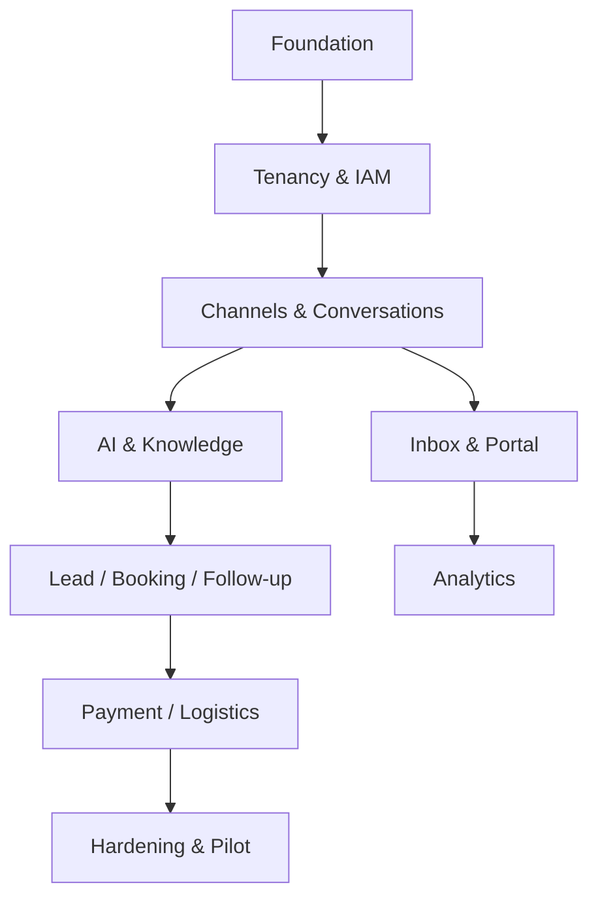

# Engineering Backlog and Delivery Plan

## 1. Delivery Assumption

Recommended squad:

- Founder/Product Owner;
- Principal/Tech Lead;
- 2 Backend Engineers;
- 1 Frontend Engineer;
- 1 Integration/Automation Engineer;
- 1 QA/SDET;
- shared DevOps/SRE and Product Designer.

Two-week iterations, trunk-based development, feature flags, contract-first.

## 2. Workstream Dependencies

## 3. Stage 0 — Foundation

### EPIC FND-01 Repository and CI

Deliverables:

- monorepo structure;
- local Compose;
- lint/type/test/build;
- environment config;
- container build;
- SBOM/security scans.

Acceptance:

- one command local boot;
- CI blocks failed checks;
- no secrets committed;
- preview/staging pipeline.

### EPIC FND-02 Contracts

- shared resource schemas;
- error contract;
- event envelope;
- OpenAPI generation;
- API client generation;
- compatibility CI.

### EPIC FND-03 Observability

- OpenTelemetry bootstrap;
- correlation IDs;
- structured redaction;
- baseline dashboards;
- Sentry/error capture.

### EPIC FND-04 Database Foundation

- migrations;
- UUID/time standards;
- owner/runtime roles;
- tenant transaction context;
- RLS test harness;
- outbox/inbox/idempotency.

Exit:

- synthetic wrong-tenant test fails closed;
- example mutation commits business + audit + outbox.

### EPIC FND-05 Payment and Logistics Discovery

Deliverables:

- no-custody/client-owned-account commercial and legal boundary;
- provider scorecards and one payment/shipping sandbox candidate;
- canonical state/error/capability/API/event contracts;
- hosted-checkout and tracking webhook/poll spikes;
- signature, deduplication, tenant isolation, unknown-result, and reconciliation proof;
- threat model, prohibited payment fields, address/proof privacy, and retention decision owners;
- feature flags, cost/support model, UX prototype, fixtures, and load assumptions.

Exit:

- duplicate event creates one logical transition;
- provider adapters can be swapped without changing AI/domain contracts;
- wrong-tenant provider account/resource fails closed;
- no card/CVV/PIN/OTP/bank-login data enters platform storage/logs;
- uncertain payment/shipment result can be reconciled safely.

## 4. Stage 1A — Tenancy, IAM, and Owner Console

### EPIC TEN-01 Owner Authentication

Stories:

- separate owner audience;
- Platform Owner seed;
- MFA;
- recovery;
- session/device list;
- recent-auth guard.

### EPIC TEN-02 Tenant Lifecycle

- tenant directory/detail;
- create wizard;
- status transitions;
- package/entitlement;
- onboarding checklist;
- suspend/deletion request.

### EPIC TEN-03 Client IAM

- invitation;
- memberships/roles;
- client session;
- tenant switcher;
- permission bootstrap;
- revoke/session invalidation.

### EPIC TEN-04 Audit

- mutation audit;
- sensitive read audit;
- owner tenant context;
- audit UI/filter/export permission.

Exit:

- clients cannot reach owner route/API;
- only Founder has internal role;
- two tenants operate without data crossing.

## 5. Stage 1B — Channel and Conversation Core

### EPIC CHN-01 Provider SDK

- connector contract;
- manifest;
- errors;
- health;
- secret references;
- rate limit.

### EPIC CHN-02 Meta Direct

- webhook verify;
- event normalization;
- outbound text/media;
- delivery status;
- templates/window guard;
- usage/cost;
- test account.

### EPIC CHN-03 Website Widget

- publish config;
- origin/session;
- text/media;
- realtime/poll fallback;
- handover;
- abuse controls.

### EPIC CHN-04 Community Gateway Pilot

- isolated deployment;
- QR/pairing;
- encrypted session;
- text/media;
- health;
- operator-only risk acceptance;
- migration dry-run.

Optional; does not block official MVP.

### EPIC CON-01 Contact and Identity

- contact;
- identity resolution;
- profile;
- consent/suppression;
- merge preview.

### EPIC CON-02 Conversation and Message

- state machine;
- messages/attachments;
- assignments;
- takeover/resume;
- internal notes;
- delivery;
- realtime events.

Exit:

- Meta inbound → stored conversation → human reply;
- duplicate webhook no duplicate message;
- Community failure isolated.

## 6. Stage 1C — Client Portal and Inbox

### EPIC UI-01 App Shell/Design System

- tokens/components;
- owner/client shells;
- responsive navigation;
- permission/feature gates;
- global states.

### EPIC INB-01 Unified Inbox

- list/filter;
- conversation timeline;
- composer;
- context panel;
- assignment;
- takeover;
- resolve/reopen;
- mobile flow.

### EPIC CUS-01 Customer 360

- profile/identities;
- timeline;
- consent;
- related lead/booking;
- masking.

### EPIC HOME-01 Client Home

- alerts;
- KPI cards;
- trend/funnel;
- freshness/definitions.

## 7. Stage 1D — AI, Knowledge, and Multimodal

### EPIC AI-01 AI Gateway

- internal request/response;
- LiteLLM adapter;
- two cloud providers;
- one compatible/local endpoint;
- aliases;
- routing/fallback/budget;
- traces.

### EPIC AI-02 Agent Runtime

- profile/release;
- context;
- decisions;
- human-state guard;
- structured output;
- handover.

### EPIC KB-01 Knowledge

- sources/documents;
- upload/sync;
- scan/extract/chunk/embed;
- hybrid retrieval;
- test/publish/rollback;
- citations.

### EPIC MED-01 Multimodal

- object pipeline;
- image;
- voice transcription;
- PDF/document extraction;
- unsupported/error UX.

### EPIC AI-03 Evaluation

- datasets;
- runner;
- critical suite;
- comparison;
- canary/rollback.

Exit:

- grounded FAQ;
- safe no-answer;
- provider fallback;
- prompt injection tool access denied;
- multimodal critical samples.

## 8. Stage 1E — Lead, Booking, and Follow-up

### EPIC SAL-01 Lead

- schema;
- extraction;
- qualification rules + AI;
- score version;
- pipeline/detail;
- assignment/alerts.

### EPIC CAL-01 Calendar

- OAuth;
- resources;
- free/busy;
- appointment state;
- create/reschedule/cancel;
- idempotency/reconciliation.

### EPIC AUT-01 Simple Follow-up

- definitions/versions;
- schedule;
- stop rules;
- consent/window;
- run history;
- pause.

Exit:

- inquiry → qualified lead → confirmed booking;
- follow-up stops on reply/opt-out;
- no duplicate event.

## 8A. Stage 1E2 — Optional Payment and Logistics Vertical Modules

These epics are implemented behind tenant entitlements. They do not block the core AI CS launch for tenants that do not buy them, but are mandatory for any pilot that enables the module.

### EPIC PAY-01 Hosted Payment Foundation

- tenant-owned provider/merchant connection and one adapter;
- hosted payment request/link for booking deposit, order, or invoice;
- immutable minor-unit amount/currency and authoritative source reference;
- verified webhook plus authenticated query/reconciliation fallback;
- state timeline, expiry, cancellation where supported, and uncertainty handling;
- stop payment reminder on verified terminal state;
- client payment page and owner operational health;
- audit, attribution, metrics, alerts, and kill switch;
- no refund execution, recurring mandate, payout, split payment, or stored payment method.

Exit:

- link → provider sandbox/live pilot → verified paid/expired state;
- redirect/screenshot cannot mark paid;
- duplicate/out-of-order events and timeout do not create duplicate or false state;
- payment account/data remain tenant-isolated.

### EPIC LOG-01 Read-Only Shipment Tracking

- tenant-owned shipping account and one adapter;
- link/import shipment from order/fulfillment;
- canonical status mapping and immutable tracking timeline;
- verified webhook plus state-aware polling fallback;
- customer identity/order verification for self-service lookup;
- proactive configured milestones and stop/dedup rules;
- stale/failed/lost/damaged/return exception queue;
- client shipment pages and owner provider/freshness health;
- metrics, alerts, reconciliation, and kill switch;
- no label purchase, pickup, cancellation, or return mutation.

Exit:

- linked shipment → tracking timeline → milestone and exception flow;
- duplicate/unknown/out-of-order provider events fail safely;
- guessed tracking reference cannot expose private/order/proof data;
- tracking data/provider accounts remain tenant-isolated.

## 9. Stage 1F — Analytics, Usage, and Operations

### EPIC REP-01 Metric Pipeline

- metric events;
- aggregates;
- definitions;
- late/dedup;
- freshness.

### EPIC REP-02 Client Analytics

- service;
- sales;
- booking;
- AI quality;
- usage;
- filters/export permission.

### EPIC USE-01 Usage/Cost

- model/channel/media usage;
- pricing version;
- quota/budget;
- owner cost view;
- reconciliation.

### EPIC OPS-01 Reliability

- queue/DLQ;
- provider health;
- incidents;
- backup status;
- kill switches;
- runbook links.

## 10. Stage 1G — Hardening and Pilot

### EPIC SEC-01 Security Hardening

- authorization/RLS suite;
- file/SSRF;
- secrets;
- DAST;
- audit review;
- privacy/retention.

### EPIC PERF-01 Performance

- MVP load profile;
- noisy tenant;
- queue/backpressure;
- realtime fan-out;
- slow query/index.

### EPIC DR-01 Recovery

- backup restore;
- outbox reconciliation;
- incident exercise;
- rollback.

### EPIC PILOT-01 Design Partners

- onboarding playbook;
- tenant templates;
- scripted UAT;
- shadow mode;
- feedback;
- go-live gate.

## 11. Suggested Iteration Sequence

| Iteration | Focus |
|---:|---|
| 0 | Repo, CI, contracts, local infra |
| 1 | DB/RLS, owner auth, tenant skeleton |
| 2 | Tenant lifecycle, client IAM, audit |
| 3 | Channel SDK, Meta webhook, conversation |
| 4 | Outbound/status, widget, realtime |
| 5 | Inbox and takeover |
| 6 | AI Gateway, agent runtime |
| 7 | Knowledge ingestion/retrieval |
| 8 | Multimodal and AI evaluation |
| 9 | Leads |
| 10 | Calendar |
| 11 | Follow-up |
| 12 | Optional hosted payment + read-only shipment tracking vertical slice |
| 13 | Analytics/usage/owner operations, including enabled payment/logistics modules |
| 14 | Security/performance/DR |
| 15 | Pilot hardening/go-live |

Parallelize frontend after API contracts and fixtures are stable. Community Gateway can run as a non-blocking integration workstream. Payment/logistics iteration may run as an independent vertical squad only after Stage 0 contracts, tenancy, policy, webhook, and reconciliation foundations are accepted.

## 12. Story Template

Every story includes:

- user/outcome;
- requirement tag;
- scope/non-scope;
- route/screen;
- permission/entitlement;
- API/event;
- data/audit/metric;
- loading/empty/error;
- security/privacy;
- acceptance;
- tests;
- rollout/flag.

## 13. Definition of Ready

- outcome and acceptance clear;
- design/route ready;
- permission known;
- contract/schema reviewed;
- dependency known;
- test data available;
- observability/metric defined;
- no unresolved architecture decision.

## 14. Definition of Done

- implemented and reviewed;
- automated tests;
- tenant/permission tests;
- accessibility for UI;
- logs/traces/metrics/audit;
- docs/contracts updated;
- migration/rollback;
- security scan;
- staging UAT;
- feature flag/config;
- runbook if operational.

## 15. MVP Go-Live Checklist

- owner MFA and client RBAC;
- tenant isolation;
- Meta Direct live account;
- website widget;
- inbox/handover;
- AI/knowledge/multimodal;
- lead/calendar/follow-up;
- hosted-payment and shipment-tracking gates for each tenant that enables those optional modules;
- dashboards/usage;
- backup/restore;
- alerts/runbooks;
- privacy/consent;
- load test;
- no open blocker/critical;
- design partner sign-off;
- payment/shipping provider, client source-of-truth, legal/privacy, approval, and escalation ownership documented.

## 16. Post-MVP Priority Rule

Score initiative by:

- client/revenue evidence;
- frequency;
- outcome impact;
- risk/compliance;
- implementation/operations cost;
- reuse across tenants;
- external approval certainty.

Do not prioritize a connector solely because it is technically interesting.

## 17. Stage 2 — Growth Epics

### EPIC GRW-01 Durable Workflow and Approval

- Temporal deployment/observability;
- versioned payment collection, refund request, shipment creation/return, and exception workflows;
- signals, timers, compensation, manual approval, migration, and replay safety;
- business-hours/consent/channel-policy recheck at every outbound step.

### EPIC PAY-02 Payment Expansion

- second payment adapter to prove portability;
- partial/deposit payment and richer invoice/accounting sync;
- approved refund execution and status reconciliation;
- settlement/report import where provider supports it;
- approval thresholds, recent authentication, finance-role views, and mismatch queue;
- provider-specific cost/usage/attribution analytics.

Exit:

- provider swap does not change canonical request/transaction contracts;
- refund cannot execute without eligibility, approval, idempotency, and reconciliation;
- daily reconciliation closes or assigns every mismatch.

### EPIC LOG-02 Logistics Actions

- second shipping adapter or marketplace fulfillment connector;
- rate quote and service selection;
- shipment/label creation and secure artifact access;
- pickup scheduling and eligible pre-handoff cancellation;
- multi-package, partial fulfillment, warehouse/location mapping;
- return request/return shipment and proof-of-delivery;
- exception assignment/SLA and customer communication templates.

Exit:

- timeout after create never purchases duplicate label/pickup;
- cost/impact summary and approval precede mutation;
- order/shipment/package/return states reconcile with provider truth.

### EPIC GRW-02 Omnichannel Commerce

- Instagram approved capabilities;
- CRM/helpdesk connectors;
- product/SKU/inventory/order read-first sync;
- Shopee/TikTok Shop projection where official scopes permit;
- vertical templates and repeatable onboarding.

Stage 2 exit gate:

- onboarding is template-driven rather than copied workflow;
- Temporal/connector/provider incidents have dashboards and runbooks;
- all new write actions pass policy, tenant, approval, idempotency, and reconciliation suites;
- at least two paying tenants validate each promoted module or Founder explicitly accepts the evidence exception.

## 18. Stage 3 — Production-Ready Epics

### EPIC PRD-01 High Availability and Capacity

- multi-AZ API/webhook/workers/database/cache;
- payment and logistics workload isolation/autoscaling;
- provider-account fair queues, backpressure, and circuit breakers;
- forecast-based load/soak tests and capacity review.

### EPIC PRD-02 Reconciliation and Data Integrity

- continuous uncertainty reconciliation and daily completeness checks;
- financial mismatch aging/ownership/close report;
- shipment webhook-gap, stale-state, and unknown-mapping controls;
- restore-time provider re-query and integrity verification;
- immutable audit and correction workflow; no direct production fixes.

### EPIC PRD-03 Security, Privacy, and Compliance

- penetration test and remediation;
- PCI-scope assessment for hosted checkout;
- payment licensing/provider/merchant-contract review;
- privacy/DPA/retention review for transaction, address, and proof data;
- secret rotation, access review, SSO/SAML/SCIM tier, SBOM, and signed images;
- high-risk action approval and break-glass exercises.

### EPIC PRD-04 SRE and Contract Readiness

- final SLI/SLO/error budgets and provider exclusions;
- status page, on-call, incident communications, and client support SLA;
- backup/PITR/DR with measured RPO/RTO;
- payment mismatch, webhook backlog, provider credential, shipment stale/exception, and data-exposure exercises;
- adapter certification, canary, rollback, feature/tool/provider kill switches.

Stage 3 exit gate:

- 99.9% platform baseline validated for in-scope services;
- zero unresolved Blocker/Critical security, cross-tenant, false-paid, duplicate-side-effect, or restricted-data findings;
- recovery, mismatch, and provider-outage exercises meet targets;
- dashboards, freshness, metric definitions, audit, exports, retention, and support ownership are contract-ready;
- every live provider/account has a certified adapter version, owner, scopes, contact, runbook, and renewal/rotation alert.

## 19. Stage 4 — Full-Feature Expansion Epics

### EPIC FUL-01 Advanced Payments

- recurring mandate/subscription where allowed;
- partial refunds and dispute/chargeback operations;
- advanced accounting/settlement reporting;
- explicit merchant-approved provider selection/routing;
- split payout/submerchant/marketplace money movement only under separately accepted legal/compliance architecture.

### EPIC FUL-02 Advanced Logistics

- dynamic rate shopping/routing policy;
- multi-warehouse and multi-package fulfillment orchestration;
- pickup optimization, return portal, claims, and reverse logistics;
- predictive ETA/exception risk as advisory output with measured quality and provider truth retained.

### EPIC FUL-03 Platform Ecosystem

- visual automation builder with simulation/versioning/approval;
- connector SDK, partner API, webhook subscriptions, and integration marketplace;
- white-label/custom domains;
- regional/dedicated deployments and private AI endpoints;
- advanced revenue attribution, forecasting, workforce, and fulfillment analytics.

Stage 4 is continuous expansion. Every capability still follows entitlement and may remain disabled for tenants that do not need it.

## 20. Phase Dependency and Promotion Rules

| Promotion | Required evidence |
|---|---|
| Stage 0 → Stage 1 | Contracts, tenant proof, provider sandbox, threat model, unknown-result reconciliation, UX/test fixtures |
| Stage 1 → Stage 2 | Paying-pilot outcome, no critical isolation/duplicate issue, support-cost evidence, stable canonical adapter |
| Stage 2 → Stage 3 | Forecast load, durable workflows, two-provider/connector evidence where required, security/compliance plan |
| Stage 3 → Stage 4 | Contract-ready SLO/DR/security, reliable unit economics, operational ownership, legal approval for regulated expansion |

No phase promotion occurs only because code is feature-complete. Product outcome, security, reconciliation, provider contract, support load, and operational evidence are part of the gate.
