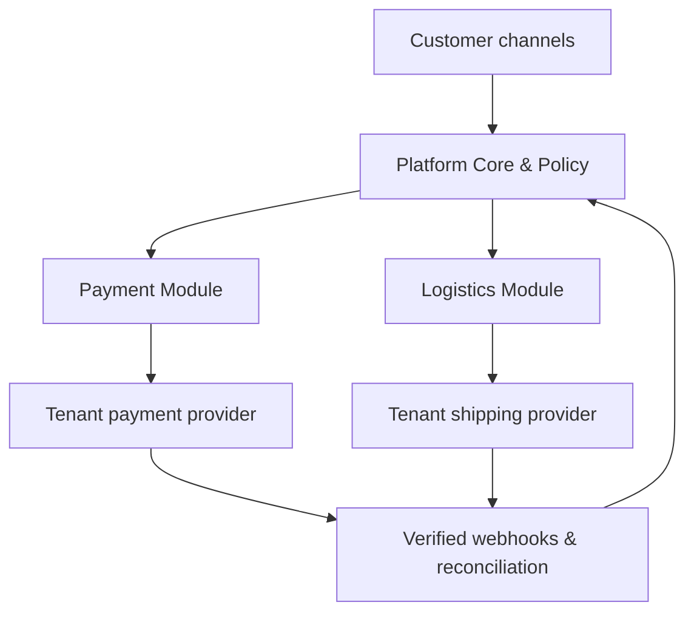

# Payment and Logistics Specification

## 1. Document Status

| Metadata | Value |
|---|---|
| Status | Implementation-ready architecture baseline |
| Version | 1.2 |
| Date | 15 July 2026 |
| Scope | Payment orchestration, shipment creation, and shipment tracking |
| Architecture | Optional tenant capabilities inside the modular platform |
| Production principle | Client-owned provider accounts; provider remains transaction source of truth |

This document defines two optional modules:

1. **Payment Orchestration** closes the journey from conversation, lead, booking, order, or invoice to verified payment.
2. **Logistics & Shipment Tracking** closes the journey from order fulfillment to delivery, exception handling, and returns.

Both modules are disabled by default per tenant. AI Customer Service, inbox, knowledge, lead, and booking continue to work when either module is not enabled.

## 2. Locked Decisions

1. The platform does not hold, pool, settle, or forward customer funds.
2. Each tenant connects its own merchant/payment-gateway account unless a later legally reviewed commercial model is approved.
3. MVP payment uses provider-hosted checkout/payment links. Card number, CVV, PIN, OTP, and banking credentials never enter platform chat, forms, logs, or storage.
4. A payment is not marked paid from a screenshot, redirect alone, or customer claim. It requires a verified provider webhook and/or authenticated server-to-server reconciliation.
5. Each tenant connects its own carrier, shipping aggregator, fulfillment, or marketplace account.
6. MVP logistics is read-first: import/link a shipment, fetch tracking, normalize events, and notify. Shipment purchase, label, pickup, and return mutations arrive after the tracking foundation is stable.
7. Marketplace-owned payment and fulfillment remain sourced from the marketplace API. The platform stores a canonical projection and does not attempt to replace marketplace settlement.
8. Provider SDK types never leak into core entities. Payment and shipping providers implement internal adapters and capability manifests.
9. Every external side effect is idempotent, audited, tenant-scoped, policy-checked, and reconcilable.
10. Refunds, payouts, split payments, recurring mandates, shipment cancellation after handoff, and return creation are high-risk capabilities with explicit rollout gates.

## 3. Product Scope

### 3.1 Payment use cases

- booking deposit or full payment;
- direct-sale payment link from WhatsApp or website;
- invoice collection and reminder;
- order payment status lookup;
- stop follow-up after verified payment;
- revenue attribution to conversation, lead, campaign, booking, or order;
- later: partial payment, refund, subscription, dispute, and accounting reconciliation.

### 3.2 Logistics use cases

- customer asks, “Paket saya sudah sampai mana?”;
- proactive shipment milestone notifications;
- delivery exception and stale-shipment alert;
- multiple parcels for one order and partial fulfillment;
- proof-of-delivery display where provider permits;
- later: rate quote, courier selection, shipment purchase, label, pickup, cancellation, return, and claims.

### 3.3 Non-goals through Stage 3

- becoming a licensed payment processor, wallet, remittance provider, or payment custodian;
- capturing raw card/bank authentication data;
- maintaining an internal financial ledger as a replacement for the gateway or client accounting system;
- guaranteeing courier ETA when the provider does not supply one;
- treating customer-uploaded payment or delivery evidence as authoritative;
- bypassing marketplace fulfillment/payment controls;
- providing unreviewed cross-border payment, payout, or customs functionality.

## 4. Architecture and Trust Boundaries

Payment and Logistics are domain modules in the modular monolith. Provider calls run through connector workers. Dedicated worker processes may be deployed without splitting the domain into microservices.

### 4.1 Components

| Component | Responsibility |
|---|---|
| Payment Domain | Payment request, attempt, status, refund request, attribution, and reconciliation state |
| Logistics Domain | Shipment, package, tracking event, proof, exception, return relation, and fulfillment projection |
| Tool Policy Engine | Entitlement, actor, customer confirmation, identity, amount, state, approval, and risk checks |
| Provider Adapter | Authentication, capability discovery, request mapping, webhook normalization, query, mutation, and reconciliation |
| Webhook Edge | Signature/timestamp verification, fast persist/ack, deduplication, and quarantine |
| Reconciliation Worker | Authenticated status query for missing, late, uncertain, or conflicting events |
| Automation Engine | Reminder, expiry, deposit deadline, milestone notification, exception escalation, and stop rules |
| Notification Service | Channel-policy-aware customer and client notifications |
| Analytics Pipeline | Canonical payment/shipment facts and tenant dashboards |

### 4.2 Source-of-truth matrix

| Object | Authoritative source | Platform responsibility |
|---|---|---|
| Invoice number/tax | Client ERP/accounting or approved invoice service | Store reference, projection, and workflow status |
| Payment transaction | Connected payment gateway/merchant account | Orchestrate request, verify status, reconcile, and attribute |
| Marketplace payment | Marketplace | Read normalized status only unless official scope permits action |
| Order | Client commerce/ERP/marketplace | Store canonical projection and links |
| Shipment/tracking | Carrier, aggregator, fulfillment provider, or marketplace | Normalize timeline, notify, detect exceptions, and reconcile |
| Customer conversation | Platform | Link verified business outcomes to the conversation/contact |

If two sources conflict, the authoritative source wins and the platform records a reconciliation mismatch rather than silently overwriting history.

## 5. Provider Account and Capability Model

Every connection is tenant-owned and environment-specific.

Required provider-account metadata:

- tenant and connector instance;
- provider key, adapter version, and live/sandbox environment;
- external merchant/store/account identifier;
- secret-manager reference, never plaintext credentials;
- effective scopes/capabilities;
- webhook subscription and signing-key version;
- health, last successful call, last webhook, and token expiry;
- rate limits, currency/market support, and configured source-of-truth role;
- risk and SLA class.

Effective capabilities are:

`adapter capability ∩ account scope ∩ provider account state ∩ tenant entitlement ∩ tool policy`.

An arbitrary client API is not called directly by the AI. A new API must be mapped through a reviewed adapter or a temporary n8n bridge that still invokes signed platform commands and returns a normalized result.

## 6. Payment Domain

### 6.1 Canonical entities

| Entity | Purpose |
|---|---|
| PaymentProviderAccount | Tenant-owned merchant/gateway connection |
| PaymentRequest | Amount requested for an invoice, order, booking, or standalone purpose |
| PaymentAttempt | One provider checkout/payment attempt for a request |
| PaymentTransaction | Provider-confirmed financial event/reference |
| PaymentWebhookEvent | Verified, deduplicated provider event |
| PaymentReconciliation | Comparison between platform projection and provider truth |
| RefundRequest | Approval workflow for a requested refund |
| Refund | Provider-confirmed refund projection; post-MVP |
| Dispute | Provider dispute/chargeback projection; later phase |

Money is stored as integer minor units plus ISO currency code. Amount, currency, and business reference become immutable after a provider attempt is created; correction creates a replacement request.

### 6.2 Payment state model

Payment request states:

`DRAFT → PENDING_CUSTOMER → PROCESSING → PAID`

Terminal/exception states:

- `EXPIRED`;
- `FAILED`;
- `CANCELLED`;
- `PARTIALLY_REFUNDED`;
- `REFUNDED`;
- `DISPUTED`.

Transitions are accepted only from a verified provider event, verified status query, or authorized local command whose effect is subsequently reconciled. Out-of-order events use provider event time plus state precedence and never regress `PAID` to `PENDING` without an explicit reversal/refund/dispute event.

### 6.3 Hosted-payment flow

1. Conversation, booking, order, or invoice supplies an authoritative amount and currency.
2. AI or user proposes `CreatePaymentLink` with a business reference, not free-form bank/card data.
3. Policy validates tenant, entitlement, customer identity, amount source, expiry, duplicate request, and required confirmation.
4. Platform creates an idempotent `PaymentRequest` and calls the tenant’s provider account.
5. Provider returns a hosted checkout link/token; platform sends it through an allowed channel.
6. Webhook Edge verifies and persists provider events before acknowledgement.
7. Payment worker updates canonical state and emits outbox events.
8. Reconciliation queries the provider when events are delayed, conflicting, or uncertain.
9. On `PAID`, the platform updates linked booking/order/invoice projection, stops applicable reminders, notifies parties, and records attribution.

### 6.4 Payment adapter contract

Required Stage 0/1 operations:

- `discoverCapabilities`;
- `createHostedPayment`;
- `getPaymentStatus`;
- `expireOrCancelPayment` where supported;
- `normalizeWebhook`;
- `verifyWebhook`;
- `reconcilePayment`;
- `healthCheck`.

Later operations:

- `createRefund` / `getRefundStatus`;
- recurring mandate/subscription operations;
- dispute retrieval/evidence references;
- settlement and accounting export retrieval.

### 6.5 Payment safety rules

- Amount is derived from an approved invoice/order/service catalog or a human-approved draft.
- AI cannot freely invent price, discount, tax, destination account, or currency.
- A redirect success page is customer UX only, not settlement proof.
- Webhooks require signature/timestamp verification where supported; otherwise use authenticated status queries and compensating controls.
- Duplicate creation uses tenant + operation + business reference + idempotency key.
- Unknown submit result is reconciled before retry to avoid duplicate charges/links.
- `ExecuteRefund`, payout, and split settlement are disabled for AI on MVP.
- Refund execution requires recent authentication, approval according to monetary threshold, audit, and provider reconciliation.
- Payment link output must show amount, currency, purpose, expiry, and merchant identity before the customer opens it.

## 7. Logistics and Shipment Domain

### 7.1 Canonical entities

| Entity | Purpose |
|---|---|
| ShippingProviderAccount | Tenant-owned carrier/aggregator/fulfillment connection |
| Shipment | One fulfillment movement linked to order/contact |
| ShipmentPackage | Parcel dimensions/weight/items; one shipment may have multiple packages |
| ShipmentItem | Quantity relationship between order item and shipment |
| TrackingEvent | Immutable normalized milestone with provider raw reference |
| DeliveryCommitment | Provider/client promised date or range and source |
| ProofOfDelivery | Restricted reference to signature/photo/name where available |
| ShipmentException | Operational issue, severity, owner, and resolution status |
| ReturnShipment | Relation to original shipment; post-MVP mutation |
| ShippingReconciliation | Comparison of canonical state with source provider |

One order can have multiple shipments. One shipment can contain multiple packages/items. Partial fulfillment is represented explicitly rather than forcing a single order-level delivery status.

### 7.2 Canonical shipment states

Happy path:

`CREATED → AWAITING_PICKUP → PICKED_UP → IN_TRANSIT → OUT_FOR_DELIVERY → DELIVERED`

Exception/terminal states:

- `ON_HOLD`;
- `DELIVERY_FAILED`;
- `ADDRESS_ISSUE`;
- `CUSTOMS_HOLD`;
- `LOST`;
- `DAMAGED`;
- `CANCELLED`;
- `RETURNING`;
- `RETURNED`;
- `UNKNOWN`.

Provider-specific codes are retained as diagnostic metadata and mapped to a versioned canonical taxonomy. An unrecognized code maps to `UNKNOWN` and opens a mapping alert; it must not be guessed by AI.

### 7.3 Tracking flow

1. Order/fulfillment sync, client user, or approved API creates/links a shipment with provider account and external reference.
2. Platform subscribes to provider events when available and schedules polling fallback based on shipment state.
3. Webhook/poll result is authenticated, deduplicated, normalized, and appended as a tracking event.
4. Logistics Domain computes current state without deleting prior events.
5. Automation evaluates milestone, duplicate-notification, business-hours, consent, and channel rules.
6. Customer and client receive allowed updates; delivery exceptions create actionable alerts/handover.
7. After delivery/return, polling is reduced or stopped and retention policy applies.

Customer lookup verifies tenant plus customer/order ownership. A guessed tracking number alone must not expose address, recipient name, order items, or proof of delivery.

### 7.4 Shipping adapter contract

Required Stage 0/1 operations:

- `discoverCapabilities`;
- `linkOrImportShipment`;
- `getShipment`;
- `getTrackingEvents`;
- `normalizeWebhook`;
- `verifyWebhook`;
- `reconcileShipment`;
- `healthCheck`.

Stage 2+ operations where supported:

- `quoteRates`;
- `createShipment`;
- `purchaseLabel`;
- `schedulePickup`;
- `cancelShipment`;
- `createReturnShipment`;
- `getProofOfDelivery`;
- `fileClaim`.

### 7.5 Logistics safety rules

- ETA is shown only with provider/source and freshness. The platform never fabricates a delivery date.
- Address correction, label purchase, pickup, cancellation, and return may create cost or operational impact and therefore require policy/confirmation.
- Unknown submit result is reconciled before another shipment/label is created.
- Proof-of-delivery access is role-checked, short-lived, audited, and masked where possible.
- Full address and recipient data are excluded from broad analytics, logs, and AI context unless needed for the current authorized action.
- Marketplace shipments use marketplace fulfillment truth when the marketplace owns the label and carrier relationship.

## 8. API Contract Additions

All mutations require `Idempotency-Key`; guarded mutations also require expected version, confirmation, approval, or recent authentication according to policy.

### 8.1 Client payment endpoints

| Method | Endpoint | Purpose |
|---|---|---|
| GET | `/tenants/:tenantId/payment-provider-accounts` | Connection capability/health metadata |
| POST | `/tenants/:tenantId/payment-requests` | Create draft/request according to policy |
| GET | `/tenants/:tenantId/payment-requests` | Filtered list |
| GET | `/tenants/:tenantId/payment-requests/:id` | Detail, attempts, timeline, reconciliation state |
| POST | `/tenants/:tenantId/payment-requests/:id/payment-links` | Create/refresh hosted link if eligible |
| POST | `/tenants/:tenantId/payment-requests/:id/cancel` | Cancel/expire if supported |
| POST | `/tenants/:tenantId/payment-requests/:id/reconcile` | Guarded refresh from provider |
| POST | `/tenants/:tenantId/payment-requests/:id/refund-requests` | Create approval request; post-MVP |

### 8.2 Client logistics endpoints

| Method | Endpoint | Purpose |
|---|---|---|
| GET/POST | `/tenants/:tenantId/shipments` | List or import/link shipment |
| GET | `/tenants/:tenantId/shipments/:id` | Shipment, packages, items, and timeline |
| POST | `/tenants/:tenantId/shipments/:id/reconcile` | Refresh from provider |
| GET | `/tenants/:tenantId/shipments/:id/proof-of-delivery` | Guarded short-lived reference |
| GET | `/tenants/:tenantId/shipment-exceptions` | Actionable exception queue |
| POST | `/tenants/:tenantId/shipment-exceptions/:id/resolve` | Resolve with reason |
| POST | `/tenants/:tenantId/shipments/:id/return-requests` | Request return; post-MVP |

Owner endpoints expose cross-tenant health, lag, failures, and reconciliation mismatch metadata, but do not expose unrestricted payment secrets, customer addresses, or proof-of-delivery content.

## 9. Events, Commands, and Queues

### 9.1 Canonical events

Payment:

- `payment_request.created`;
- `payment_link.created`;
- `payment.status_changed`;
- `payment.paid`;
- `payment.expired`;
- `payment.failed`;
- `payment.reconciliation_mismatch`;
- `refund.requested`, `refund.approved`, `refund.status_changed`.

Logistics:

- `shipment.created`;
- `shipment.linked`;
- `shipment.status_changed`;
- `shipment.tracking_event_recorded`;
- `shipment.delivered`;
- `shipment.exception_opened`;
- `shipment.exception_resolved`;
- `shipment.stale_detected`;
- `return.status_changed`.

### 9.2 Commands

- `CreatePaymentRequest`, `CreatePaymentLink`, `CancelPaymentRequest`, `ReconcilePayment`, `RequestRefund`;
- `LinkShipment`, `RefreshShipmentTracking`, `CreateShipment`, `SchedulePickup`, `CancelShipment`, `CreateReturnShipment`, `ResolveShipmentException`.

### 9.3 Workload isolation

| Queue | Priority | Notes |
|---|---:|---|
| payment-webhook | Highest | Persisted verified event processing |
| payment-command | High | Customer-visible creation and status actions |
| payment-reconciliation | Normal | Scheduled/query fallback with provider rate limits |
| logistics-webhook | High | Shipment milestones and exceptions |
| logistics-command | High | Tracking lookup and later mutations |
| logistics-poll | Normal | State-aware polling; bulk isolated from realtime |

Queues carry tenant and resource references, never provider credentials or full sensitive payloads.

## 10. AI Tool Policy

| Tool | Risk | Default policy |
|---|---|---|
| `GetPaymentStatus` | Low | Auto after customer/order identity check |
| `CreatePaymentLink` | Medium | Deterministic approved amount + customer confirmation/rule |
| `CancelPaymentRequest` | Medium/High | Confirmation; block if paid/processing where unsupported |
| `RequestRefund` | High | Human review and eligibility check |
| `ExecuteRefund` | Critical | Disabled for AI; recent auth + approval threshold |
| `GetShipmentStatus` | Low | Auto after identity check; redact private fields |
| `GetTrackingTimeline` | Low | Auto after identity check |
| `CreateShipment` | High | Human approval, validated address, rate/cost summary |
| `SchedulePickup` | High | Human approval or deterministic policy |
| `CancelShipment` | High | State recheck + confirmation |
| `CreateReturnShipment` | High | Eligibility + human approval |
| `GetProofOfDelivery` | Medium | Restricted role/identity and audited access |

AI communication rules:

- distinguish `payment link sent`, `payment processing`, and `payment confirmed`;
- never claim paid from image/OCR evidence;
- cite provider/source timestamp for payment and shipment status;
- explain stale/partial provider data;
- never expose internal provider errors, secrets, full address, or unrelated order data;
- escalate disputes, suspected fraud, lost/damaged package, threats, and regulatory complaints.

## 11. Automation Templates

MVP templates:

1. Booking deposit request and expiry.
2. Invoice/payment reminder with stop-on-paid/reply/opt-out.
3. Payment success confirmation and booking/order activation.
4. Shipment created/picked up/in transit/out-for-delivery/delivered notifications.
5. Delivery failure or stale shipment escalation to client team.

Growth templates:

- partial-payment sequence;
- abandoned payment recovery with consent;
- refund approval/status notification;
- delivery reschedule/support case;
- return eligibility and return-tracking flow;
- post-delivery CSAT/review/cross-sell after configurable cooling period.

Every template stores version, consent basis, business hours, maximum sends, dedup key, stop rules, and escalation target.

## 12. UX and RBAC

### 12.1 Client Portal

Payment pages:

- overview: paid value, outstanding, failures, expiry, conversion, and reconciliation health;
- transaction/request list with amount, purpose, customer, source, status, freshness, and provider;
- detail timeline: request, link, attempts, verified events, linked invoice/order/booking, and audit-safe actions;
- settings: provider account health/capability; secrets use one-way create/rotate flow.

Logistics pages:

- overview: active, delivered, exception, stale, and notification health;
- shipment list with order, customer, provider, tracking reference, current status, ETA source, and last event;
- detail timeline, packages/items, exception owner, and restricted proof-of-delivery;
- exception queue with severity, age, owner, next action, and resolution;
- settings: provider health, sync mode, notification templates, and stale threshold.

### 12.2 Internal Control Panel

The Platform Owner sees:

- tenant/provider connection health;
- webhook verification failures, lag, rate limits, circuit state, and token expiry;
- reconciliation mismatch and queue/DLQ counts;
- capability/adapter version and sandbox/live state;
- operational metrics and incident controls.

Raw credentials, full card/bank data, and unrestricted customer address/proof content are never displayed.

### 12.3 Role baseline

| Capability | Client Owner/Admin | Manager | Agent | Analyst/Viewer |
|---|---:|---:|---:|---:|
| View payment status | Yes | Yes | Scoped | Aggregate/read policy |
| Create payment link | Guarded | By policy | Scoped proposal | No |
| Request refund | Yes | Threshold policy | No | No |
| Execute refund | Recent auth/approval | Threshold/two-person | No | No |
| View shipment | Yes | Yes | Scoped | Aggregate/read policy |
| Create/cancel shipment | Guarded | By policy | Proposal only | No |
| Resolve exception | Yes | Yes | Assigned/scoped | No |
| View proof of delivery | Guarded | Guarded | Scoped | No |

## 13. Security, Privacy, and Compliance

1. Connect only to providers whose licensing/authorization is appropriate for the client’s market and use case. In Indonesia, payment-service licensing and registered institutions must be verified through Bank Indonesia’s payment-system information and current regulations.
2. The tenant’s merchant account receives funds directly. Any future platform-led onboarding, aggregation, payout, submerchant, or settlement model requires separate legal, compliance, contractual, and architecture review.
3. Use hosted checkout to keep payment-account data entry on the provider surface. This reduces exposure but does not eliminate the need to assess the merchant’s applicable PCI DSS responsibilities.
4. Store provider tokens/keys in a secret manager using per-tenant references, least scope, rotation, environment separation, and audited access.
5. Verify webhook signature/timestamp; use replay protection, body limits, raw-payload restricted retention, and inbox deduplication.
6. Do not log payment URLs containing sensitive tokens, full addresses, bank references, proof-of-delivery images, or unrestricted provider payloads.
7. RLS, composite tenant foreign keys, tenant-scoped object keys, and per-tenant queue/rate-limit keys apply to all entities.
8. Tracking lookup requires an authenticated client user or an end-customer identity/order verification policy.
9. Payment and delivery data enter retention/deletion/export policies, except records that must be retained under contract or applicable law; legal review determines final periods.
10. Fraud decisions, credit decisions, sanctions screening, and regulated financial advice are outside the generic AI policy and require specialized reviewed systems.

## 14. Reliability, Reconciliation, and SLO Targets

Targets measure platform behavior and exclude provider processing/transport time unless explicitly stated.

| Indicator | Stage 1 target | Stage 3 production baseline |
|---|---:|---:|
| Verified provider webhook persist/ack | ≥99.5% | ≥99.9% |
| Duplicate logical payment/shipment side effect | <0.1% | <0.01% |
| Payment projection update after accepted webhook p95 | <2 min | <30 sec |
| Payment unresolved mismatch age | <24 h | <15 min critical / <4 h non-critical |
| Shipment event projection after accepted webhook p95 | <5 min | <1 min |
| Proactive notification dispatch after canonical event p95 | <10 min | <2 min |
| Cross-tenant exposure | 0 | 0 |

Required controls:

- provider-aware retry and `Retry-After`;
- circuit breaker and tenant/provider fair queues;
- uncertain-result state instead of blind retries;
- scheduled reconciliation with increasing urgency near fulfillment/deposit deadlines;
- gap detection for missing sequence/webhook silence;
- daily summary reconciliation and manual exception queue;
- kill switch by tenant, provider account, operation, and tool;
- provider outage degraded UX with freshness timestamp.

## 15. Metrics and Reporting

### 15.1 Payment metrics

- payment requests and hosted links created;
- paid conversion = paid eligible requests / eligible requests;
- time to pay from first valid link;
- paid value by currency, source, channel, campaign, lead, booking, and order;
- expired, failed, cancelled, and abandonment reasons where available;
- webhook lag and reconciliation mismatch;
- refund and dispute rate after those capabilities launch;
- payment-attributed revenue, clearly separated from platform-recognized revenue.

### 15.2 Logistics metrics

- active shipments by canonical state;
- delivered rate;
- on-time delivery only when a versioned commitment exists;
- time in transit and milestone dwell time;
- stale shipment and exception rate;
- delivery failure, return-to-sender, lost, and damaged rate;
- time to acknowledge/resolve exception;
- tracking self-service containment and human escalation;
- proactive notification success and customer response;
- provider event freshness and reconciliation mismatch.

Every dashboard shows provider/source, timezone, freshness, numerator/denominator, excluded records, and partial-data warnings.

## 16. Test Strategy

Minimum automated coverage:

- tenant isolation for provider accounts, requests, transactions, shipments, events, proof, exports, realtime, and replay;
- webhook valid/invalid signature, replay, duplicate, out-of-order, unknown status, oversized payload, and key rotation;
- create timeout before/after provider acceptance and unknown-result reconciliation;
- concurrent payment-link creation and shipment import;
- amount/currency immutability, overflow, rounding, zero/negative values, and multi-currency reporting separation;
- paid → late pending event does not regress state;
- refund/payment and return/shipment state transition rules;
- one order with partial/multiple shipments and one shipment with multiple packages;
- customer tracking lookup with valid/invalid identity and guessed tracking number;
- stale provider, missing event, provider 429/5xx, circuit breaker, queue backlog, worker restart, and DB failover;
- AI attempts to invent amount, accept screenshot as proof, reveal address, or execute refund/shipment mutation without approval;
- payment/shipping UI loading, empty, stale, partial, permission, and accessibility states;
- metric reconciliation against provider sandbox fixtures;
- load profile isolating realtime webhooks from bulk polling/reconciliation.

Production certification per provider account/adapter includes sandbox/live separation, capability discovery, scopes, webhook security, idempotency, rate limits, reconciliation, PII redaction, kill switch, and runbook.

## 17. Phase Plan: Stage 0 to Production-Ready

### Stage 0 — Discovery and Foundation

Deliver:

- legal/commercial boundary: direct tenant merchant/carrier accounts and no custody;
- provider-selection scorecard and one sandbox candidate for payment and shipping;
- canonical states, errors, capability manifests, API/event schemas, and threat model;
- tenant/RLS schema proof, secret flow, signed webhook/dedup spike;
- create/unknown-result/reconciliation spike;
- hosted-checkout prototype and tracking webhook/poll prototype;
- UX prototype for Payments, Shipments, provider health, and exception queue;
- test fixtures, load assumptions, cost/support model, and feature flags.

Exit gate:

- wrong-tenant tests fail closed;
- duplicate event produces one logical result;
- provider can be replaced behind the adapter contract;
- no raw payment credential reaches platform storage/logs;
- unknown payment/shipment result is reconcilable;
- source-of-truth and legal review owners are documented.

### Stage 1 — MVP Optional Vertical Modules

Payment:

- one provider adapter using tenant-owned merchant account;
- hosted payment link for invoice/order/booking deposit;
- verified status webhook, polling/reconciliation fallback, expiry, and reminder stop-on-paid;
- payment dashboard, timeline, audit, attribution, and alerts;
- no refund execution, recurring mandate, payout, split payment, or stored payment method.

Logistics:

- one carrier/aggregator/commerce adapter;
- link/import shipment and read-only tracking;
- canonical status/timeline, webhook plus state-aware polling fallback;
- customer self-service lookup, proactive milestones, stale/exception alert, and dashboard;
- no autonomous label purchase, pickup, cancellation, or return creation.

Stage 1 modules do not block core AI CS launch for tenants that do not buy them. If either module is enabled for a pilot tenant, its own acceptance gate is mandatory before live use.

### Stage 2 — Growth

- second provider adapter for portability/failover choice, not silent transaction rerouting;
- partial payments/deposits, richer invoice/accounting sync, refund request and approved execution;
- durable payment reminders, compensation, and reconciliation workflows in Temporal;
- shipping rate quotes, shipment/label creation, pickup, cancellation before handoff, and return request;
- multi-location/warehouse, split shipment, proof-of-delivery, and exception workflow;
- marketplace payment/fulfillment projections where official scopes permit;
- expanded RBAC, approval thresholds, analytics, and vertical templates.

### Stage 3 — Production-Ready

- HA webhook edge, workers, database/cache, and provider-aware autoscaling;
- contractual SLO/SLI with provider exclusions and freshness definitions;
- continuous and daily reconciliation, aging thresholds, mismatch ownership, and financial close checks;
- tested backup/restore, DR, provider outage, webhook backlog, credential compromise, mismatch, and delivery-exception runbooks;
- penetration test, PCI-scope assessment, privacy/legal review, secret rotation, SBOM/signed images, and access review;
- load/soak/chaos testing at forecast volume with noisy-tenant isolation;
- adapter certification, canary rollout, rollback/kill switches, status communication, and support SLA;
- audit/export/retention controls and production dashboards for both client and owner.

### Stage 4 — Full Feature

- recurring payment/mandate where legally and provider-contractually allowed;
- partial refund, dispute/chargeback operations, advanced accounting and settlement reports;
- smart provider selection only after explicit merchant/compliance review; no hidden rerouting of an active payment;
- split payout/submerchant/marketplace money movement only under a separately approved legal architecture;
- dynamic rate shopping, routing rules, pickup orchestration, multi-package labels, return portal, claims, and reverse logistics;
- predictive ETA/exception risk as advisory output with measured confidence and provider truth retained;
- multi-region/dedicated deployments, connector SDK, partner ecosystem, and advanced revenue/fulfillment analytics.

## 18. Acceptance Criteria

| ID | Requirement | Stage |
|---|---|---:|
| PAY-01 | Tenant merchant credentials and transactions are isolated by RLS, secret reference, queue, cache, and audit | 0 |
| PAY-02 | Hosted link amount/currency/purpose come from approved business data and are confirmed according to policy | 1 |
| PAY-03 | Status changes only from verified provider evidence; redirect/screenshot/customer claim is insufficient | 1 |
| PAY-04 | Duplicate/replayed/out-of-order webhook cannot duplicate or regress a logical payment | 1 |
| PAY-05 | Unknown create result is reconciled before retry | 1 |
| PAY-06 | Paid event updates linked projection and stops applicable reminders exactly once | 1 |
| PAY-07 | Refund execution is disabled until approval, recent-auth, reconciliation, and provider tests pass | 2 |
| PAY-08 | Production payment mismatch has alert, owner, aging target, runbook, and audit trail | 3 |
| LOG-01 | Shipment/tracking data is tenant-isolated and end-customer lookup verifies ownership | 0/1 |
| LOG-02 | Provider statuses map to versioned canonical states and unknown codes fail safely | 1 |
| LOG-03 | Duplicate/out-of-order tracking events create one immutable timeline and correct current state | 1 |
| LOG-04 | Customer receives only configured, consent/policy-compliant milestone notifications | 1 |
| LOG-05 | Stale/failed/lost/damaged/return events open actionable exceptions without inventing ETA | 1 |
| LOG-06 | Multiple shipments/packages and partial fulfillment are represented correctly | 1/2 |
| LOG-07 | Cost-bearing or destructive logistics actions require state recheck, idempotency, and approval | 2 |
| LOG-08 | Production tracking has webhook/poll fallback, rate-limit control, SLO, alert, and runbook | 3 |

## 19. Provider Selection Checklist

Do not choose solely by transaction fee or API popularity. Score:

- authorization/licensing and client-market eligibility;
- supported payment methods, currencies, carrier services, and marketplace ownership;
- tenant-owned account and settlement model;
- sandbox fidelity and test fixtures;
- hosted checkout or label/tracking capabilities;
- signed webhooks, event coverage, ordering, and retry behavior;
- idempotency and authenticated status/reconciliation APIs;
- OAuth/API-key scopes, rotation, and subaccount model;
- rate limits, uptime history, support, incident communication, and version policy;
- refund/dispute or return/claim behavior;
- data location, retention, export, and contractual responsibilities;
- pricing, settlement, carrier charges, support labor, and reconciliation cost;
- official SDK quality is secondary to stable HTTP contracts and replaceable adapters.

## 20. Decisions Required Before Sprint Commitment

1. Initial vertical and whether Stage 1 requires booking deposit, direct-sale payment, or both.
2. First payment provider and client-owned merchant onboarding flow.
3. Invoice/order system that supplies authoritative amount, tax, and business reference.
4. First shipping source: direct carrier, aggregator, client OMS/ERP, or marketplace.
5. Customer identity proof required for payment and tracking lookup.
6. Notification milestones, consent basis, business hours, and maximum frequency.
7. Refund and return approval thresholds and responsible client roles.
8. Retention for transaction events, tracking events, addresses, and proof of delivery.
9. Contractual SLO exclusions for provider/marketplace outages.
10. Which design partner will validate each optional module before wider release.

## 21. Primary References

- [Bank Indonesia — Payment System Licensing](https://www.bi.go.id/id/fungsi-utama/sistem-pembayaran/perizinan/default.aspx)
- [Bank Indonesia — Licensing Information](https://www.bi.go.id/id/layanan/informasi-perizinan/default.aspx)
- [PCI Security Standards Council — Merchant Resources](https://www.pcisecuritystandards.org/merchants/)
- [Midtrans — HTTP(S) Payment Notifications](https://docs.midtrans.com/docs/https-notification-webhooks)
- [Midtrans — Notification Signature Verification](https://docs.midtrans.com/reference/handle-notifications)

These references establish design guardrails, not provider endorsement or legal advice. Final provider, licensing, PCI scope, tax, privacy, and contract decisions require review for the client’s actual business model and jurisdiction.
