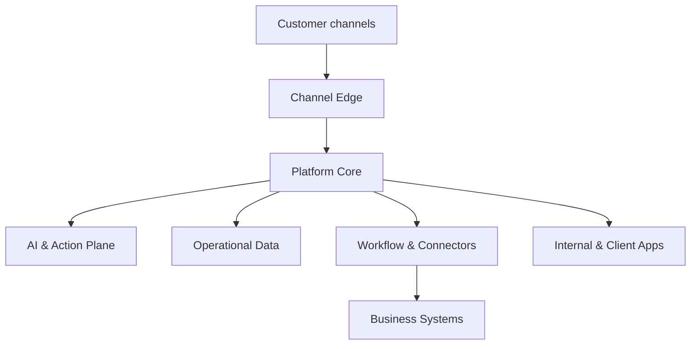
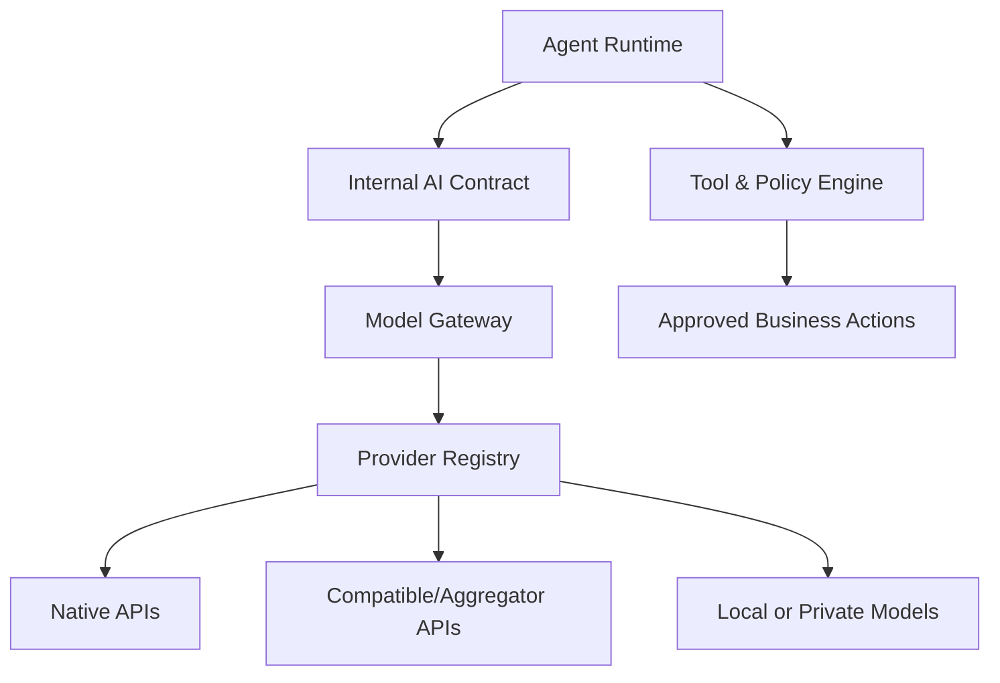
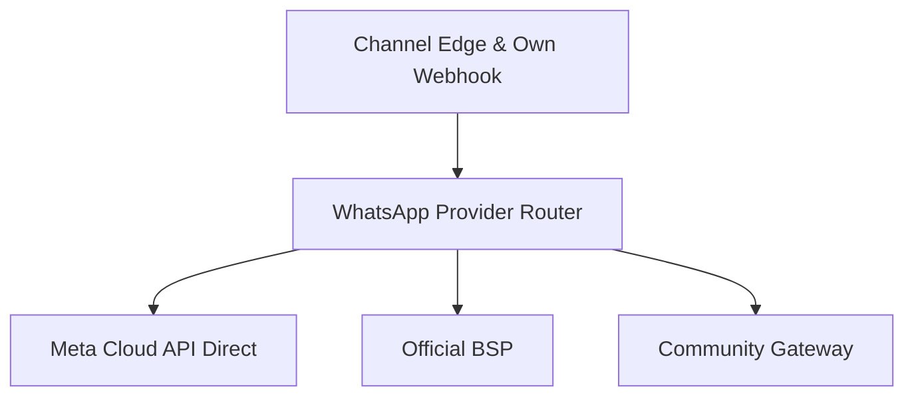
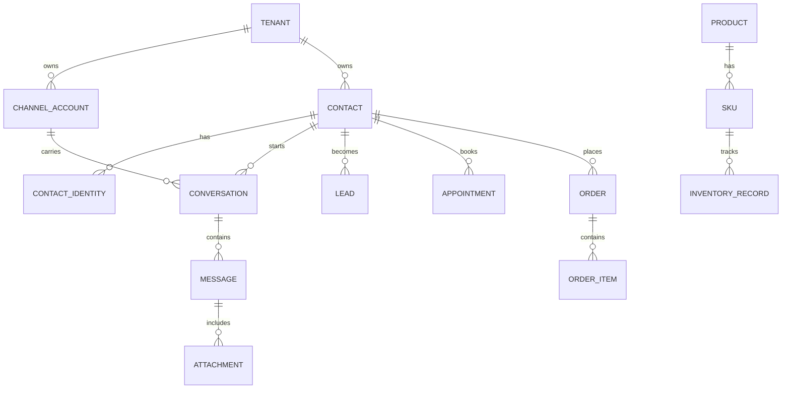

# PRD & Architecture Blueprint

## Omnichannel AI Customer Operations Platform

| Metadata | Nilai |
|---|---|
| Status | Architecture approved; implementation-ready baseline |
| Versi | 1.2 |
| Tanggal | 15 Juli 2026 |
| Pemilik produk | Founder / Platform Operator |
| Target pasar awal | Bisnis Indonesia yang memerlukan AI Customer Service dan sales automation |
| Model bisnis | Managed service, setup fee, subscription, dan usage-based add-ons |
| Keputusan arsitektur | Modular monolith, event-driven, multi-tenant, connector-first |
| Baseline saat ini | Workflow n8n + WhatsApp/WAHA + model AI, text-first |

### Perubahan v1.1

- Menambahkan **WhatsApp Provider Strategy** dengan tiga mode: Meta Cloud API direct dengan webhook milik platform, BSP, dan Community/Self-hosted Gateway.
- Menambahkan opsi berbiaya rendah untuk inbound customer service melalui official direct integration.
- Menambahkan Community Gateway sebagai capability eksperimental/best-effort dengan session isolation, health monitoring, dan migration path.
- Memperbarui roadmap, acceptance criteria, packaging, security, SLO, dan risk register untuk kedua mode tersebut.

### Perubahan v1.2

- Menambahkan **Payment Orchestration** dengan akun merchant/payment gateway milik tenant, hosted checkout, verified webhook/status query, dan reconciliation; platform tidak menampung dana atau payment credentials mentah.
- Menambahkan **Logistics & Shipment Tracking** dengan shipping API milik tenant, canonical shipment timeline, webhook + polling fallback, proactive notification, exception handling, dan multi-package/partial fulfillment.
- Memasukkan hosted payment link dan read-only shipment tracking sebagai modul vertikal opsional pada Stage 1, lalu refund/shipment mutation pada Growth dan hardening penuh pada Production Ready.
- Memperbarui data model, API/event/tool policy, UX/RBAC, analytics, QA, SRE/runbook, backlog, risk register, packaging, dan acceptance criteria dari Stage 0 sampai Stage 4.
- Menambahkan spesifikasi implementasi lintas-fase di `17_PAYMENT_AND_LOGISTICS_SPEC.md`.

---

## 1. Ringkasan Eksekutif

Produk yang akan dibangun bukan sekadar “bot WhatsApp”, melainkan **platform operasi pelanggan berbasis AI** yang dapat dikonfigurasi berbeda untuk setiap klien. Platform memiliki dua permukaan:

1. **Control Panel internal** untuk tim operator: membuat tenant, menghubungkan channel, mengatur AI, knowledge base, automasi, integrasi, biaya, health, dan support.
2. **Client Portal** untuk klien: melihat inbox, mengambil alih percakapan, mengelola knowledge dan konfigurasi yang diizinkan, serta memantau hasil secara transparan.

Core yang sama harus tetap berfungsi walaupun satu klien hanya mengaktifkan WhatsApp dan FAQ, sementara klien lain mengaktifkan website, Instagram, booking, lead qualification, stok, order, invoice, payment, shipment tracking, serta follow-up. Karena itu, kemampuan produk dibangun sebagai **capability modules**, bukan workflow yang disalin untuk setiap klien.

Rekomendasi teknis:

- Gunakan **TypeScript end-to-end** untuk dashboard dan domain core.
- Bangun backend sebagai **modular monolith event-driven** yang dapat direplikasi secara horizontal.
- Gunakan **PostgreSQL + Row-Level Security** sebagai source of truth dan boundary isolasi tenant.
- Gunakan **Redis + BullMQ** untuk pekerjaan singkat dan asynchronous pada MVP.
- Tambahkan **Temporal** pada fase Growth untuk workflow panjang, timer berhari-hari, retry durable, approval, dan compensation.
- Pertahankan **n8n sebagai integration layer**, bukan database, conversation engine, atau source of truth.
- Buat **AI Gateway dan Model Registry** yang terpisah dari agent runtime. Implementasi awal dapat menggunakan LiteLLM, tetapi domain platform tidak boleh tergantung pada format atau nama model LiteLLM.
- Dukung provider native, aggregator, endpoint OpenAI-compatible, dan model lokal melalui adapter yang dapat ditambah tanpa mengubah agent core.
- Gunakan **Meta WhatsApp Cloud API direct dengan webhook milik platform sebagai jalur produksi utama**. Ini menghindari ketergantungan dan markup BSP, tetapi tidak menghapus tarif pesan Meta.
- Sediakan **Community/Self-hosted WhatsApp Gateway** sebagai opsi eksperimental atau best-effort. Gateway dapat memakai session engine seperti WAHA atau adapter internal setara, tetapi tidak boleh dipasarkan sebagai API resmi atau diberi production SLA.
- Bangun **Payment Orchestration** sebagai provider-neutral module: tenant menghubungkan akun merchant sendiri, customer membayar di hosted provider checkout, dan status diakui hanya melalui verified provider evidence/reconciliation.
- Bangun **Logistics & Shipment Tracking** sebagai provider-neutral module: tenant menghubungkan carrier/aggregator/marketplace API sendiri, platform menormalisasi tracking dan exception, sedangkan provider tetap source of truth.

Hasil akhirnya adalah produk SaaS/managed platform yang dapat menjual “AI CS” sebagai core, kemudian menambah revenue melalui channel, automasi, commerce, analytics, jumlah agent, dan volume penggunaan.

---

## 2. Masalah yang Diselesaikan

### 2.1 Masalah klien

- Pesan pelanggan tersebar di WhatsApp, website, Instagram, marketplace, dan kanal lain.
- Respons lambat di luar jam kerja.
- Jawaban agent manusia tidak konsisten.
- Lead tidak dikualifikasi atau ditindaklanjuti dengan disiplin.
- Data customer, order, booking, dan stok berada di sistem yang berbeda.
- Pemilik bisnis sulit mengetahui apakah bot benar-benar membantu penjualan dan layanan.
- Bot yang ada biasanya kaku: perubahan kecil membutuhkan duplikasi workflow atau intervensi teknis.

### 2.2 Masalah operator platform

- Setiap klien memiliki kebutuhan, channel, SOP, bahasa, dan integrasi berbeda.
- Workflow per klien cepat menjadi sulit dirawat.
- Kredensial, nomor WhatsApp, dan customer data berisiko tercampur.
- Biaya model dan penggunaan tidak mudah diatribusikan ke tenant.
- Kegagalan provider/channel sulit dilacak.
- Tidak ada cara aman untuk memberi AI akses ke tindakan bisnis.

### 2.3 Product thesis

Semua klien memiliki kebutuhan berbeda, tetapi berbagi fondasi yang sama:

> **Menerima interaksi pelanggan, memahami maksudnya, menggunakan knowledge yang benar, melakukan tindakan yang diizinkan, dan menyerahkan ke manusia ketika diperlukan.**

Platform harus mengemas fondasi tersebut sekali, lalu mengaktifkan capability sesuai paket dan kebutuhan setiap tenant.

---

## 3. Visi, Positioning, dan Prinsip Produk

### 3.1 Visi

Menjadi control plane bagi seluruh interaksi customer service, sales, dan support automation milik klien—dengan AI yang dapat diaudit, dapat diganti providernya, dan aman melakukan tindakan bisnis.

### 3.2 Positioning

**Bukan:** chatbot FAQ, wrapper model, kumpulan workflow n8n, atau blast tool.

**Adalah:** managed, multi-tenant, omnichannel AI customer operations platform dengan human-in-the-loop dan connector ecosystem.

### 3.3 Prinsip desain

1. **Tenant-first:** setiap query, file, cache key, event, secret, dan metric memiliki konteks tenant.
2. **Channel-neutral:** domain conversation tidak bergantung pada WhatsApp, Instagram, atau marketplace tertentu.
3. **Provider-neutral AI:** model dipilih berdasarkan capability dan policy, bukan hardcoded.
4. **AI proposes, platform disposes:** AI mengusulkan intent/tool call; policy engine memvalidasi sebelum action dijalankan.
5. **Human handover is a core feature:** bukan fallback tambahan.
6. **Configuration over duplication:** kebutuhan klien dipenuhi melalui konfigurasi, template vertikal, dan connector.
7. **Official APIs first:** adapter non-resmi boleh ada hanya dengan risk flag dan migration path.
8. **Observable by default:** setiap message, model call, tool call, workflow, dan connector call dapat ditelusuri.
9. **Progressive complexity:** Kubernetes, Kafka, ClickHouse, dan microservices ditambahkan hanya saat ada kebutuhan terukur.
10. **Transparent outcomes:** dashboard menjelaskan definisi metric, bukan hanya menampilkan angka.

---

## 4. Sasaran dan Non-Sasaran

### 4.1 Sasaran 12–18 bulan

- Meng-onboard klien baru tanpa membuat ulang core workflow.
- Menjalankan WhatsApp dan website AI CS dengan human handover yang andal.
- Mendukung input teks, gambar, voice note, dan dokumen.
- Melakukan lead qualification, booking, follow-up, dan basic CRM.
- Menyediakan unified inbox serta dashboard hasil untuk operator dan klien.
- Menghubungkan product, inventory, order, dan invoice melalui canonical commerce model.
- Menghubungkan hosted payment link, verified payment outcome, shipment tracking, delivery exception, dan proactive notification melalui canonical payment/logistics model.
- Mendukung banyak provider/model/endpoint AI per tenant.
- Menyediakan audit trail, consent, usage metering, serta billing-ready records.
- Mencapai production baseline dengan isolasi tenant, backup, DR, observability, dan incident response.

### 4.2 Non-sasaran MVP

- Menjadi CRM, ERP, helpdesk, atau e-commerce platform lengkap.
- Menyimpan atau memproses dana pembayaran sebagai payment custodian.
- Menggantikan seluruh aplikasi operasional milik klien.
- Menyediakan generic TikTok organic DM automation tanpa API/partner access resmi.
- Menyebut webhook buatan sendiri atau Community WhatsApp Gateway sebagai “WhatsApp API resmi gratis”.
- Membangun visual workflow engine sekompleks n8n pada fase awal.
- Menjalankan microservices dan Kafka dari hari pertama.
- Mengizinkan LLM mengeksekusi SQL atau memanggil API pihak ketiga secara langsung.

---

## 5. Persona dan Jobs-to-be-Done

| Persona | Kebutuhan utama |
|---|---|
| Platform Owner | Mengelola seluruh tenant, paket, biaya, health, security, dan pertumbuhan layanan |
| Implementation Engineer | Meng-onboard channel, knowledge, SOP, connector, dan automation klien |
| Platform Support/Ops | Menangani incident, failed event, token expiry, dan eskalasi klien |
| Client Owner | Melihat outcome, biaya/usage, kualitas layanan, dan konfigurasi bisnis |
| Client Manager | Memantau queue, agent, SLA, lead, booking, order, dan CSAT |
| Human Agent | Menangani inbox, melihat context, mengambil alih, memberi disposition, dan memperbaiki jawaban |
| Analyst/Viewer | Membaca dashboard serta mengekspor laporan tanpa mengubah konfigurasi |
| End Customer | Mendapat jawaban cepat, akurat, aman, dan mudah beralih ke manusia |

---

## 6. Keputusan Arsitektur: Dua Pendekatan

| Dimensi | A. Modular Monolith Event-Driven | B. Microservices sejak awal |
|---|---|---|
| Bentuk | Satu domain core terstruktur per module, worker terpisah, satu source of truth | Service terpisah untuk conversation, AI, lead, commerce, automation, analytics, dan connector |
| Time-to-market | Lebih cepat | Lebih lambat |
| Konsistensi data | Sederhana dengan transaksi PostgreSQL | Memerlukan distributed transaction/saga |
| Operasional | Lebih sedikit komponen | Observability, deploy, schema, network, dan incident lebih kompleks |
| Scale | API dan worker dapat di-scale horizontal; module berat dapat diekstrak kemudian | Scale independen sejak awal |
| Team fit | Cocok untuk squad kecil–menengah | Cocok ketika sudah ada beberapa autonomous teams |
| Risiko utama | Coupling jika boundary module tidak disiplin | Over-engineering dan biaya operasi sebelum product-market fit |
| Evolusi | Outbox dan module boundary memudahkan ekstraksi service | Sudah terpisah, tetapi perubahan lintas domain lebih mahal |

### Rekomendasi

Pilih **Pendekatan A: Modular Monolith Event-Driven**.

Alasannya:

- Scope produk sangat luas dan masih membutuhkan validasi lapangan.
- Satu transaksi sering menyentuh conversation, message, lead, usage, dan audit.
- Bottleneck awal lebih mungkin berasal dari provider eksternal, media processing, serta model latency daripada domain core.
- API server, connector workers, media workers, AI workers, dan scheduler tetap dapat di-deploy serta di-scale terpisah walaupun berbagi codebase dan database.
- Outbox, canonical events, dan module contracts menjadi jalur ekstraksi microservice jika kelak dibutuhkan.

### Trigger nyata untuk mengekstrak microservice

Ekstraksi dilakukan hanya bila salah satu kondisi berikut terukur:

- Satu module membutuhkan scaling atau runtime yang sangat berbeda.
- Release cadence suatu domain menghambat domain lain.
- Ownership sudah dibagi ke autonomous team.
- Failure blast radius tidak dapat diterima.
- Volume event memerlukan partitioning/replay yang tidak lagi efisien dengan outbox + queue.
- Compliance mengharuskan data/workload dipisahkan secara fisik.

---

## 7. Arsitektur Target

### 7.1 System context

**Customer channels:** WhatsApp, website widget, Instagram, marketplace, email/future channels.

**Channel Edge:** signature verification, webhook acknowledgement, normalization, deduplication, rate limit, media references, dan outbound adapters.

**Platform Core:** tenancy, contacts, conversations, inbox, leads, tickets, appointments, commerce, billing records, policy, audit, dan capability configuration.

**AI & Action Plane:** agent runtime, RAG, model gateway, prompt/eval, tool registry, approval, and model/provider policies.

**Workflow & Connectors:** BullMQ, Temporal pada fase berikutnya, n8n, scheduler, webhook delivery, serta adapter SaaS/e-commerce.

**Operational Data:** PostgreSQL, Redis, object storage, vector search, secret manager, dan analytics store.

### 7.2 Message lifecycle

1. Provider mengirim webhook.
2. Channel Edge memverifikasi signature, menyimpan raw envelope secara terbatas, dan mengembalikan acknowledgement secepat mungkin.
3. Event dinormalisasi menjadi CanonicalMessageReceived.
4. Idempotency service menolak event duplikat.
5. Contact resolver memetakan identity dalam tenant dan channel account yang benar.
6. Conversation service menyimpan message dan memperbarui state.
7. Routing policy menentukan: AI, automation deterministic, queue manusia, atau kombinasi.
8. Agent runtime mengambil policy, prompt version, knowledge, context, dan tool catalog yang diizinkan.
9. AI Gateway memilih provider/model berdasarkan tenant policy dan capability.
10. Tool call divalidasi oleh policy/action service. Action berisiko dapat meminta konfirmasi customer atau approval manusia.
11. Outbound message ditulis ke outbox, dikirim oleh connector worker, lalu status delivery diperbarui.
12. Seluruh tahap menghasilkan trace, audit event, usage record, dan metric event.

### 7.3 Reliability pattern

- **At-least-once processing** dengan idempotency key.
- **Transactional outbox** agar perubahan database dan event tidak terpisah.
- **Inbox table** untuk dedupe event eksternal.
- **Exponential backoff + jitter** untuk retry.
- **Dead-letter queue** dan replay terkontrol.
- **Circuit breaker** per connector/provider.
- **Per-tenant rate limit dan concurrency budget** agar satu tenant tidak mengganggu tenant lain.
- **Ordering key** per conversation untuk menghindari balasan keluar urutan.
- **Optimistic locking/state version** untuk takeover dan concurrent update.
- **Idempotency key untuk side effect**, terutama booking, invoice, stock mutation, refund, dan outbound message.

---

## 8. Multi-Tenancy dan Isolasi Data

### 8.1 Boundary

**Tenant adalah boundary utama.** Nomor WhatsApp atau account channel adalah child resource milik tenant.

Ini lebih aman daripada menjadikan nomor WhatsApp sebagai boundary tertinggi karena:

- satu klien dapat memiliki beberapa nomor;
- satu customer dapat berinteraksi melalui beberapa channel;
- klien dapat memilih apakah contact lintas nomor digabung di dalam tenant;
- tidak pernah ada penggabungan contact lintas tenant.

### 8.2 Aturan wajib

| Area | Aturan |
|---|---|
| Database | Semua business table memiliki tenant_id NOT NULL |
| Authorization | Tenant context berasal dari verified session/token, tidak dipercaya dari body request |
| PostgreSQL | RLS aktif; runtime role bukan owner dan tidak memiliki BYPASSRLS; gunakan FORCE ROW LEVEL SECURITY bila tepat |
| Foreign key | Relasi sensitif memakai composite key yang menyertakan tenant_id |
| Unique key | Keunikan business object selalu scoped dengan tenant_id |
| Object storage | Prefix/bucket policy per tenant; akses melalui short-lived signed URL |
| Cache | Key namespace tenant + environment |
| Queue/event | Payload memiliki tenant_id dan schema version; consumer memvalidasi membership |
| Search/vector | Filter tenant wajib dan diuji; tidak boleh mengandalkan prompt |
| Secrets | Credential dienkripsi, versioned, tidak masuk log, dan dibatasi per connector/tenant |
| Analytics | Metric event memuat tenant_id; dataset client portal hanya membaca tenant sendiri |
| Export/delete | Job export dan deletion memiliki approval, audit, dan scope tenant |

PostgreSQL menerapkan default-deny ketika RLS aktif tanpa policy, tetapi table owner dan role dengan BYPASSRLS dapat melewatinya. Karena itu runtime role harus berbeda dari migration/owner role dan isolation test wajib dijalankan di CI. Lihat [PostgreSQL Row Security Policies](https://www.postgresql.org/docs/current/ddl-rowsecurity.html).

### 8.3 Contact identity

Contact tidak diidentifikasi hanya oleh nomor telepon. Modelnya:

- **Contact:** profil customer dalam satu tenant.
- **ContactIdentity:** WhatsApp phone/LID, Instagram user, website visitor, email, marketplace buyer ID.
- Unique identity: tenant + channel + channel account + external user ID.
- Merge hanya melalui identity terverifikasi atau keputusan manusia.
- Unmerge harus tersedia dan tercatat di audit log.
- PII sensitif dapat dipisahkan/encrypted dan memiliki retention policy.

### 8.4 Opsi isolasi komersial

| Paket | Database | Object storage | Kegunaan |
|---|---|---|---|
| Standard | Shared schema + RLS | Shared bucket + tenant prefix/policy | Mayoritas SMB |
| Advanced | Shared cluster, dedicated database/schema | Dedicated prefix/key | Klien dengan kebutuhan lebih tinggi |
| Enterprise | Dedicated database/cluster dan deployment option | Dedicated bucket/key | Compliance, residency, atau volume besar |

---

## 9. Modular Component Breakdown

### 9.1 Control plane

- Tenant, subscription, entitlement, feature flag.
- User, membership, role, service account.
- Channel/connector catalog dan capability manifest.
- Credential lifecycle, OAuth state, token refresh, expiry alert.
- Usage metering, quota, cost allocation, invoice-ready records.
- Global templates: vertical pack, prompt, automation, dashboard, knowledge schema.
- Platform health, tenant health, incident, replay, audit.

### 9.2 Customer operations plane

- Contact and identity resolution.
- Conversation, message, attachment, delivery status.
- Unified inbox, assignment, queue, SLA, disposition.
- Human takeover, pause/resume AI, internal notes, mentions.
- Lead, qualification, stage, owner, activity.
- Ticket/case, priority, status, escalation.
- Appointment, availability, reminder, reschedule/cancel.
- Product, variant, SKU, listing, inventory, order, fulfillment.
- Invoice draft/status and payment link/reference.
- Payment provider account, request, attempt, verified transaction projection, refund request, attribution, and reconciliation.
- Shipping provider account, shipment, package/item, tracking event, delivery commitment, proof reference, exception, return relation, and reconciliation.
- Consent, opt-out, suppression, retention, data request.

### 9.3 AI plane

- Agent profile and instructions.
- Prompt registry/version/release labels.
- Knowledge sources, ingestion, chunking, retrieval, citation.
- Model gateway/provider registry.
- Routing policy, budget, fallback, rate limit.
- Tool registry with JSON Schema input/output.
- Guardrails, policy checks, confirmation/approval.
- Conversation and tool traces.
- Evaluation datasets, regression tests, feedback, quality score.

### 9.4 Automation plane

- Event trigger, filter, condition, delay, schedule.
- Durable workflow state.
- Template follow-up sequences.
- Business hours, timezone, holiday calendars.
- Approval and compensation.
- Webhook/integration delivery.
- n8n bridge for custom integrations.
- Payment reminder/expiry/reconciliation and shipment milestone/exception workflows.

### 9.5 Analytics plane

- Canonical metric events.
- Operational aggregates.
- Client dashboards.
- Internal unit economics and platform health.
- Export, scheduled report, metric definitions.
- Later: ClickHouse for high-volume event analytics.
- Payment conversion/value/time-to-pay/mismatch and shipment delivery/stale/exception/freshness metrics.

---

## 10. AI Provider-Agnostic Architecture

### 10.1 Tujuan

Platform harus dapat menggunakan:

- provider native seperti OpenAI, Anthropic, Google Gemini/Vertex AI, Azure AI, AWS Bedrock, Mistral, Cohere, Groq, xAI, dan provider lain;
- aggregator seperti OpenRouter;
- endpoint OpenAI-compatible milik pihak ketiga;
- runtime lokal/private seperti Ollama dan vLLM;
- custom internal API dengan request/response yang tidak OpenAI-compatible;
- provider terpisah untuk embeddings, reranking, speech-to-text, text-to-speech, OCR, dan image understanding.

Daftar tersebut **bukan hardcoded allowlist**. Provider baru ditambahkan melalui adapter dan capability manifest.

LiteLLM dipilih sebagai implementasi gateway awal karena menyediakan unified API, banyak provider, endpoint OpenAI-compatible, routing, retry/cooldown/fallback, dan budget/rate-limit controls. Namun platform menyimpan **logical model alias** sendiri agar LiteLLM dapat diganti tanpa migrasi seluruh domain. Referensi: [LiteLLM providers](https://docs.litellm.ai/docs/providers), [routing](https://docs.litellm.ai/docs/routing), [OpenAI-compatible endpoints](https://docs.litellm.ai/docs/providers/openai_compatible), dan [custom API server](https://docs.litellm.ai/docs/providers/custom_llm_server).

### 10.2 AI request flow

### 10.3 Internal contracts

Core tidak memanggil provider SDK langsung. Ia mengirim AIRequest ter-normalisasi:

- task type: chat, classify, extract, embed, rerank, transcribe, synthesize, vision, OCR;
- tenant/model policy alias;
- messages/content parts;
- structured output schema;
- allowed tools;
- latency class;
- data sensitivity class;
- max cost/token;
- region/residency requirement;
- trace and idempotency context.

Gateway mengembalikan AIResponse ter-normalisasi:

- text/content parts;
- structured output;
- proposed tool calls;
- provider/model/deployment used;
- token/usage/cost;
- latency and retry count;
- safety metadata;
- finish/error reason.

### 10.4 Capability registry

Setiap deployment model menyatakan capability, bukan hanya nama:

- text input/output;
- vision/image input;
- audio input/output;
- tool calling;
- strict structured output;
- streaming;
- embeddings/rerank;
- context size;
- supported regions;
- retention/training policy;
- cost and rate limit;
- health and current circuit state.

Routing tidak boleh mengirim request vision ke text-only model atau data restricted ke endpoint yang tidak memenuhi policy.

### 10.5 Routing hierarchy

1. Tenant allowlist/denylist.
2. Data classification dan residency.
3. Required capability.
4. Quality tier per use case.
5. Latency target.
6. Budget/cost ceiling.
7. Provider health dan rate limit.
8. Weighted primary deployment.
9. Same-model fallback.
10. Cross-provider fallback yang sudah lulus evaluation.
11. Safe degraded response atau human handover.

### 10.6 Model aliases

Contoh alias domain:

| Alias | Tujuan | Contoh policy |
|---|---|---|
| cs-fast | FAQ dan routing volume tinggi | model murah, cepat, tool-safe |
| cs-quality | kasus kompleks | model kualitas tinggi, fallback lintas provider |
| lead-extractor | structured lead fields | strict JSON schema wajib |
| vision-product | memahami foto produk/resi | vision required |
| transcription-id | voice note Bahasa Indonesia | STT terbaik untuk bahasa/biaya tenant |
| embedding-default | RAG | dimension dan version terkunci |

Klien memilih policy/tier, bukan model fisik, kecuali paket advanced mengizinkan BYOK dan model pinning.

### 10.7 BYOK dan platform-managed keys

- **Platform-managed:** mudah untuk SMB; biaya dimeter per tenant.
- **BYOK:** klien membawa API key/provider account; credential tetap terenkripsi dan tidak terlihat operator biasa.
- **Dedicated endpoint:** enterprise dapat menggunakan Azure/Bedrock/Vertex/private vLLM.
- Provider key tidak pernah dikirim ke browser atau n8n workflow yang tidak membutuhkannya.
- Rotasi, expiry, last-used, dan health check dicatat.

### 10.8 AI safety dan action safety

- RAG content diperlakukan sebagai data, bukan instruction.
- Prompt injection detector dan tool allowlist per tenant/agent.
- JSON Schema validation untuk tool input/output.
- Policy engine memeriksa role, tenant, consent, business rule, amount, stock, dan current state.
- High-impact actions memerlukan customer confirmation atau human approval.
- AI tidak dapat membaca semua record; tool mengembalikan field minimum.
- Sensitive values direduksi dari prompt dan trace bila tidak diperlukan.
- Jawaban faktual penting menyertakan source reference internal.
- Jika confidence/evidence tidak cukup, AI bertanya, mengeskalasi, atau menyatakan tidak tahu.
- Release prompt/model baru harus melewati regression dataset dan canary.

### 10.9 LLM observability

Gunakan Langfuse atau implementation equivalent untuk trace AI, prompt version, token/cost, dataset, dan evaluation; hubungkan trace ID dengan message/workflow trace. Langfuse mendukung model usage/cost tracking, prompt management, datasets, dan evaluasi. Referensi: [Langfuse observability](https://langfuse.com/docs/observability/overview) dan [datasets](https://langfuse.com/docs/evaluation/experiments/datasets).

---

## 11. Channel dan Connector Architecture

### 11.1 Canonical event envelope

Setiap inbound event minimal memiliki:

- event_id dan schema_version;
- tenant_id dan channel_account_id;
- channel/provider;
- external_event_id;
- event_type;
- occurred_at dan received_at;
- external actor/conversation identifiers;
- normalized payload;
- raw payload reference dengan retention terbatas;
- signature verification result;
- correlation/trace ID.

### 11.2 Canonical actions

- SendMessage
- SendTemplate
- MarkRead
- AddReaction
- AssignConversation
- CreateLead / UpdateLead
- CheckAvailability / CreateAppointment / RescheduleAppointment / CancelAppointment
- SearchProduct / GetInventory / ReserveInventory / UpdateInventory
- GetOrder / UpdateOrder / CancelOrder
- CreateInvoiceDraft / SendInvoice / GetPaymentStatus
- CreateTicket / UpdateTicket
- TriggerWebhook

Connector menyatakan capability melalui manifest. UI dan agent tidak menawarkan action yang tidak didukung connector/account.

### 11.3 Capability matrix dan batas resmi

| Channel | Target capability | Status/constraint |
|---|---|---|
| Website widget | Text, media, identity handoff, live agent, forms | Dikontrol penuh oleh platform |
| WhatsApp Cloud API Direct | Text/media, template, delivery, interactive messages, handover | Jalur produksi utama; webhook dan connector dibangun platform, sedangkan transport tetap resmi melalui Meta |
| WhatsApp BSP | Capability resmi melalui partner | Opsi bagi klien yang memerlukan onboarding, billing, atau support partner; dapat memiliki markup/biaya tambahan |
| Community/Self-hosted Gateway | Text/media/session melalui WhatsApp Web session | Opsi eksperimental/best-effort; tidak resmi, tidak dijamin bebas blok, dan tidak mendapat production SLA |
| Instagram | DM, webhook, comments, replies, private reply | Memerlukan professional account, scope, token, dan App Review; fitur bergantung permission/account |
| TikTok organic | Comment/DM | Jangan dijanjikan sebagai generic feature; akses publik tidak setara Instagram CS API dan dapat bergantung Business/Shop partner, region, serta approval |
| Shopee | Product, stock, order, shop, selected chat capability | Tergantung partner app, shop authorization, API category, market, dan approval |
| TikTok Shop | Product, inventory, order/fulfillment | Tergantung seller/partner authorization, market, scope, dan review |
| Google Calendar | Free/busy, create/update/cancel event, reminders | OAuth per tenant/user; timezone dan idempotency wajib |
| CRM/ERP | Contact, lead, ticket, product/order sync | Connector-specific |
| Email/future | Inbound/outbound, threading | Setelah core omnichannel stabil |

WhatsApp Business Messaging Policy mensyaratkan opt-in, penghormatan opt-out, template untuk business-initiated conversation, batas layanan 24 jam untuk balasan bebas template, dan jalur eskalasi manusia yang jelas. Referensi: [WhatsApp Business Messaging Policy](https://whatsappbusiness.com/policy/).

WAHA, sebagai salah satu contoh session engine Community Gateway, menyatakan dirinya tidak terafiliasi atau diotorisasi WhatsApp dan merekomendasikan metode resmi untuk aplikasi kritis. API gateway juga tidak boleh diekspos langsung ke internet. Referensi: [WAHA introduction](https://waha.devlike.pro/docs/overview/introduction/) dan [WAHA security](https://waha.devlike.pro/docs/how-to/security/).

### 11.4 n8n boundary

n8n digunakan untuk:

- custom SaaS connector;
- transform non-core;
- client-specific webhook;
- low-risk back-office automation;
- prototyping integration sebelum menjadi native connector.

n8n tidak digunakan untuk:

- menyimpan conversation/customer state;
- tenant authorization;
- source of truth lead/order/booking;
- global AI routing;
- action policy enforcement;
- high-volume raw message fan-in tanpa buffering.

Untuk scale, n8n dapat memakai queue mode dengan main instance dan worker. Static workflow data bersifat experimental dan tidak cocok menjadi session/state store frekuensi tinggi. Referensi: [n8n queue mode](https://docs.n8n.io/deploy/host-n8n/configure-n8n/scaling/enable-queue-mode) dan [workflow static data](https://docs.n8n.io/code/cookbook/builtin/get-workflow-static-data/).

### 11.5 WhatsApp Provider Strategy

Istilah “membuat webhook WhatsApp sendiri” dapat berarti dua hal yang berbeda:

1. **Official Direct / DIY Webhook:** platform membangun endpoint webhook, verification, normalization, outbound client, inbox, dan dashboard sendiri, tetapi transport pesan tetap melalui Meta Cloud API.
2. **Community/Self-hosted Gateway:** platform menjalankan session WhatsApp Web lalu mengubah event session tersebut menjadi canonical webhook/event internal.

Keduanya menggunakan UI, conversation engine, database, AI, dan automation yang sama. Perbedaannya hanya berada di provider adapter.

#### 11.5.1 Pilihan transport

| Mode | Biaya channel | Status | SLO | Kapan digunakan |
|---|---|---|---|---|
| Meta Cloud API Direct | Tarif Meta sesuai kategori/market; tanpa markup BSP dari platform perantara | Resmi | Production | Default semua klien production |
| Official BSP | Tarif Meta + kemungkinan biaya/markup BSP | Resmi | Production sesuai kontrak | Klien memerlukan billing, onboarding, atau support partner |
| Community/Self-hosted Gateway | Tidak memakai tarif pesan Business Platform; tetap ada biaya server, SIM/device, monitoring, dan maintenance | Tidak resmi/best-effort | Tidak termasuk production channel SLO | Lab, demo, internal use, atau pilot yang menerima risiko |

Per 14 Juli 2026, halaman pricing resmi menyatakan service messages dalam customer service window 24 jam tidak dikenakan biaya, demikian pula utility messages yang dikirim sebagai respons kepada user; kategori dan kondisi lain mengikuti per-message pricing. Karena pricing dapat berubah, rate tidak boleh di-hardcode. Platform harus menyimpan versioned rate card atau membaca konfigurasi billing yang dapat diperbarui. Referensi: [WhatsApp Business Platform Pricing](https://whatsappbusiness.com/products/platform-pricing/).

Dengan demikian, opsi resmi yang paling dekat dengan “gratis” untuk bot CS adalah:

- memakai Meta Cloud API secara direct;
- membangun webhook/inbox/automation sendiri;
- memprioritaskan inbound customer service dalam window resmi;
- tetap menyediakan budget guard untuk template marketing, authentication, dan utility yang berbayar.

#### 11.5.2 Official Direct / DIY Webhook

Platform memiliki dan mengoperasikan:

- HTTPS webhook endpoint;
- verification token dan signature validation;
- raw-envelope retention terbatas;
- canonical event normalization;
- idempotency dan ordering;
- outbound Graph API client;
- template registry dan policy/window guard;
- delivery/read/error status;
- token/permission health;
- per-tenant cost and usage records.

Meta Cloud API tetap menjadi transport resmi yang mengirim event ke webhook tersebut. Dokumentasi Meta menjelaskan Cloud API sebagai mekanisme untuk mengirim pesan dan menerima webhook. Referensi: [WhatsApp Cloud API Get Started](https://developers.facebook.com/documentation/business-messaging/whatsapp/get-started).

Untuk menawarkan onboarding resmi kepada banyak bisnis, product plan harus memasukkan jalur **Tech Provider/Tech Partner dan Embedded Signup** sesuai program Meta. Referensi: [WhatsApp Partner Ecosystem](https://whatsappbusiness.com/partners/become-a-partner/).

#### 11.5.3 Community/Self-hosted WhatsApp Gateway

Community Gateway adalah service terisolasi di belakang Channel Edge. Ia boleh menggunakan WAHA atau session engine internal/setara, tetapi platform tidak mengimplementasikan business logic di dalamnya.

Tanggung jawab gateway:

- QR/pairing dan session lifecycle;
- encrypted session persistence per channel account;
- inbound text/media/status event capture;
- normalized internal webhook publishing;
- outbound text/media send;
- reconnect dengan backoff;
- heartbeat, session state, last-seen, dan disconnect reason;
- message ordering dan conservative rate guard;
- media retrieval ke object storage;
- kill switch dan export/migration support.

Gateway tidak boleh:

- menjadi source of truth conversation/contact;
- menyimpan credential beberapa tenant dalam namespace yang sama;
- diekspos langsung ke internet;
- melakukan bulk messaging atau contact scraping;
- menyembunyikan status tidak resmi kepada operator/klien;
- diberi production availability guarantee.

Recommended deployment boundary:

- satu session identity hanya milik satu tenant + channel account;
- session secret dienkripsi dengan KMS dan key context tenant;
- isolated container/process per session untuk tahap awal, atau hardened pool setelah isolation test;
- internal mTLS atau signed service token antara Platform Core dan Gateway;
- outbound queue per conversation/account;
- dedicated resource limits dan restart policy;
- nomor/SIM serta WhatsApp account tetap dimiliki klien;
- support view menampilkan CONNECTED, DEGRADED, REAUTH_REQUIRED, BLOCKED, atau DISABLED.

#### 11.5.4 Risk and consent policy

WhatsApp Terms melarang akses otomatis atau pembuatan API yang tidak diotorisasi dalam cara yang tidak diizinkan. Karena itu Community Gateway:

- diberi risk class **UNOFFICIAL_HIGH_RISK**;
- hanya dapat diaktifkan oleh Platform Owner;
- memerlukan informed acceptance dari klien;
- tidak boleh menjadi default onboarding;
- tidak cocok untuk nomor utama yang business-critical;
- tidak termasuk channel uptime SLA atau compensation;
- harus memiliki migration plan ke Meta Cloud API;
- dinonaktifkan jika legal/policy review menyatakan tidak dapat diterima.

Referensi: [WhatsApp Terms of Service](https://www.whatsapp.com/legal/terms-of-service) dan [WhatsApp Business Messaging Policy](https://whatsappbusiness.com/policy/).

#### 11.5.5 Provider-neutral data model

ChannelAccount menambahkan field:

- provider_mode: META_DIRECT, OFFICIAL_BSP, atau COMMUNITY_GATEWAY;
- provider_key dan provider_account_id;
- risk_class dan sla_class;
- capabilities;
- connection_status dan health_reason;
- last_inbound_at, last_outbound_at, dan last_health_at;
- migration_status dan target_provider;
- pricing_policy_version;
- session_reference untuk Community Gateway, bukan raw session secret.

Conversation, Contact, Lead, Message, Appointment, dan automation tidak menyimpan provider-specific logic. Pergantian provider tidak boleh mengganti tenant contact IDs atau menghilangkan history.

#### 11.5.6 Migration path

1. Verifikasi kepemilikan nomor dan business account.
2. Pause outbound Community Gateway.
3. Drain queue dan rekonsiliasi delivery status.
4. Onboard nomor melalui official flow yang tersedia.
5. Aktifkan Meta webhook dan lakukan test inbound/outbound.
6. Alihkan provider_mode secara controlled.
7. Pertahankan canonical conversation/contact history.
8. Revoke/delete community session secret setelah rollback window.
9. Catat seluruh tindakan di audit log.

---

## 12. Data Architecture

### 12.1 Source of truth

| Data | Store |
|---|---|
| Tenant, user, config, contact, conversation, lead, booking, commerce, audit | PostgreSQL |
| Queue, cache, locks, rate limit, ephemeral presence | Redis |
| Message attachments, media, documents, exports | S3-compatible object storage |
| Embeddings awal | pgvector dalam PostgreSQL |
| AI traces/evals | Langfuse store |
| Operational telemetry | OpenTelemetry backend |
| High-volume analytical events | PostgreSQL awal; ClickHouse pada fase scale |
| Secrets | Cloud secret manager / Vault-compatible store |

### 12.2 Core entity map

### 12.3 Additional entities

- Membership, Role, Permission.
- ConnectorDefinition, ConnectorInstance, ConnectorCredential, ConnectorCapability.
- AgentProfile, PromptVersion, ModelAlias, ModelDeployment, RoutingPolicy.
- KnowledgeSource, Document, Chunk, EmbeddingVersion.
- ToolDefinition, ToolPolicy, ActionRequest, Approval.
- AutomationDefinition, AutomationVersion, AutomationRun, Timer.
- Ticket, SLAEvent, Assignment, InternalNote.
- ConsentEvent, SuppressionEntry, DataSubjectRequest.
- UsageRecord, CostRecord, Entitlement, Subscription.
- AuditLog, InboxEvent, OutboxEvent, DeadLetter.
- MetricEvent, DashboardDefinition, ReportSchedule.

### 12.4 RAG strategy

- Hybrid retrieval: PostgreSQL full-text + pgvector.
- Semua document/chunk memiliki tenant_id, source version, status, visibility, language, dan effective dates.
- Ingestion melakukan malware scan, MIME validation, text extraction, chunking, metadata extraction, embedding, dan review.
- Embedding model/version tidak diganti diam-diam; re-index berjalan side-by-side.
- Jawaban menyimpan chunk/source IDs yang digunakan.
- Content expiry/freshness alert untuk harga, kebijakan, jam operasional, dan katalog.
- Pindah ke dedicated vector/search engine hanya jika corpus, latency, atau filtering membuktikan kebutuhan.

pgvector menyediakan exact dan approximate vector search di PostgreSQL, termasuk HNSW dan IVFFlat. Referensi: [pgvector](https://github.com/pgvector/pgvector).

### 12.5 Analytics strategy

- MVP: append-only MetricEvent + materialized/summary tables di PostgreSQL.
- Growth: CDC atau outbox event ke ClickHouse.
- Client dashboard membaca semantic metric layer, bukan query raw operational tables.
- Definisi metric versioned.
- Late-arriving events dan timezone tenant ditangani secara eksplisit.
- PII tidak disalin ke analytical store kecuali diperlukan.

ClickHouse incremental materialized views dapat memindahkan biaya agregasi dari query time ke insert time dan cocok untuk dashboard event volume tinggi. Referensi: [ClickHouse materialized views](https://clickhouse.com/docs/materialized-views).

---

## 13. Tech Stack yang Direkomendasikan

Versi exact harus dipin setelah technical spike. Gunakan **current stable/LTS** pada saat implementasi, bukan floating latest di production.

| Layer | MVP | Growth / Production |
|---|---|---|
| Monorepo | pnpm workspaces + Turborepo | Tetap; ownership dan build boundaries diperketat |
| Web apps | Next.js, TypeScript, Tailwind, shadcn/ui | Tetap; CDN/edge caching untuk asset |
| Server state/UI data | TanStack Query, TanStack Table | Tetap |
| Charts | Apache ECharts | Tetap |
| Backend core | NestJS + Fastify, TypeScript | Horizontal replicas; extract module hanya jika trigger terpenuhi |
| API | REST + OpenAPI; SSE/WebSocket untuk inbox | Versioning, partner API, webhook platform |
| Validation/contracts | JSON Schema + TypeScript schema library | Contract registry dan compatibility tests |
| Database | PostgreSQL | HA managed PostgreSQL, read replica sesuai kebutuhan, PgBouncer |
| ORM/query | Drizzle/Kysely-style typed SQL + explicit migrations | Tetap; SQL untuk hot paths |
| Vector/search | PostgreSQL FTS + pgvector | Optional OpenSearch/Qdrant hanya jika benchmark membutuhkan |
| Cache/locks | Redis | Redis HA/managed |
| Short async jobs | BullMQ | Tetap untuk media, webhook, dan short tasks |
| Durable workflows | Timer/outbox sederhana di MVP | Temporal untuk follow-up panjang, approval, booking, saga |
| Event backbone | Transactional outbox + BullMQ | Kafka/Redpanda hanya jika replay/throughput/partitioning membuktikan kebutuhan |
| Object storage | S3-compatible; MinIO untuk local dev | Managed S3-compatible + lifecycle/replication |
| AI gateway | LiteLLM container di balik internal contract | HA gateway, tenant budgets, regional deployments |
| Local model serving | Ollama untuk dev/small private use | vLLM/Ray Serve atau managed private endpoints untuk production GPU |
| AI observability | Langfuse | HA/self-hosted atau managed sesuai compliance |
| Media/doc | FFmpeg, malware scan, text extraction/OCR adapters | Isolated workers, sandbox, autoscaling |
| Integration | n8n | Queue mode, Git-backed deployment, native connector SDK |
| WhatsApp transport | Meta Cloud API direct + own webhook; optional isolated Community Gateway | Tech Provider/Embedded Signup, provider router, migration tooling |
| Auth | OIDC provider abstraction; managed provider mempercepat MVP | Enterprise SSO/SAML/SCIM; optional Keycloak/Zitadel deployment |
| Secrets | Managed secret manager | Per-environment/per-tenant keys, rotation automation |
| Telemetry | OpenTelemetry + Sentry; managed logs/metrics awal | Prometheus, Grafana, Loki/Tempo atau managed equivalents |
| Analytics | PostgreSQL aggregates | ClickHouse |
| Local deployment | Docker Compose | Tetap untuk dev |
| Production compute | Managed containers/VM orchestration | Kubernetes hanya saat operasi/scale membenarkan |
| CI/CD | GitHub Actions/GitLab CI, container registry | Progressive delivery, canary, SBOM, signed images |
| Infrastructure | Terraform/OpenTofu | Multi-environment, DR region, policy-as-code |

NestJS memberi struktur module yang sesuai modular monolith dan dapat memakai Fastify sebagai HTTP adapter. Referensi: [NestJS](https://docs.nestjs.com/) dan [Fastify adapter](https://docs.nestjs.com/techniques/performance).

OpenTelemetry dipilih agar trace, metric, dan log instrumentation tetap vendor-neutral. Referensi: [OpenTelemetry documentation](https://opentelemetry.io/docs/).

---

## 14. Tahapan Produk

### 14.1 Stage 0 — Foundation & Risk Reduction

**Tujuan:** membuktikan boundary tersulit sebelum feature sprint.

Deliverables:

- canonical message/event/action schemas;
- tenant/RLS proof-of-concept dan automated isolation tests;
- provider-agnostic AI contract + dua cloud provider + satu custom compatible endpoint;
- WhatsApp Provider Adapter contract untuk Meta Direct, optional BSP, dan Community Gateway;
- spike own Meta webhook, pricing/window guard, serta official Tech Provider onboarding path;
- isolated Community Gateway spike dengan QR lifecycle, session encryption, disconnect handling, dan migration proof;
- raw workflow migration map dari n8n;
- official partner/app applications untuk Meta, TikTok/Shopee yang dibutuhkan;
- threat model, data classification, retention draft;
- UX prototype control panel, client portal, dan inbox;
- baseline load model dan cost model.
- client-owned payment/shipping account boundary, provider scorecard, and legal/privacy owners;
- hosted checkout + signed payment webhook/reconciliation spike;
- shipment import + tracking webhook/state-aware polling/exception spike;
- canonical payment/shipment states, errors, APIs, events, tool risk, and synthetic fixtures.

Exit gate:

- Tidak ada cross-tenant access dalam negative tests.
- Provider dapat diganti tanpa mengubah agent runtime.
- Duplicate webhook menghasilkan tepat satu logical message/action.
- Switching WhatsApp provider tidak mengubah canonical contact/conversation history.
- Community Gateway ditandai best-effort dan tidak tercampur dengan official channel SLO.
- Risiko API approval tercatat dan tidak dianggap pasti.
- Prohibited payment credentials do not enter storage/logs, and redirect/screenshot cannot produce PAID.
- Unknown payment/shipment result is reconciled before retry; provider swap does not change canonical contracts.

### 14.2 Stage 1 — MVP: Sellable AI CS

**Tujuan:** mendapatkan 3–5 design partners berbayar dan membuktikan outcome.

Must-have:

- internal tenant/client/channel management;
- client portal basic;
- WhatsApp Meta Direct adapter dengan webhook milik platform dan website widget;
- optional Community Gateway di balik operator-only feature flag untuk lab/pilot;
- unified inbox + human handover;
- text, image, voice-note transcription, dan basic document extraction;
- tenant knowledge base + hybrid RAG + citations internal;
- configurable AI agent, business hours, escalation, and fallback;
- multi-provider AI gateway, model aliases, per-tenant budgets, BYOK optional;
- contact/conversation history;
- basic lead capture, qualification fields, score/rules, and pipeline;
- Google Calendar availability + booking/reschedule/cancel;
- simple follow-up sequence with consent and stop rules;
- CSAT, conversation, lead, booking, response-time, handover, and usage dashboards;
- audit log, usage/cost records, backup, monitoring, dead-letter/replay;
- opt-in/opt-out and WhatsApp 24-hour/template guard.
- optional vertical module: one tenant-owned hosted-payment provider for booking/order/invoice link, verified status, expiry, and reconciliation;
- optional vertical module: one tenant-owned shipping source for read-only shipment tracking, canonical timeline, proactive milestones, and delivery exceptions.

Explicitly deferred:

- Instagram production connector;
- marketplace write operations;
- advanced visual automation builder;
- automated collection of the platform’s own subscription billing; payment custody/payout/split/recurring;
- refund execution and cost-bearing shipment label/pickup/cancel/return actions;
- generic TikTok DM;
- production SLA untuk Community WhatsApp Gateway;
- dedicated analytics warehouse;
- enterprise SSO/dedicated deployment.

### 14.3 Stage 2 — Growth: Omnichannel & Business Actions

- Instagram DM/comments/private replies, subject to approval.
- CRM/ticketing connectors.
- Product/SKU/listing/inventory canonical model.
- Read-only stock, product, order status for first commerce connectors.
- Invoice draft and payment link connector.
- Second payment/shipping adapter, partial/deposit payments, refund request/approved execution, and daily mismatch workflow.
- Shipment rate quote, create/label, pickup, eligible cancellation, return request, proof-of-delivery, and multi-package/partial fulfillment.
- Temporal-based follow-up, approval, reminders, and compensation.
- Knowledge approval/freshness lifecycle.
- Agent teams, queues, SLA, routing, supervisor tools.
- Automation templates and safe no-code configuration.
- Tenant usage limits, packaging, overage, and billing exports.
- Vertical packs for 2–3 target industries.

### 14.4 Stage 3 — Production Ready

- 99.9% platform SLO baseline with defined exclusions.
- HA database/cache/gateway and horizontally scaled workers.
- Tested backup restore, RPO/RTO, and disaster recovery runbook.
- Full OpenTelemetry traces and per-tenant/provider/channel health.
- Security review against OWASP ASVS target, penetration testing, dependency/SBOM controls.
- SSO/SAML/SCIM for enterprise tier.
- Fine-grained RBAC, approval matrix, service accounts.
- Data export/deletion, legal hold/retention controls.
- Dedicated tenant option.
- Prompt/model regression gates, canary, rollback.
- Incident management, status page, support SLA.
- Load/soak/failure tests against contractual design targets.
- Payment/shipping adapter certification, PCI-scope/payment legal review, address/proof privacy review, and continuous/daily reconciliation.
- Tested runbooks for payment mismatch/webhook silence and shipment stale/exception/provider outage.

### 14.5 Stage 4 — Full-Feature Platform

- Shopee and TikTok Shop deeper product/inventory/order/fulfillment actions, subject to partner access.
- TikTok capabilities only where official/partner API permits.
- Returns, refund request, warranty, and service cases.
- Recurring mandate, advanced refund/dispute/accounting only where legally/provider-contractually permitted.
- Dynamic shipping rate/routing, multi-warehouse fulfillment, return portal, claims, and reverse logistics.
- Split payout/submerchant/money movement only through separately approved legal/compliance architecture.
- Advanced lead scoring, next-best-action, attribution, and revenue analytics.
- Visual automation builder with versioning, simulation, and approval.
- Connector SDK, partner API, webhook subscriptions, integration marketplace.
- White-label client portal and custom domains.
- Multi-language agent and knowledge localization workflows.
- Agent QA, coaching, conversation sampling, and compliance review.
- Advanced forecasting, workload planning, and anomaly detection.
- Optional voice call/contact-center integration.
- Regional deployment and enterprise private AI endpoints.

### 14.6 Feature phasing matrix

| Capability | Stage 1 MVP | Stage 2 Growth | Stage 3 Prod | Stage 4 Full |
|---|---:|---:|---:|---:|
| WhatsApp + website | ✓ | Enhance | Harden | Global/regional |
| Meta Direct own webhook | ✓ | Embedded Signup | Production SLO | Regional scale |
| Community WhatsApp Gateway | Optional pilot | Best-effort | No channel SLA | Maintain/migrate |
| Instagram | — | ✓ | Harden | Enhance |
| TikTok organic CS | — | Conditional discovery | Conditional | Partner-dependent |
| Shopee/TikTok Shop | — | Read-first | Harden | Write/actions |
| Text/image/voice/docs | Basic | Enhance | Harden | Advanced |
| Human inbox/handover | ✓ | Teams/SLA | Enterprise | Workforce tools |
| Knowledge/RAG | ✓ | Lifecycle | Eval/DR | Localization |
| Lead/sales | Basic | CRM/pipeline | Attribution | Next-best-action |
| Calendar | ✓ | Multi-resource | Harden | Optimization |
| Follow-up | Simple | Durable | Policy/compliance | Visual builder |
| Hosted payment link | Optional vertical pilot | Multi-provider/refund request | Reconciliation/SLO/compliance | Recurring/dispute/advanced accounting |
| Shipment tracking | Optional read-only pilot | Create/label/pickup/return | Reconciliation/SLO/privacy | Routing/claims/reverse logistics |
| Invoice | —/linked when payment pilot | Draft/sync | Reconciliation | Advanced connectors |
| AI multi-provider | ✓ | Routing/evals | Regional/HA | Marketplace |
| Client analytics | Basic | Expanded | Warehouse/SLO | Forecasting |
| Billing/metering | Records | Plans/limits | Automated | Marketplace split |

---

## 15. Functional Requirements

Priority menggunakan MoSCoW:

- **Must:** produk tidak layak diluncurkan tanpa fitur ini pada stage terkait.
- **Should:** bernilai tinggi, tetapi dapat ditunda satu release.
- **Could:** dikerjakan bila kapasitas tersedia.
- **Won’t now:** sengaja tidak masuk stage tersebut.

### 15.1 Tenant, identity, dan entitlement

| ID | Requirement | Priority | Stage |
|---|---|---:|---:|
| TEN-01 | Platform admin dapat membuat, suspend, archive, dan menghapus tenant melalui controlled workflow | Must | 1 |
| TEN-02 | Setiap tenant memiliki timezone, locale, business hours, data policy, package, quota, dan feature flags | Must | 1 |
| TEN-03 | User dapat menjadi anggota lebih dari satu tenant dengan role berbeda | Should | 2 |
| TEN-04 | Semua request dan background job memverifikasi tenant context | Must | 1 |
| TEN-05 | Entitlement mencegah penggunaan module/channel di luar paket | Must | 1 |
| TEN-06 | Tenant dapat memakai platform-managed key, BYOK, atau dedicated AI endpoint sesuai paket | Should | 1 |
| TEN-07 | Enterprise tenant dapat dipindah ke dedicated data/deployment boundary | Should | 3 |

Acceptance summary:

- Negative test dengan ID milik tenant lain selalu gagal, walaupun user mengubah URL/body.
- Suspend tenant menghentikan outbound automation tanpa menghilangkan akses operator untuk recovery.
- Perubahan package/feature flag tercatat dan reversible.

### 15.2 Channel onboarding dan health

| ID | Requirement | Priority | Stage |
|---|---|---:|---:|
| CHN-01 | Admin dapat menambah lebih dari satu channel account ke tenant | Must | 1 |
| CHN-02 | OAuth/credential flow menyimpan token secara encrypted dan mendukung refresh/rotation | Must | 1 |
| CHN-03 | Connector menyatakan capability, scope, token expiry, webhook status, dan health | Must | 1 |
| CHN-04 | Webhook signature diverifikasi sebelum event diproses | Must | 1 |
| CHN-05 | Duplicate dan out-of-order webhook tidak membuat duplicate logical action | Must | 1 |
| CHN-06 | Operator mendapat alert sebelum token/authorization kedaluwarsa | Should | 2 |
| CHN-07 | Connector dapat dinonaktifkan tanpa menonaktifkan tenant atau channel lain | Must | 1 |
| CHN-08 | Connector version dan breaking-change migration dapat dikelola | Should | 3 |
| CHN-09 | WhatsApp account menyimpan provider_mode, risk class, SLA class, dan capability aktual | Must | 1 |
| CHN-10 | Meta Direct menerima inbound melalui webhook milik platform dan mengirim melalui official API client | Must | 1 |
| CHN-11 | Community Gateway mendukung QR/pairing, encrypted session, reconnect, dan explicit health state | Should | 1 |
| CHN-12 | Hanya Platform Owner dapat mengaktifkan Community Gateway setelah informed acceptance | Must | 1 |
| CHN-13 | UI tidak menawarkan template/interactive capability yang tidak didukung provider aktif | Must | 1 |
| CHN-14 | Provider migration mempertahankan canonical contact, conversation, lead, dan history | Must | 1 |

### 15.3 Unified inbox dan human collaboration

| ID | Requirement | Priority | Stage |
|---|---|---:|---:|
| INB-01 | Inbox menggabungkan conversation lintas channel tanpa kehilangan asal channel | Must | 1 |
| INB-02 | Filter berdasarkan tenant, channel, queue, assignee, status, SLA, tag, dan intent | Must | 1 |
| INB-03 | Agent dapat take over, pause AI, resume AI, assign, close, reopen, dan memberi disposition | Must | 1 |
| INB-04 | Agent melihat customer profile, conversation history, lead, booking, order, dan knowledge evidence yang diizinkan | Must | 1 |
| INB-05 | Internal note dan mention tidak pernah dikirim ke customer | Must | 1 |
| INB-06 | Collision protection memberi tahu jika agent lain sedang mengetik/menangani | Should | 2 |
| INB-07 | Supervisor dapat melihat queue, SLA breach, workload, dan live health | Should | 2 |
| INB-08 | Suggested reply dapat diedit agent dan feedback-nya menjadi evaluation data | Should | 2 |

Handover trigger minimal:

- customer meminta manusia;
- low confidence/no evidence;
- sentimen atau risiko tinggi;
- tool gagal berulang;
- topik terlarang/sensitif;
- refund, dispute, ancaman, legal, atau komplain berat;
- limit AI/usage tercapai;
- policy tenant mengharuskan manusia.

### 15.4 Conversation dan customer memory

| ID | Requirement | Priority | Stage |
|---|---|---:|---:|
| CON-01 | Message menyimpan sender, direction, timestamps, provider ID, content parts, delivery status, dan trace | Must | 1 |
| CON-02 | Context window dibangun dari recent turns + structured memory + retrieved evidence | Must | 1 |
| CON-03 | Long-term memory hanya menyimpan field yang diizinkan, dengan source dan expiry | Must | 1 |
| CON-04 | Contact merge/unmerge memiliki preview, conflict handling, dan audit | Should | 2 |
| CON-05 | Customer dapat meminta update/correction/delete sesuai workflow data rights | Should | 3 |
| CON-06 | AI tidak menggunakan conversation tenant lain sebagai context atau training data | Must | 1 |

### 15.5 Agent, prompt, dan knowledge

| ID | Requirement | Priority | Stage |
|---|---|---:|---:|
| AIA-01 | Tenant memiliki agent profile, tone, language, business rules, escalation, dan enabled tools | Must | 1 |
| AIA-02 | Prompt/instruction versioned, memiliki draft/published/rollback state | Must | 1 |
| AIA-03 | Knowledge sources dapat di-upload, sync, review, publish, expire, dan re-index | Must | 1 |
| AIA-04 | Jawaban knowledge menyimpan evidence/source IDs untuk audit | Must | 1 |
| AIA-05 | Model alias, primary, fallback, max cost, dan timeout dapat diatur per use case | Must | 1 |
| AIA-06 | Model/prompt release harus lolos golden dataset minimum | Should | 2 |
| AIA-07 | Tenant dapat melihat agregat kualitas dan biaya tanpa melihat secret internal | Must | 1 |
| AIA-08 | Agent dapat menjawab “tidak tahu” dan melakukan handover tanpa dipaksa berhalusinasi | Must | 1 |

### 15.6 Multimodal

| ID | Requirement | Priority | Stage |
|---|---|---:|---:|
| MED-01 | Platform menerima text, image, audio/voice note, dan document melalui content-part model | Must | 1 |
| MED-02 | File divalidasi berdasarkan MIME nyata, ukuran, extension, dan malware scan | Must | 1 |
| MED-03 | Voice note ditranskrip dan original audio tetap dapat diakses sesuai permission/retention | Must | 1 |
| MED-04 | Gambar dapat dipakai untuk OCR, product identification, bukti transaksi, atau contextual vision | Must | 1 |
| MED-05 | Dokumen diproses di isolated worker; active content/macro tidak dieksekusi | Must | 1 |
| MED-06 | Extracted text menyimpan source page/time offset dan confidence bila tersedia | Should | 2 |
| MED-07 | Provider multimodal dipilih melalui capability registry | Must | 1 |
| MED-08 | Unsupported/oversized/corrupt file menghasilkan pesan aman dan opsi human handover | Must | 1 |

### 15.7 Lead dan sales

| ID | Requirement | Priority | Stage |
|---|---|---:|---:|
| SAL-01 | AI dapat mengekstrak field lead melalui schema yang ditentukan tenant | Must | 1 |
| SAL-02 | Qualification menggabungkan deterministic rules dan AI classification | Must | 1 |
| SAL-03 | Score model versioned dan menyimpan alasan/evidence | Must | 1 |
| SAL-04 | Stage, owner, activity, source, campaign, dan outcome dapat dilacak | Must | 1 |
| SAL-05 | Hot lead dapat memberi alert dan handover ke sales | Must | 1 |
| SAL-06 | Duplicate lead resolution mengikuti contact identity, bukan hanya kemiripan nama | Must | 1 |
| SAL-07 | CRM sync mendukung direction, conflict policy, idempotency, dan field mapping | Should | 2 |
| SAL-08 | Attribution dan revenue outcome dapat dikaitkan ke conversation/automation | Should | 3 |

AI score tidak boleh menjadi satu-satunya dasar untuk keputusan berisiko tinggi seperti menolak layanan, menentukan kredit, atau diskriminasi customer.

### 15.8 Calendar dan booking

| ID | Requirement | Priority | Stage |
|---|---|---:|---:|
| CAL-01 | Tenant dapat menghubungkan satu atau lebih calendar/resource | Must | 1 |
| CAL-02 | Sistem membaca free/busy dengan timezone yang eksplisit | Must | 1 |
| CAL-03 | Slot diperiksa ulang tepat sebelum event dibuat | Must | 1 |
| CAL-04 | Create/reschedule/cancel bersifat idempotent dan menyimpan external event ID | Must | 1 |
| CAL-05 | Customer menerima ringkasan dan diminta konfirmasi sebelum final action bila policy mewajibkan | Must | 1 |
| CAL-06 | Reminder, no-show, buffer, capacity, holiday, dan working hours dapat dikonfigurasi | Should | 2 |
| CAL-07 | Round-robin/resource matching tersedia untuk multi-staff | Could | 4 |

Google Calendar menyediakan FreeBusy query dan Events insert; unique conference/Google Meet dapat diminta saat membuat event. Referensi: [FreeBusy query](https://developers.google.com/workspace/calendar/api/v3/reference/freebusy/query) dan [Events insert](https://developers.google.com/workspace/calendar/api/v3/reference/events/insert).

### 15.9 Follow-up dan automation

| ID | Requirement | Priority | Stage |
|---|---|---:|---:|
| AUT-01 | Automation memiliki trigger, conditions, actions, delay, stop rules, version, dan owner | Must | 1 |
| AUT-02 | Follow-up berhenti saat customer membalas, opt-out, lead closed, booking selesai, atau policy berubah | Must | 1 |
| AUT-03 | Channel window/template/consent guard dievaluasi pada saat pengiriman, bukan hanya saat schedule dibuat | Must | 1 |
| AUT-04 | Retry tidak boleh mengirim action yang sama dua kali | Must | 1 |
| AUT-05 | Long-running workflow bertahan dari restart/deploy | Must | 2 |
| AUT-06 | High-impact action dapat memiliki approval step dan timeout | Must | 2 |
| AUT-07 | Definition baru dapat disimulasikan terhadap sample event sebelum publish | Should | 4 |
| AUT-08 | Version publish tidak mengubah run yang sudah berjalan tanpa migration policy | Must | 2 |

### 15.10 Commerce, inventory, order, invoice

| ID | Requirement | Priority | Stage |
|---|---|---:|---:|
| COM-01 | Canonical product/SKU/listing memetakan identifier tiap channel/store | Must | 2 |
| COM-02 | Inventory response menyebut source dan last-synced time | Must | 2 |
| COM-03 | External commerce/ERP tetap menjadi source of truth kecuali dikonfigurasi berbeda | Must | 2 |
| COM-04 | Read actions diluncurkan sebelum write actions | Must | 2 |
| COM-05 | Stock reservation/update memerlukan idempotency, version check, dan audit | Must | 4 |
| COM-06 | Order lookup memverifikasi identity/order proof sesuai policy tenant | Must | 2 |
| COM-07 | Cancellation/refund/return mengikuti eligibility rules dan approval | Must | 4 |
| COM-08 | Invoice dibuat sebagai draft sebelum send, kecuali deterministic auto-approval policy | Must | 2 |
| COM-09 | Nomor invoice/tax calculation mengikuti source system atau service resmi klien | Must | 2 |
| COM-10 | Payment status berasal dari signed webhook atau verified polling, bukan klaim customer | Must | 1 |

### 15.10A Payment orchestration

| ID | Requirement | Priority | Stage |
|---|---|---:|---:|
| PAY-01 | Tenant menghubungkan merchant/payment-provider account miliknya melalui encrypted secret reference dan environment separation | Must | 0/1 |
| PAY-02 | Platform tidak menerima/menyimpan card number, CVV, PIN, OTP, bank login, atau menampung dana customer | Must | 1 |
| PAY-03 | MVP membuat hosted payment link untuk approved invoice/order/booking amount, currency, purpose, dan expiry | Must | 1 |
| PAY-04 | Amount/currency berasal dari authoritative business reference/version atau human-approved draft dan immutable setelah provider attempt | Must | 1 |
| PAY-05 | Paid state hanya berasal dari verified provider webhook/query; redirect, screenshot, OCR, dan customer claim tidak cukup | Must | 1 |
| PAY-06 | Create/cancel/reconcile action menggunakan idempotency; unknown result direconcile sebelum retry | Must | 1 |
| PAY-07 | Duplicate/out-of-order webhook tidak membuat duplicate action atau menurunkan PAID tanpa explicit reversal | Must | 1 |
| PAY-08 | Verified PAID memperbarui linked projection, menghentikan reminder, dan mencatat attribution tepat satu kali | Must | 1 |
| PAY-09 | Refund request/execution memerlukan eligibility, state recheck, monetary threshold, recent auth, approval, dan reconciliation | Must | 2 |
| PAY-10 | Recurring, payout, split settlement, submerchant, dan stored payment method disabled sampai legal/compliance/provider gate tersendiri | Must | 4 |
| PAY-11 | Dashboard menampilkan status, freshness, provider, time-to-pay, conversion, currency-separated value, dan mismatch | Must | 1/2 |
| PAY-12 | Production memiliki adapter certification, PCI-scope/payment legal review, SLO, alerts, daily close/reconciliation, DR, dan runbook | Must | 3 |

### 15.10B Logistics and shipment tracking

| ID | Requirement | Priority | Stage |
|---|---|---:|---:|
| LOG-01 | Tenant menghubungkan shipping/carrier/aggregator/fulfillment/marketplace account miliknya dengan secret dan rate-limit isolation | Must | 0/1 |
| LOG-02 | Provider/marketplace tetap source of truth; platform menyimpan canonical shipment/package/tracking/exception projection | Must | 1 |
| LOG-03 | MVP mengimpor/link shipment, membaca tracking melalui webhook + state-aware polling fallback, dan menampilkan source/freshness | Must | 1 |
| LOG-04 | Provider status dipetakan ke taxonomy versioned; unknown code menjadi UNKNOWN dan tidak ditebak AI | Must | 1 |
| LOG-05 | Satu order mendukung multiple/partial shipments dan satu shipment mendukung multiple packages/items | Must | 1/2 |
| LOG-06 | Customer lookup memverifikasi contact/order ownership; tracking number saja tidak membuka address, order item, atau proof | Must | 1 |
| LOG-07 | Configured milestone notification deduplicated dan mengikuti consent, channel window, business hours, serta stop rules | Must | 1 |
| LOG-08 | Stale/failed/address/lost/damaged/return state membuat actionable exception dan tidak menghasilkan ETA buatan | Must | 1 |
| LOG-09 | Create/label/pickup/cancel/return mutation memerlukan cost/state summary, idempotency, confirmation/approval, dan reconcile-before-retry | Must | 2 |
| LOG-10 | Proof of delivery restricted, masked, short-lived, audited, dan retention-controlled | Must | 2/3 |
| LOG-11 | Dashboard menampilkan status mix, delivered/on-time eligible, stale, exception, freshness, dan provider health | Must | 1/2 |
| LOG-12 | Production memiliki adapter certification, SLO, alerts, privacy review, load/chaos/DR, dan stale/exception runbook | Must | 3 |

### 15.11 Dashboard, reporting, dan transparency

| ID | Requirement | Priority | Stage |
|---|---|---:|---:|
| REP-01 | Semua metric memiliki definisi, numerator, denominator, timezone, dan freshness | Must | 1 |
| REP-02 | Dashboard dapat difilter channel, account, date, team, agent, automation, dan intent | Must | 1 |
| REP-03 | Bot, human, dan blended outcome dibedakan | Must | 1 |
| REP-04 | Client hanya melihat tenant sendiri dan field sesuai role | Must | 1 |
| REP-05 | Export menggunakan asynchronous job, signed link, expiry, dan audit | Must | 2 |
| REP-06 | Scheduled report dan anomaly alert | Should | 3 |
| REP-07 | AI quality dashboard menampilkan fallback, evidence, handover, action failure, dan cost | Must | 2 |
| REP-08 | Data freshness/partial outage ditampilkan agar angka tidak menyesatkan | Must | 1 |

### 15.12 Developer dan connector platform

| ID | Requirement | Priority | Stage |
|---|---|---:|---:|
| DEV-01 | Internal connector interface memiliki contract tests dan sandbox fixtures | Must | 1 |
| DEV-02 | Webhook outbound ditandatangani, retried, rate-limited, dan memiliki delivery log | Should | 2 |
| DEV-03 | Partner API menggunakan versioned scopes dan service accounts | Should | 4 |
| DEV-04 | Connector SDK menyediakan auth, pagination, rate limit, error normalization, dan idempotency helpers | Should | 4 |
| DEV-05 | Connector marketplace memiliki review, permissions, version, dan disable switch | Could | 4 |

---

## 16. Information Architecture Dashboard

### 16.1 Internal Control Panel

Navigasi utama:

1. **Overview:** MRR/usage proxy, active tenants, message volume, AI cost, incident, connector health.
2. **Tenants:** lifecycle, plan, feature, limits, users, data region, support context.
3. **Channels & Connectors:** account, scopes, webhook, token expiry, rate limits, health.
4. **AI Operations:** model aliases, providers, routing, budgets, prompt releases, evaluations.
5. **Automations:** templates, versions, runs, failures, replay, approvals.
6. **Conversations:** cross-tenant support view dengan explicit support access grant dan audit.
7. **Usage & Billing:** tenant usage, provider cost, margin estimate, quota, overage.
8. **Reliability:** queue lag, DLQ, error rate, SLO, deployments, incidents.
9. **Security & Audit:** privileged access, secret events, export/delete, anomalies.
10. **Templates:** vertical packs, knowledge schema, lead form, dashboard, SOP.
11. **Payment Operations:** provider account health, webhook lag, mismatch, reconciliation, capability, dan incident metadata.
12. **Logistics Operations:** provider health, polling freshness, unknown mapping, stale shipment, exception, dan queue health.

Support operator tidak mendapat akses conversation content secara default. Access harus time-bound, memiliki alasan/ticket, dan tercatat.

### 16.2 Client Portal

Navigasi utama:

1. **Home:** outcome summary dan alerts.
2. **Inbox:** conversation dan human handover.
3. **Contacts & Leads:** customer 360, pipeline, assignment.
4. **Knowledge:** sources, review, freshness, unanswered questions.
5. **Bookings:** schedule, resources, no-show, conversion.
6. **Commerce:** product/order/inventory status sesuai connector.
7. **Payments:** request/link/status/timeline/reconciliation dan guarded actions sesuai entitlement.
8. **Shipments:** tracking timeline, package/item, ETA source, exception, proof access sesuai entitlement.
9. **Automations:** enabled flows, safe parameters, run history.
10. **Analytics:** service, sales, payment, logistics, AI quality, channel, agent, usage.
11. **Team:** users, roles, queues, business hours.
12. **Settings:** brand, tone, policies, channel, integration, consent.

### 16.3 Configuration safety

Konfigurasi dibagi menjadi:

- **Safe self-service:** business hours, FAQ content, routing recipients, notification, dashboard filters.
- **Guarded self-service:** prompt policy, follow-up, model tier, tool access; memerlukan validation dan preview.
- **Operator-only:** connector secret, RLS/data boundary, system prompt base, destructive action policy, billing override.
- **Two-person/recent-auth approval:** bulk send, refund/payout/split/recurring action, cost-bearing/destructive logistics mutation, data export besar, tenant deletion, privileged support access.

---

## 17. Core User Journeys

### 17.1 FAQ dengan handover

1. Customer mengirim WhatsApp.
2. Pesan dinormalisasi dan contact ditemukan dalam tenant.
3. AI mengambil knowledge yang published.
4. Jawaban dikirim dengan evidence tersimpan.
5. Jika evidence lemah atau customer meminta manusia, conversation masuk queue.
6. Agent melihat summary, evidence, dan percakapan lalu mengambil alih.
7. Setelah selesai, disposition dan feedback menjadi data evaluasi.

### 17.2 Lead qualification dan booking

1. Customer bertanya mengenai layanan.
2. Agent mengumpulkan hanya field yang belum tersedia.
3. Rule + AI menghasilkan qualification dan alasan.
4. Hot lead dapat dialihkan ke sales.
5. Agent mencari slot free/busy.
6. Customer memilih dan mengonfirmasi.
7. Sistem memeriksa ulang slot, membuat event, dan mengirim detail.
8. Reminder berjalan; balasan, reschedule, cancel, atau opt-out menghentikan sequence yang tidak relevan.

### 17.3 Stock dan order status

1. Customer menyebut produk atau nomor order.
2. Identity/order proof diverifikasi sesuai policy.
3. Tool mencari canonical product/order lalu connector membaca source system.
4. Bot menyebut status serta freshness.
5. Jika data conflict/stale, bot tidak membuat janji dan melakukan escalation.
6. Write action seperti cancel/refund/reserve meminta confirmation/approval.

### 17.4 Client onboarding

1. Operator membuat tenant dari vertical template.
2. Klien menerima invite dan menyetujui data/role setup.
3. Channel dan OAuth connector dihubungkan.
4. Knowledge di-ingest lalu direview.
5. Test inbox menjalankan scripted scenarios.
6. Model/prompt/automation lolos evaluation.
7. Soft launch: limited hours/traffic, human shadow mode.
8. Go-live setelah checklist channel, policy, handover, dashboard, backup, dan support selesai.

### 17.5 Hosted payment link

1. Booking/order/invoice menyediakan authoritative amount, currency, purpose, dan version.
2. AI/user mengusulkan payment link; policy memeriksa tenant, entitlement, customer, duplicate, confirmation, dan approval.
3. Provider membuat hosted checkout melalui merchant account milik tenant.
4. Customer membayar di provider surface; platform menunggu verified webhook/query.
5. Redirect/screenshot hanya evidence non-authoritative dan tidak membuat status PAID.
6. Verified PAID memperbarui linked projection, menghentikan reminder, memberi notifikasi, dan mencatat attribution tepat satu kali.
7. Timeout/conflict masuk reconciliation dan tidak langsung membuat request baru.

### 17.6 Shipment tracking dan delivery exception

1. Order/fulfillment mengimpor atau menautkan shipment/provider reference.
2. Webhook atau state-aware polling menghasilkan immutable tracking events dan canonical state.
3. Customer lookup memverifikasi contact/order ownership sebelum menampilkan status.
4. Bot menyebut provider/source, last event, freshness, dan ETA hanya bila provider menyediakannya.
5. Milestone notification dikirim sesuai consent/channel/business-hours/dedup rules.
6. Stale/failed/address/lost/damaged/return state membuka exception, assignment, dan handover tanpa mengarang ETA.

---

## 18. RBAC dan Approval Model

### 18.1 Internal roles

| Role | Scope |
|---|---|
| Platform Owner | Seluruh control plane; aksi kritis tetap menggunakan approval |
| Platform Admin | Tenant/config/connector; tidak otomatis melihat message content |
| Implementation Engineer | Assigned tenants, onboarding, knowledge, automation |
| Support Operator | Health dan support tools; content access time-bound |
| Security/Auditor | Read-only audit, access review, incident evidence |
| Billing Ops | Plan, usage, invoice-ready records; tidak melihat conversation content |

### 18.2 Client roles

| Role | Scope |
|---|---|
| Client Owner | Tenant settings, billing view, users, all business modules |
| Client Admin | Operational configuration dan team |
| Manager/Supervisor | Inbox, queue, analytics, assignment, approval sesuai limit |
| Agent | Assigned conversations, contact context minimum, notes |
| Analyst | Analytics/export sesuai policy |
| Viewer | Read-only summary |
| Integration Service Account | Scope API sempit, tanpa interactive login |

### 18.3 Approval dimensions

Policy mempertimbangkan:

- actor role;
- tenant dan channel;
- action type;
- monetary/quantity threshold;
- customer confirmation;
- conversation state;
- consent/window;
- source system state;
- risk classification;
- time/business hours.

---

## 19. Multimodal Processing Pipeline

1. Inbound connector membuat attachment reference; file tidak dipindahkan melalui payload queue.
2. Downloader memakai allowlist, timeout, max size, dan SSRF protection.
3. MIME sniffing dan malware scan.
4. Original disimpan encrypted di object storage dengan retention.
5. Router memilih pipeline: image vision/OCR, audio transcription, PDF/doc extraction.
6. Extraction worker berjalan dalam isolated container dengan CPU/memory/time limits.
7. Text/content parts dinormalisasi dan diberi source coordinates.
8. Sensitive-data policy dapat meredact sebelum dikirim ke AI provider.
9. Provider dipilih berdasarkan capability, region, privacy, cost, dan health.
10. Hasil, confidence, model version, dan trace disimpan.

Default safety limits perlu ditetapkan per channel dan paket. File berbahaya, password-protected, corrupt, atau tidak didukung tidak diproses oleh model; customer mendapat alternatif aman.

---

## 20. Non-Functional Requirements dan SLO

Nilai berikut adalah **initial design targets**, bukan janji kontraktual. Target final harus dikalibrasi dengan forecast penjualan, provider limits, dan paket support.

### 20.1 Reliability targets

| Metric | MVP target | Production baseline |
|---|---:|---:|
| Platform API availability | 99.5% bulanan | 99.9% bulanan |
| Webhook acknowledgement p95 | < 1 detik | < 500 ms |
| Accepted text event persisted/enqueued p95 | < 3 detik | < 2 detik |
| Platform processing overhead p95, tanpa model/channel | < 1.5 detik | < 750 ms |
| End-to-end first useful text response p95, provider sehat | < 15 detik | < 10 detik |
| Logical message processing success setelah retry | ≥ 99.5% | ≥ 99.9% |
| Duplicate externally visible actions | < 0.1% | < 0.01% |
| Cross-tenant data exposure | 0 | 0 |
| Backup RPO | 24 jam | ≤ 5 menit |
| Restore RTO | 8 jam | ≤ 1 jam |
| Metric/dashboard freshness | < 30 menit | < 5 menit |
| Verified payment webhook → canonical projection p95 | < 2 menit | < 30 detik |
| Payment unresolved mismatch age | < 24 jam | < 15 menit critical / < 4 jam non-critical |
| Shipment event → canonical projection p95 | < 5 menit | < 1 menit |
| Canonical shipment milestone → notification dispatch p95 | < 10 menit | < 2 menit |

Channel delivery, payment settlement, carrier transit/ETA, dan model latency memiliki dependency eksternal; SLO harus membedakan platform latency dari provider latency. Payment/logistics SLO mengukur secure ingestion, canonical projection, reconciliation, notification dispatch, dan freshness disclosure—bukan menjamin bank settlement atau kurir tiba tepat waktu. **Community WhatsApp Gateway dikecualikan dari production channel SLO** karena availability dipengaruhi session WhatsApp Web, device/account state, perubahan protocol, dan enforcement pihak ketiga. Platform tetap mengukur uptime gateway, tetapi metric tersebut adalah best-effort indicator, bukan service commitment.

### 20.2 Initial load-test profiles

| Profile | Tenant | Channel account | Sustained ingress | Burst ingress | Concurrent conversations |
|---|---:|---:|---:|---:|---:|
| MVP validation | 25 | 100 | 10 msg/s | 50 msg/s | 500 |
| Production baseline | 250 | 1,000 | 100 msg/s | 500 msg/s | 5,000 |

Angka ini harus diganti jika pipeline sales menunjukkan target yang lebih tinggi. Load test meliputi text, media reference, model timeout, connector 429, webhook duplicate, dan worker restart.

Payment/logistics load extension meliputi payment webhook burst, reconciliation backlog, shipping webhook burst, active-shipment polling fan-out, provider rate limit, unknown status mapping, dan noisy merchant/store isolation. Realtime customer status lookup tidak boleh terhambat bulk reconciliation/polling.

### 20.3 Performance isolation

- Per-tenant request, token, tool, message, and worker concurrency quotas.
- Bulk/analytics/export queues terpisah dari realtime conversation.
- Media processing terpisah dari text path.
- Provider rate-limit state per deployment.
- Community Gateway memiliki resource/session isolation dan concurrency limit per account.
- Payment webhook/command/reconciliation dan logistics webhook/command/poll memakai queue/circuit/rate state terpisah per tenant/provider account.
- Fair scheduling agar large tenant tidak membuat noisy-neighbor.
- Backpressure dan graceful degradation sebelum overload.

### 20.4 Maintainability

- Module dependency rules di CI.
- Public contract/schema versioning.
- Database migration forward-compatible dan rollback plan.
- Feature flag untuk risky release.
- Runbook untuk top failure modes.
- No manual production changes tanpa audit.
- Minimum automated test coverage ditentukan per risk, bukan angka coverage tunggal.

---

## 21. Security, Privacy, dan Compliance

### 21.1 Baseline

- OWASP ASVS Level 2 sebagai target verification untuk production.
- OWASP API Security Top 10 sebagai threat checklist.
- TLS in transit; encryption at rest; KMS/envelope encryption untuk secrets dan data sensitif.
- MFA untuk privileged roles.
- Short-lived session/token, rotation, revocation, device/session visibility.
- Least privilege untuk database, cloud IAM, connector scopes, and service accounts.
- WAF/rate limiting, bot/abuse controls, webhook signature verification.
- Community WhatsApp session secret dienkripsi, tidak masuk log/backup umum, dan hanya dapat dibuka oleh gateway identity yang tepat.
- QR/pairing event, session export, reauthentication, provider switch, dan session revocation selalu diaudit.
- Dependency scanning, secret scanning, SBOM, signed artifacts, patch SLA.
- Central audit log yang append-oriented dan tamper-evident.

Referensi: [OWASP ASVS](https://owasp.org/www-project-application-security-verification-standard/) dan [OWASP API Security Top 10](https://owasp.org/API-Security/editions/2023/en/0x11-t10/).

### 21.2 Indonesia data protection

UU No. 27 Tahun 2022 mengatur hak subjek data, pemrosesan data pribadi, kewajiban pengendali/prosesor, transfer, serta sanksi. Sebelum go-live, kontrak dan product flow harus memetakan:

- siapa pengendali dan prosesor untuk setiap data flow;
- dasar/tujuan pemrosesan;
- consent dan notice;
- subprocessor/provider AI;
- transfer lintas negara;
- retention/deletion;
- data-subject request;
- security incident response dan notification;
- DPA dengan klien.

Referensi resmi: [UU No. 27 Tahun 2022 tentang Pelindungan Data Pribadi](https://peraturan.bpk.go.id/Details/229798/uu-no-27-tahun-2022). Dokumen ini bukan nasihat hukum; legal review tetap diperlukan.

### 21.3 AI privacy controls

- Provider/deployment metadata mencatat training/retention terms dan region.
- Tenant policy dapat melarang provider tertentu.
- PII minimization/redaction sebelum model call.
- Raw prompts/responses memiliki retention lebih pendek dan akses lebih ketat daripada business records.
- Production data tidak dipakai untuk model/prompt evaluation tanpa governance.
- Evaluation dataset dianonimkan atau memperoleh dasar pemrosesan yang sah.
- BYOK dan dedicated endpoint untuk kebutuhan khusus.

### 21.4 Connector and file threats

- Proteksi SSRF ketika mengambil media URL.
- Domain allowlist dan redirect limit.
- Decompression bomb/archive traversal protection.
- Macro/script tidak dieksekusi.
- HTML/Markdown output disanitasi.
- OAuth state/PKCE, token encryption, scope minimization.
- Webhook replay protection dan timestamp tolerance.
- Third-party API response dianggap untrusted input.
- Payment/shipping provider account, webhook secret, queue, cache, object, dan external ID selalu tenant-scoped.
- Hosted payment checkout dipakai agar card/CVV/PIN/OTP/bank-login credential tidak masuk platform; redirect/screenshot bukan payment proof.
- Full delivery address dan proof-of-delivery dikeluarkan dari broad AI context, log, analytics, dan list view.
- Unknown payment/shipment mutation result masuk reconciliation sebelum retry.

Payment provider licensing/authorization dan merchant relationship harus diverifikasi melalui regulator/contract yang relevan. Untuk Indonesia, gunakan informasi resmi [perizinan sistem pembayaran Bank Indonesia](https://www.bi.go.id/id/fungsi-utama/sistem-pembayaran/perizinan/default.aspx). Hosted checkout membantu mengecilkan exposure, tetapi applicable PCI DSS scope tetap harus dinilai menggunakan panduan [PCI SSC untuk merchant](https://www.pcisecuritystandards.org/merchants/). Ini adalah guardrail arsitektur, bukan nasihat hukum/compliance.

### 21.5 High-risk action classes

| Risk | Contoh | Default |
|---|---|---|
| Low | FAQ, product search, free/busy, verified payment/shipment status read | Auto jika identity/policy lolos |
| Medium | Create booking, hosted payment link dari approved amount, send invoice draft, update lead | Customer confirmation atau rule |
| High | Cancel order/payment request, refund request, inventory mutation, create label/pickup/return, send bulk follow-up | State recheck + human approval |
| Critical | Execute refund, payout/split/recurring mandate, delete tenant/data, privileged access | Strong auth + threshold/two-person approval; AI disabled by default |

---

## 22. Observability dan Operations

### 22.1 Correlation

Satu trace menghubungkan:

tenant → channel webhook → canonical event → conversation/message → AI call → retrieval → tool/action → external connector → outbound delivery.

Trace/log tidak boleh menyimpan token, API key, full authorization header, atau PII yang tidak diperlukan.

### 22.2 Golden signals

- inbound/outbound rate;
- error and retry rate;
- queue lag/depth;
- provider/model latency, 429, timeout, fallback;
- connector latency/health/token expiry;
- database saturation/slow query;
- media processing latency/failure;
- automation overdue timers;
- AI cost/token and margin;
- delivery/read status;
- payment webhook lag, uncertain result, mismatch age, and paid-event processing;
- shipment webhook/poll freshness, unknown mapping, stale state, exception age, and notification lag;
- SLO burn rate.

### 22.3 Incident tooling

- Tenant/channel/model kill switch.
- Pause outbound automation globally atau per tenant.
- Replay event dari inbox/DLQ dengan dry-run.
- Inspect normalized event dan action decision.
- Safe fallback provider.
- Status page dan client-visible incident timeline pada production stage.
- Post-incident review dan action tracking.

---

## 23. KPI Framework

### 23.1 North-star proposal

**Successful Automated Outcomes per Active Tenant**

Outcome dihitung hanya bila tujuan bisnis selesai tanpa correction/reopen dalam window yang ditentukan, misalnya:

- pertanyaan terjawab dengan evidence dan tidak dieskalasi/reopen;
- booking berhasil dibuat;
- lead qualified dan diterima sales;
- order status ditemukan;
- ticket selesai;
- invoice/payment link berhasil dikirim.
- verified payment confirmed;
- shipment status ditemukan atau delivery exception ditangani.

Metric ini lebih sehat daripada sekadar jumlah message atau containment rate.

### 23.2 Client metrics

| Metric | Definisi ringkas |
|---|---|
| First response time | Waktu inbound pertama sampai respons bot/manusia pertama |
| Resolution time | Waktu open sampai resolved, dikurangi paused time bila didefinisikan |
| Automation/containment rate | Eligible conversations selesai tanpa human takeover; tampilkan denominator |
| Handover rate | Eligible conversations yang berpindah ke manusia |
| Reopen/correction rate | Resolved conversation yang dibuka/dikoreksi kembali |
| Lead qualification rate | Qualified leads / leads with sufficient data |
| Lead-to-booking/conversion | Outcome / qualified leads, dengan attribution window |
| Booking completion/no-show | Completed atau no-show / confirmed appointments |
| Tool success rate | Successful business actions / attempted actions |
| CSAT | Positive/total valid responses; response rate selalu ditampilkan |
| Cost per conversation/outcome | Allocated AI/channel/platform usage / conversation atau outcome |
| Payment conversion | Verified paid eligible requests / eligible payment requests |
| Time to pay | First verified paid event − first valid hosted link |
| Payment-attributed value | Verified paid value by currency and attribution source; bukan platform revenue/settlement |
| Payment mismatch | Unresolved provider-vs-platform mismatch / reconciled eligible requests |
| Delivered/on-time rate | Delivered shipments and only eligible versioned commitments for on-time denominator |
| Shipment exception/stale rate | Shipments with qualifying exception/no-event threshold / eligible shipments |
| Tracking self-service containment | Verified tracking intents resolved without human/reopen / eligible tracking intents |

### 23.3 AI quality metrics

- grounded answer rate;
- citation/evidence coverage;
- unsupported-claim rate dari sampled evaluation;
- structured-output validity;
- tool selection accuracy;
- action success and compensation rate;
- fallback rate;
- low-confidence handover precision;
- prompt injection block rate;
- human edit distance on suggested replies;
- model/provider cost, latency, and quality by use case.

### 23.4 Platform/business metrics

- time-to-first-live tenant;
- onboarding completion rate;
- active tenants and channel accounts;
- MRR/ARR, expansion, churn;
- gross margin after model/channel/infrastructure cost;
- support tickets per tenant;
- automation adoption;
- connector attach rate;
- SLA attainment;
- incident minutes and error-budget burn.

---

## 24. Testing dan Quality Gates

### 24.1 Required test layers

- Unit tests untuk policy, state transition, score, and mapping.
- Integration tests dengan PostgreSQL/RLS/Redis/object storage.
- Contract tests per connector menggunakan recorded/synthetic fixtures.
- Webhook duplicate, replay, out-of-order, malformed signature tests.
- Tenant isolation tests untuk API, DB, search, export, cache, object store, and jobs.
- Golden conversation tests untuk prompt/model/knowledge.
- Tool/action simulation and idempotency tests.
- Multimodal malicious/corrupt/oversized file tests.
- Load, burst, soak, and backpressure tests.
- Chaos/failure tests: provider timeout/429, worker crash, Redis/database failover.
- Backup restore dan DR exercise.
- SAST/DAST/dependency/container/secret scanning.
- Penetration test sebelum production-ready gate.
- Payment tests: prohibited credential fields, minor-unit amount/currency, hosted-checkout boundary, signature rotation, redirect-vs-paid, duplicate/out-of-order event, unknown result, reconciliation, refund approval, and merchant-account isolation.
- Logistics tests: tracking identity/enumeration, mapping/UNKNOWN, multi-package/partial fulfillment, webhook gap/poll fallback, stale/exception, proof privacy, unknown mutation result, and provider-account isolation.

### 24.2 AI release gate

Prompt/model/knowledge version baru harus:

1. Lolos schema/tool tests.
2. Tidak menurunkan critical safety cases.
3. Memenuhi quality floor pada golden dataset per vertical.
4. Memenuhi cost/latency ceiling.
5. Melewati shadow/canary traffic.
6. Memiliki rollback satu langkah.

### 24.3 Connector release gate

- Auth and token refresh tested.
- Scope/capability manifest matches actual account.
- Rate limit and retry behavior tested.
- Pagination and clock/timezone edge cases tested.
- Idempotency and duplicate webhook tested.
- Sandbox and production base URLs separated.
- Kill switch and migration notes available.
- WhatsApp Meta Direct adapter lulus webhook verification, status, template/window, dan pricing attribution tests.
- Jika Community Gateway diaktifkan: QR, reconnect, REAUTH_REQUIRED, blocked/disconnected state, session isolation, dan provider migration diuji.
- Payment adapter: hosted checkout, amount/currency, signing keys, redirect vs verified status, idempotency, timeout after acceptance, reconciliation mismatch, sandbox/live, dan kill switch diuji.
- Shipping adapter: mapping version, unknown status, multi-package, webhook/poll gap, rate limit, stale/exception, privacy, reconciliation, sandbox/live, dan kill switch diuji.

---

## 25. MVP Acceptance Criteria

MVP dapat ditawarkan kepada design partners bila seluruh kondisi berikut terpenuhi:

### Product

- Minimal dua tenant pilot aktif tanpa data bercampur.
- Setiap tenant memiliki channel, knowledge, model policy, agent behavior, dan dashboard berbeda.
- Fitur yang dinonaktifkan tidak merusak AI CS core.
- WhatsApp dan website conversation tampil di unified inbox.
- Minimal satu Meta Direct account bekerja end-to-end melalui webhook milik platform.
- Community Gateway bersifat optional; jika ditawarkan, UI menampilkan status tidak resmi, best-effort, dan tanpa production SLA.
- Agent dapat take over dan AI berhenti mengirim selama takeover.
- Text, image, voice note, dan basic document path memiliki fallback aman.
- Lead qualification dan calendar booking selesai end-to-end.
- Follow-up berhenti saat reply/opt-out/status berubah.
- Jika payment module aktif: hosted link memakai merchant account tenant, status verified, redirect/screenshot tidak menandai PAID, dan duplicate/timeout tidak menghasilkan duplicate/false state.
- Jika shipment module aktif: shipment tracking ternormalisasi, customer ownership diverifikasi, milestone/exception bekerja, dan unknown/stale data tidak menghasilkan ETA buatan.

### AI

- Minimal dua provider cloud dan satu custom/local OpenAI-compatible endpoint berhasil melalui alias yang sama.
- Primary provider failure memicu fallback atau safe handover.
- Per-tenant budget/rate limit bekerja.
- Tool call invalid tidak dieksekusi.
- Model/prompt/knowledge version tercatat pada setiap AI response.

### Reliability

- Duplicate webhook dan retry tidak menghasilkan duplicate booking/message.
- Duplicate/out-of-order payment/shipment events tidak menghasilkan duplicate side effect atau state regression.
- Unknown provider mutation direconcile sebelum retry; payment mismatch dan shipment stale/exception masuk queue/alert dengan owner.
- Simulasi pergantian WhatsApp provider mempertahankan contact, conversation, lead, dan message history.
- Putusnya Community Gateway tidak menghambat tenant/channel resmi lain.
- DLQ, replay, alert, dan connector kill switch diuji.
- Backup restore berhasil di staging.
- Load profile MVP lulus tanpa cross-tenant starvation.

### Security/compliance

- RLS dan application authorization negative tests lulus.
- Secret tidak muncul di log/trace/export.
- OAuth/webhook/file security tests lulus.
- Prohibited payment credentials ditolak/redacted; hosted checkout and applicable PCI-scope review owner terdokumentasi.
- Payment/shipping account, event, object, export, realtime, queue, dan provider call lulus cross-tenant negative tests.
- Consent/opt-out/template/handover guard bekerja.
- Community Gateway tidak dapat diaktifkan tanpa operator authorization, informed acceptance, dan risk flag.
- DPA/privacy notice/retention responsibilities sudah direview secara legal.

### Transparency

- Dashboard membedakan bot vs human.
- Metric glossary dan freshness tampil.
- Usage dan estimated AI cost dapat direkonsiliasi ke provider sample.
- Dashboard membedakan Meta message cost, BSP cost, dan Community Gateway infrastructure/support cost.
- Payment dashboard membedakan requested/processing/verified paid/expired/refunded, currency, freshness, dan reconciliation.
- Logistics dashboard menampilkan provider/source/freshness, milestone, stale/exception, dan eligible denominator.
- Audit trail mencatat configuration, approval, export, dan privileged access.

---

## 26. Delivery Plan dan Team Assumption

Estimasi berikut mengasumsikan satu squad fokus:

- 1 product/founder;
- 1 principal/tech lead;
- 2 backend/platform engineers;
- 1 frontend engineer;
- 1 integration/automation engineer;
- 1 QA/SDET dengan DevOps/SRE support;
- AI/product design support part-time.

| Fase | Estimasi | Fokus | Exit |
|---|---:|---|---|
| Stage 0 | 3–5 minggu | Spikes, schemas, isolation, provider/channel/payment/logistics contracts, UX | Risiko utama terbukti |
| Stage 1 MVP | 14–18 minggu | Sellable AI CS plus optional hosted payment/read-only tracking vertical slice | 3–5 design partners |
| Stage 2 Growth | 16–24 minggu | Omnichannel, commerce actions, refund/shipment mutation, durable automation, teams | Repeatable onboarding |
| Stage 3 Prod Ready | 10–14 minggu | HA, DR, security/compliance, reconciliation, SLO, enterprise controls | Contract-ready baseline |
| Stage 4 Full | 2–4 kuartal dan berlanjut | Marketplace, deep commerce, advanced analytics, vertical packs | Expansion platform |

App Review dan partner approval berjalan paralel dan dapat melampaui jadwal engineering. Roadmap tidak boleh menjadikan approval eksternal sebagai asumsi pasti.

### 26.1 Suggested implementation order

1. Tenancy/IAM/RLS/audit.
2. Canonical event/action + inbox/outbox.
3. WhatsApp provider router, Meta Direct own webhook, optional Community Gateway spike, dan website widget.
4. Conversation/unified inbox/handover.
5. AI contract/gateway/model registry.
6. Knowledge/RAG/evidence.
7. Multimodal workers.
8. Lead + calendar + simple follow-up.
9. Client dashboard + usage/cost.
10. Optional hosted-payment and read-only shipment-tracking vertical slices for selected design partners.
11. Reliability/security/reconciliation hardening.
12. First design-partner rollout.
13. Refund/shipment actions and connector expansion berdasarkan revenue evidence serta stage gate.

---

## 27. Packaging dan Unit Economics

### 27.1 Packaging dimensions

- Base platform per tenant.
- Included channel accounts dan human seats.
- Message/conversation volume.
- WhatsApp provider mode dan Meta/BSP pass-through fees.
- AI token/audio/image/document usage.
- Automation runs.
- Premium connectors.
- Payment orchestration: provider account, verified requests/transactions, reconciliation volume, and premium refund/accounting capabilities.
- Logistics: active shipments, tracking events/polls, milestone notifications, exceptions, labels/pickups/returns when enabled.
- Advanced analytics/export.
- BYOK vs platform-managed AI.
- Dedicated database/deployment.
- Onboarding, custom integration, and managed optimization service.

### 27.2 Suggested commercial shape

| Tier | Target | Bentuk |
|---|---|---|
| Starter | Small business, satu channel | Core AI CS, basic inbox/analytics, limits |
| Growth | Multi-channel dan sales | Lead, calendar, automation, integrations, team |
| Enterprise | Compliance/volume | SSO, dedicated option, BYOK/private endpoint, SLA, advanced audit |

Harga tidak ditentukan sebelum cost model mengukur:

- channel fees;
- input/output tokens;
- audio minutes;
- vision/document processing;
- storage/egress;
- automation compute;
- support/onboarding labor;
- failed/retried calls;
- observability and backup.
- payment/shipping provider fees passed directly or transparently according to client contract;
- webhook/reconciliation/polling compute and provider API quota;
- payment mismatch, delivery exception, and connector support labor.

Gross margin harus dihitung per tenant dan capability agar klien volume besar tidak terlihat menguntungkan hanya dari revenue.

### 27.3 WhatsApp access options

| Offering | Komponen harga | SLA | Catatan |
|---|---|---|---|
| Official Direct | Setup/onboarding + platform subscription + Meta usage pass-through | Production | Recommended default; webhook dan inbox milik platform |
| Official Managed/BSP | Platform subscription + BSP/Meta pass-through + managed support | Production sesuai kontrak | Untuk kebutuhan billing/support/onboarding partner |
| Community Pilot | Setup + dedicated gateway infrastructure + monitoring/support | Best-effort, tanpa channel SLA | Tidak dipasarkan sebagai API resmi/gratis total; legal/policy approval wajib |

Community Pilot mungkin tidak memiliki Meta Business Platform message charge, tetapi biaya support dapat lebih tinggi karena QR reauthentication, reconnect, protocol drift, device/account issues, dan kemungkinan migrasi. Unit economics harus mengukur engineering/support minutes per session, bukan hanya biaya server.

Product copy yang diperbolehkan:

- “Self-hosted Community Gateway—best effort.”
- “Tidak ada biaya pesan Meta Business Platform untuk mode ini.”
- “Tetap terdapat biaya hosting, platform, dan support.”

Product copy yang tidak diperbolehkan:

- “Official WhatsApp API gratis.”
- “Anti-banned” atau “pasti tidak diblokir.”
- “SLA production” untuk Community Gateway.
- Klaim bahwa webhook sendiri menghilangkan seluruh biaya Meta.

---

## 28. Risiko dan Mitigasi

| Risiko | Dampak | Mitigasi |
|---|---|---|
| Community Gateway/session terkena block atau logout | Channel klien berhenti | Meta Cloud API default production, isolated adapter, health alert, risk disclosure, migration runbook |
| Community Gateway bertentangan dengan policy/terms | Suspension atau legal/commercial risk | Operator-only flag, legal review, no critical use, official migration, stop offering if unacceptable |
| Klien menganggap “webhook sendiri” berarti gratis total | Salah ekspektasi dan margin dispute | Pricing disclosure: webhook/software, Meta charge, infrastructure, dan support dipisahkan |
| Meta Tech Provider/Embedded Signup belum siap | Official onboarding multi-client lambat | Apply di Stage 0, manual controlled onboarding untuk pilot, partner option |
| Meta/TikTok/Shopee approval tertunda | Feature roadmap tertahan | Apply di Stage 0, capability flags, jangan jual fitur sebelum approval |
| Generic TikTok DM tidak tersedia | Overpromise ke klien | Mark conditional, gunakan only official/partner capabilities |
| Cross-tenant leak | Critical trust/legal failure | RLS, composite keys, tenant context, CI isolation tests, least privilege |
| Hallucination/unsafe action | Salah informasi atau kerugian | Evidence, schema tools, policy engine, confirmation, approval, handover |
| Provider outage/rate limit | Respons gagal/lambat | Multi-provider routing, circuit breaker, queue, fallback, degraded mode |
| AI cost tidak terkendali | Margin negatif | Budgets, aliases, caching where safe, small-model routing, metering |
| n8n workflow sprawl | Sulit dirawat | Core state/API terpusat, templates, Git/versioning, connector promotion path |
| Third-party schema/API berubah | Connector rusak | Contract tests, version tracking, synthetic checks, health alert |
| Inventory/order stale | Janji salah ke customer | Source/freshness display, read-through, revalidation before write |
| Metric tidak dipercaya | Client churn | Metric glossary, reconciliation, freshness, bot/human split |
| Scope terlalu luas | MVP tidak selesai | Stage gates, design partners, vertical focus, non-goals |
| Prompt injection melalui dokumen | Data/action abuse | Treat content as data, tool allowlist, isolation, policy checks |
| Token/secret bocor | Account takeover | Secret manager, redaction, rotation, scope minimization |
| Workflow lama rusak setelah deploy | Lost follow-up/action | Temporal/versioned definitions, deterministic migration, idempotency |
| Model gateway menjadi lock-in baru | Sulit berpindah | Internal contract, logical aliases, replaceable LiteLLM implementation |
| Platform dianggap menampung/memproses dana | Licensing/contract/compliance exposure | Client-owned merchant account, hosted checkout, no custody, legal/provider review, clear contract/copy |
| Raw payment credentials masuk chat/log | Fraud/PCI/security incident | Reject/redact prohibited fields, hosted provider surface, tests, DLP/monitoring, incident runbook |
| Redirect/screenshot dianggap paid | Barang/jasa diberikan tanpa pembayaran valid | Verified webhook/query only, state precedence, reconciliation, UI copy |
| Timeout membuat duplicate payment link/charge | Customer harm dan reconciliation cost | Idempotency, unknown-result state, query before retry |
| Payment provider mismatch terlambat diketahui | Finance/order/booking salah | Continuous/daily reconciliation, aging SLA, exception owner, fulfillment guard |
| Tracking number digunakan untuk enumerasi | Address/order/proof data exposure | Contact/order ownership verification, masking, rate limit, audit |
| Shipping status/ETA stale atau salah map | Janji customer salah | Versioned mapping, webhook + poll fallback, freshness, UNKNOWN fail-safe, mapping alert |
| Duplicate label/pickup/return setelah timeout | Biaya dan shipment ganda | Idempotency, state check, reconcile-before-retry, approval |
| Provider polling membebani sistem/API quota | Rate limit dan delayed CS | State-aware polling, webhook first, fair queue, backoff, priority isolation |

---

## 29. Assumptions dan Open Questions

Keputusan berikut tidak menghalangi arsitektur, tetapi harus ditutup sebelum scope sprint final:

1. Vertikal pertama apa: jasa profesional, klinik non-sensitive use case, pendidikan, property, retail, atau lainnya?
2. Berapa target tenant, nomor/channel account, dan message volume dalam 12 bulan?
3. Apakah Community Gateway akan ditawarkan kepada pilot eksternal, atau dibatasi untuk lab/internal sampai legal review selesai?
4. Apakah klien memakai inbox platform ini atau integrasi ke helpdesk yang sudah ada?
5. Commerce connector pertama yang paling menjual: Shopee, TikTok Shop, Shopify/WooCommerce, atau ERP lokal?
6. Level self-service client: hanya reporting/inbox atau juga prompt/automation/config?
7. Region hosting dan aturan transfer data apa yang diwajibkan klien target?
8. Default retention untuk message, attachment, AI trace, audit, dan backup?
9. Apakah BYOK diperlukan di MVP atau cukup platform-managed keys?
10. SLO/support hours apa yang akan dijual, dan apakah ada service credit?
11. Payment/invoice system mana yang menjadi source of truth, provider pertama apa, dan bagaimana tenant-owned merchant onboarding?
12. Industri atau use case terlarang/regulated apa yang tidak akan dilayani?
13. Apakah white-label merupakan sales blocker awal atau dapat ditunda?
14. Apakah bahasa awal hanya Indonesia/English atau memerlukan bahasa daerah?
15. Berapa budget team dan target tanggal design-partner pertama?
16. Shipping source pertama: carrier direct, aggregator, OMS/ERP, atau marketplace; siapa design partner validasinya?
17. Customer proof apa yang dibutuhkan untuk payment/tracking lookup tanpa membuat friction berlebihan?
18. Milestone shipment, consent, business hours, frequency, stale threshold, dan escalation policy apa yang menjadi default?
19. Refund/return threshold dan role approval client seperti apa?
20. Retention transaction, tracking event, address, dan proof-of-delivery berapa lama setelah legal/client review?

### Recommended default bila belum diputuskan

- Fokus vertical awal: bisnis layanan berjadwal atau retail ringan yang membutuhkan WhatsApp, lead, dan booking.
- Meta Cloud API Direct + own webhook sebagai production path.
- Community Gateway hanya operator-enabled, best-effort, tanpa channel SLA, dan selalu memiliki migration path.
- Client portal awal: inbox, knowledge review, lead/booking, analytics; prompt/tool policy tetap guarded.
- Platform-managed AI dengan BYOK sebagai advanced option.
- Commerce dimulai read-only dari satu connector dengan demand tertinggi.
- Payment MVP memakai satu tenant-owned provider dan hosted link; refund/recurring/payout/split disabled.
- Logistics MVP memakai satu provider/source dan read-only tracking; label/pickup/cancel/return disabled.
- Deploy di managed cloud region yang memenuhi latency dan legal review; hindari multi-region sebelum perlu.

---

## 30. Architecture Decision Records yang Harus Dibuat

Sebelum implementasi, buat ADR ringkas untuk:

1. Tenant boundary dan database isolation modes.
2. Modular monolith module boundaries.
3. Canonical message/event/action schema.
4. Transactional outbox dan ordering strategy.
5. BullMQ versus Temporal responsibility.
6. AI internal contract dan LiteLLM replaceability.
7. Model alias/routing/evaluation policy.
8. WhatsApp Provider Strategy: Meta Direct, BSP, Community Gateway, risk/SLA class, dan migration policy.
9. Contact identity/merge rules.
10. RAG source/version/evidence strategy.
11. Commerce source-of-truth and write approval.
12. Analytics semantic layer dan ClickHouse adoption trigger.
13. Data retention, deletion, and legal hold.
14. Enterprise dedicated deployment boundary.
15. Payment orchestration/no-custody, hosted checkout, verified status, dan reconciliation.
16. Canonical shipment/tracking source-of-truth, status mapping, privacy, dan mutation gate.
17. Optional Stage 1 vertical-module promotion and exit gates.

---

## 31. Research Notes dan Sumber Primer

Dokumentasi channel dan provider dapat berubah. Capability harus diverifikasi kembali saat connector dibangun dan pada setiap major API version.

### AI gateway dan model serving

- [LiteLLM supported providers](https://docs.litellm.ai/docs/providers)
- [LiteLLM routing, retries, cooldowns, and fallbacks](https://docs.litellm.ai/docs/routing)
- [LiteLLM proxy load balancing](https://docs.litellm.ai/docs/proxy/load_balancing)
- [LiteLLM provider failover](https://docs.litellm.ai/docs/proxy/reliability)
- [LiteLLM budgets and rate limits](https://docs.litellm.ai/docs/proxy/users)
- [LiteLLM OpenAI-compatible endpoints](https://docs.litellm.ai/docs/providers/openai_compatible)
- [LiteLLM custom API server](https://docs.litellm.ai/docs/providers/custom_llm_server)
- [Ollama OpenAI API compatibility](https://docs.ollama.com/api/openai-compatibility)
- [vLLM OpenAI-compatible server](https://docs.vllm.ai/en/stable/serving/online_serving/)
- [Langfuse observability](https://langfuse.com/docs/observability/overview)
- [Langfuse prompt management](https://langfuse.com/docs/prompt-management/overview)
- [Langfuse datasets](https://langfuse.com/docs/evaluation/experiments/datasets)

### Workflow dan integration

- [Temporal Workflow Execution](https://docs.temporal.io/workflow-execution)
- [Temporal failures and error handling](https://docs.temporal.io/encyclopedia/failures-and-error-handling)
- [BullMQ overview](https://docs.bullmq.io/)
- [BullMQ retrying failed jobs](https://docs.bullmq.io/guide/retrying-failing-jobs)
- [n8n queue mode](https://docs.n8n.io/deploy/host-n8n/configure-n8n/scaling/enable-queue-mode)
- [n8n concurrency](https://docs.n8n.io/deploy/host-n8n/configure-n8n/scaling/control-concurrency)
- [n8n workflow static data limitations](https://docs.n8n.io/code/cookbook/builtin/get-workflow-static-data/)
- [n8n external storage](https://docs.n8n.io/deploy/host-n8n/configure-n8n/scaling/use-external-storage)

### WhatsApp official, Community Gateway, dan WAHA

- [WhatsApp Business Messaging Policy](https://whatsappbusiness.com/policy/)
- [WhatsApp Cloud API Get Started](https://developers.facebook.com/documentation/business-messaging/whatsapp/get-started)
- [About the WhatsApp Business Platform](https://developers.facebook.com/documentation/business-messaging/whatsapp/about-the-platform)
- [WhatsApp Business Platform Pricing](https://whatsappbusiness.com/products/platform-pricing/)
- [WhatsApp Partner Ecosystem and Tech Provider](https://whatsappbusiness.com/partners/become-a-partner/)
- [WhatsApp Terms of Service](https://www.whatsapp.com/legal/terms-of-service)
- [WAHA introduction and official-method warning](https://waha.devlike.pro/docs/overview/introduction/)
- [WAHA security](https://waha.devlike.pro/docs/how-to/security/)
- [WAHA receiving messages/media](https://waha.devlike.pro/docs/how-to/receive-messages/)
- [WAHA storage options](https://waha.devlike.pro/docs/how-to/storages/)
- [WAHA contacts and LID mapping](https://waha.devlike.pro/docs/how-to/contacts/)
- [WAHA labels behavior](https://waha.devlike.pro/docs/how-to/labels/)

### Instagram, TikTok, dan commerce

- [Instagram App Review](https://developers.facebook.com/docs/instagram-platform/app-review)
- [Instagram private replies](https://developers.facebook.com/docs/messenger-platform/instagram/features/private-replies/)
- [TikTok developer products](https://developers.tiktok.com/)
- [TikTok app review FAQ](https://developers.tiktok.com/doc/getting-started-faq)
- [TikTok Business API comment reply](https://business-api.tiktok.com/portal/docs/reply-to-a-comment/v1.3)
- [TikTok Business API direct-message leads](https://business-api.tiktok.com/portal/docs/get-an-instant-form-lead-or-a-direct-message-lead/v1.3)
- [TikTok Shop API concepts](https://partner.tiktokshop.com/docv2/page/tts-api-concepts-overview)
- [TikTok Shop products API](https://partner.tiktokshop.com/docv2/page/products-api-overview)
- [TikTok Shop inventory update](https://partner.tiktokshop.com/docv2/page/update-inventory-202309)
- [Shopee Open Platform guide](https://open.shopee.com/developer-guide/4)
- [Shopee shop authorization](https://open.shopee.com/developer-guide/20)
- [Shopee order management](https://open.shopee.com/developer-guide/229)
- [Shopee stock/update APIs](https://open.shopee.com/developer-guide/223)

### Calendar, data, security, dan observability

- [Google Calendar FreeBusy query](https://developers.google.com/workspace/calendar/api/v3/reference/freebusy/query)
- [Google Calendar Events insert](https://developers.google.com/workspace/calendar/api/v3/reference/events/insert)
- [PostgreSQL Row Security Policies](https://www.postgresql.org/docs/current/ddl-rowsecurity.html)
- [PostgreSQL CREATE POLICY](https://www.postgresql.org/docs/current/sql-createpolicy.html)
- [pgvector](https://github.com/pgvector/pgvector)
- [ClickHouse materialized views](https://clickhouse.com/docs/materialized-views)
- [OpenTelemetry documentation](https://opentelemetry.io/docs/)
- [OWASP API Security](https://owasp.org/www-project-api-security/)
- [OWASP ASVS](https://owasp.org/www-project-application-security-verification-standard/)
- [UU No. 27 Tahun 2022 tentang Pelindungan Data Pribadi](https://peraturan.bpk.go.id/Details/229798/uu-no-27-tahun-2022)

### Payment orchestration dan compliance boundary

- [Bank Indonesia — Perizinan Sistem Pembayaran](https://www.bi.go.id/id/fungsi-utama/sistem-pembayaran/perizinan/default.aspx)
- [Bank Indonesia — Informasi Perizinan](https://www.bi.go.id/id/layanan/informasi-perizinan/default.aspx)
- [PCI Security Standards Council — Merchant Resources](https://www.pcisecuritystandards.org/merchants/)
- [Midtrans — HTTP(S) Payment Notifications](https://docs.midtrans.com/docs/https-notification-webhooks)
- [Midtrans — Notification Signature Verification](https://docs.midtrans.com/reference/handle-notifications)

Daftar ini mendukung pola keamanan/arsitektur dan bukan rekomendasi provider. Pemilihan payment dan shipping provider harus memakai scorecard licensing/authorization, account ownership, sandbox, capability, webhook, idempotency, reconciliation, limits, support, privacy, dan total operating cost.

---

## 32. Final Recommendation

Bangun produk sebagai **AI Customer Operations Platform**, bukan sebagai kumpulan bot khusus klien.

Urutan strategis yang paling aman:

1. Menangkan core AI CS: tenancy, Meta Direct own webhook/WhatsApp, web, inbox, knowledge, dan handover.
2. Buktikan revenue dengan lead, booking, dan dashboard transparan.
3. Tambahkan provider-agnostic AI, metering, dan reliability sejak fondasi—bukan setelah banyak klien.
4. Tambahkan hosted payment dan read-only shipment tracking untuk vertical yang membutuhkannya, dengan akun provider tenant dan reconciliation.
5. Tambahkan channel dan commerce secara connector-first, read-before-write; refund dan logistics mutation menyusul setelah policy/approval gate.
6. Naikkan kompleksitas infrastruktur hanya berdasarkan volume, SLO, dan ownership yang terukur.

Keputusan terpenting adalah menjaga empat boundary:

- **Tenant boundary** mencegah data klien tercampur.
- **WhatsApp Provider boundary** memungkinkan Meta Direct, BSP, atau Community Gateway dipilih tanpa mengganti domain data; hanya Meta/BSP yang menerima production channel SLA.
- **AI Gateway boundary** mencegah ketergantungan pada satu provider/model/endpoint.
- **Action Policy boundary** mencegah AI melakukan tindakan bisnis tanpa validasi dan kontrol.
- **Payment boundary** memastikan platform mengorkestrasi merchant account tenant tanpa menyimpan payment credentials mentah atau menampung dana.
- **Logistics boundary** mempertahankan provider/marketplace sebagai tracking truth sambil memberi timeline, notification, exception, dan analytics yang konsisten.

Dengan boundary tersebut, klien dapat menggunakan hanya fitur yang mereka butuhkan. Module yang tidak aktif tidak menghalangi fungsi AI CS, sementara platform tetap memiliki jalur evolusi dari MVP berbayar menuju produk production-ready dan full-feature.
